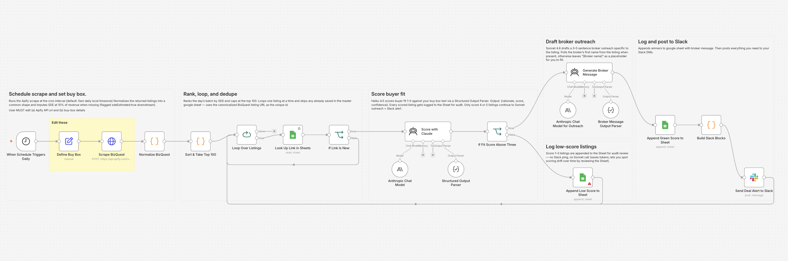
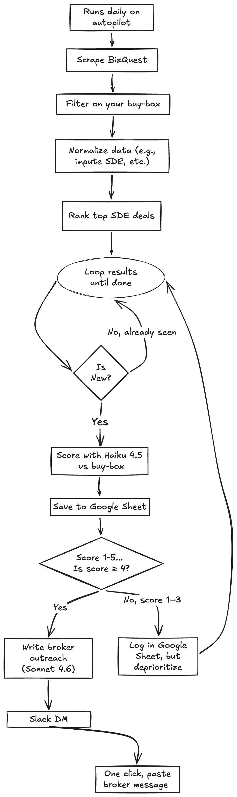

# BizQuest Daily Alert System

**An n8n workflow that scrapes new BizQuest listings every morning, scores each one against your buy box with Claude, drafts a personalized broker message for the good ones, and drops it all in your Slack.**



---

## The problem

Self-funded searchers lose an hour a day checking BizQuest — and still miss the ones that move to LOI before they see them. The listing page doesn't tell you whether it fits your **buy box**, and a generic *"interested, please send more info"* broker message gets deleted.

## The solution

A daily workflow that filters new BizQuest listings against your buy box, scores each one for buyer fit, and drafts a personalized broker outreach for every listing worth pursuing. Lands in your Slack.

Edit your buy box once. Every morning, you wake up to one-to-five Slack alerts, each tied to a listing that actually matches your criteria, with a ready-to-paste broker message already written.

---

## Value

| | Manual | Generic scraper alert | This workflow |
|---|---|---|---|
| Time to spot new listings | 30–60 min/day | <1 min | <1 min |
| Signal-to-noise in alerts | High by default (you ignored most) | Low — every new listing pings | Only listings graded a buyer fit ping |
| Pre-call analysis per listing | 30–60 min reading + notes | 30–60 min reading + notes | One-sentence rationale + drafted broker outreach waiting in Slack |
| Decision audit trail | Memory | Slack scroll | Sheet row per listing with rationale, score, confidence, and the drafted message |
| Consistency of judgment | Mood-dependent | Mood-dependent | Same rubric, every day, written down |
| Time from alert to broker reply | 10–30 min | 5–10 min | ~10 sec (hover the code block, click copy, paste) |

Your buy box lives in one place. Tune it, and the next morning's alerts reflect the change. The drafted broker messages become a permanent record of which businesses you screened and which questions you asked — a paper trail that compounds over a 12-to-24 month search.

---

## How it works

<p align="center">
  
</p>

- **Daily scrape** of new BizQuest listings matching your buy box filters
- **Normalize and dedupe** against your master Sheet so already-seen listings drop out silently (canonicalized listing URL is the unique key)
- **Claude Haiku scores** each new listing 1-to-5 for buyer fit, with a one-sentence rationale and a confidence level
- **Claude Sonnet drafts** a 3-to-5 sentence broker outreach for every score-4-or-5 listing, specific to that listing
- **Slack pings you** with the score, the stats, the link, and the broker draft in a hover-to-copy code block
- **Master Sheet logs** every listing, every score, every rationale, every draft

Score 1–3 listings are logged to the Sheet for audit but never ping you and never hit Sonnet — saving tokens and letting you spot scoring drift over time.

---

## What you need

| Tool | Cost | Why |
|------|------|-----|
| [n8n](https://n8n.partnerlinks.io/qsoyb0o2mh2x) | Free (self-hosted) | Where this runs |
| [Apify](https://apify.com/memo23/bizquest-scraper) | <$2/mo (free tier usually covers it) | BizQuest scraper |
| Anthropic API | ~$1–2/mo | Scoring + outreach drafting |
| Google Sheets | Free | Master list, dedupe, audit trail |
| Slack | Free | Where the daily alert lands |

**All in: under $5/month.** A once-daily scrape and Haiku/Sonnet on a handful of listings costs pennies a day; everything else runs on free tiers.

> ⚠️ **Terms of Use warning — use at your own risk.** BizQuest prohibits scraping. This workflow relies on a third-party Apify scraper. Account suspension is your problem. Practical guardrails: once-a-day schedule, narrow criteria, never republish raw data or spam brokers.

---

## Setup (about 20 minutes)

1. **Import the workflow.** Download [`smb-bizquest-daily.json`](smb-bizquest-daily.json) and import it into n8n (**Workflows → ⋯ → Import from File**).

2. **Create a Google Sheet** with this 16-column header row, in order:
   ```
   Title | Source | Keyword | Location | Asking Price | Revenue | SDE | SDE Estimated | Listed Date | Link | First Seen | Stage | Fit Rationale | Fit Score | Fit Confidence | Broker Message
   ```

3. **Edit `Define Buy Box`** — the only place searcher-specific config lives. Five fields:
   - `buyBox` — 2–4 paragraphs on who you are, deal-size range, verticals you want or avoid, geography
   - `keyword`, `cashFlowMin`, `priceMax`, `listingAgeDays`

4. **In `Scrape BizQuest`**, replace the Apify task URL with your own (your token is embedded as a query param).

5. **Wire credentials:** Anthropic, Google Sheets (OAuth2), Slack (OAuth).

6. **Select your Sheet** on the three Google Sheets nodes and **your Slack DM or channel** on the Slack node.

7. **Run manually.** Confirm a score-4+ listing produces a Slack alert with a working title link and a copy-pasteable broker message. Then toggle **Active**.

---

## Customization

**Switch verticals:** edit the five `Define Buy Box` fields. Nothing else changes — every downstream node reads from there.

---

## Who this is for

Business buyers · self-funded searchers · investors · operators looking to acquire an established SMB.

---

## License

[MIT](LICENSE) © David Schreiber

---

### More where this came from → **[SMB·excel](https://www.smbexcel.com)**
