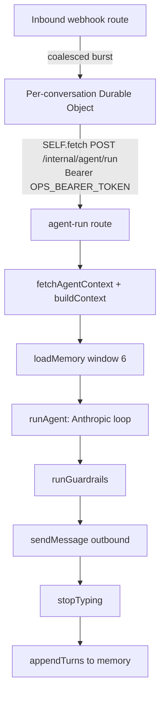
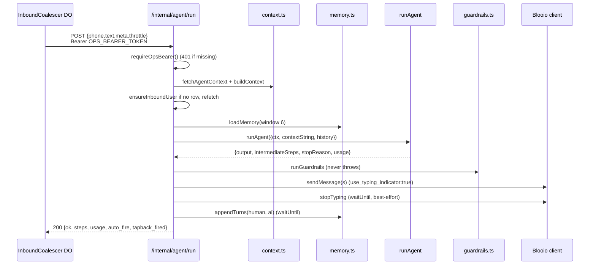

# The Agent Loop

This document describes the **hand-rolled Anthropic Messages-API agent loop** that powers the Worker — a tool-using conversational agent built directly on `messages.create` instead of a framework like LangChain. It covers the iteration loop, the errors-as-`tool_result` recovery contract, prompt caching, the tool-registry pattern, per-turn context assembly, windowed memory, and the orchestration route that ties it all together. Everything here is a reusable recipe for a Workers-hosted, tool-using agent reachable over any channel (iMessage, SMS, web chat).

The template wires this into an iMessage concierge, but nothing in the loop is channel-specific: swap the inbound/outbound transport and you have a generic agent.

---

## TL;DR / At a glance

- **No framework.** The loop is ~270 lines around `client.messages.create(...)`. You own the message array, the tool dispatch, and the stop conditions — which means you can debug every byte.
- **Iterate to a cap.** Up to `MAX_ITERATIONS = 12` round trips. `stop_reason: 'end_turn'` returns the text; `stop_reason: 'tool_use'` dispatches tools and loops; anything else throws.
- **Dispatch tools concurrently.** All `tool_use` blocks in one response run via `Promise.all`, preserving emission order for the `tool_result` array.
- **Errors are data, not exceptions.** A throwing tool handler becomes a `{ ok: false, error }` `tool_result` with `is_error: true`; the model recovers or apologizes. Only loop-runaway / unknown stop reasons escape `runAgent`.
- **Two cache breakpoints.** `cache_control: { type: 'ephemeral' }` on the system text **and** on the last tool schema → ~70% input-token discount on repeat turns within the 5-minute TTL.
- **Tools carry a trust root.** Every tool receives an `AgentCtx` with a server-derived `user_id`; tools **override** any model-supplied current-user id with `ctx.user_id`.
- **Context is pre-fetched, not tool-fetched.** The workflow reads all conversation state up front and serializes it into one structured user turn, so the agent rarely needs read-only lookup tools.
- **Memory is a 6-turn window** of a LangChain-compatible chat-history table keyed by the user's phone; the human turn is persisted before the AI turn to keep ordering stable.

---

## Where the loop sits in the request lifecycle



`runAgent` is step F. Steps D, E, G–J are the orchestration in `routes/agent-run.ts`; the inbound webhook + Durable Object debounce are covered in [ARCHITECTURE.md](./ARCHITECTURE.md). This doc focuses on D through J, with the loop itself at the center.

---

## The loop, end to end

`runAgent` (`src/agent/runner.ts`) takes a pre-assembled context string, the conversation history, and a per-turn `AgentCtx`, and returns the model's final text plus the tool calls it made and per-run token usage.

```ts
export const MAX_ITERATIONS = 12;
export const DEFAULT_MAX_TOKENS = 1024; // SMS/iMessage replies are small

export async function runAgent(input: RunAgentInput): Promise<AgentResult> {
  const { env, ctx, contextString, history } = input;
  const client = getAnthropic(env);
  const model = env.ANTHROPIC_MODEL_AGENT || DEFAULT_MODEL;

  const tools = buildToolsParam();                              // tool schemas + cache breakpoint
  const system = [cachedSystem(SYSTEM_PROMPT)];                 // system text + cache breakpoint

  let messages = [
    ...history.map((m) => ({ role: m.role, content: m.content })),
    { role: 'user', content: contextString },                  // this turn's assembled context
  ];

  for (let iter = 0; iter < MAX_ITERATIONS; iter++) {
    const resp = await client.messages.create({
      model,
      max_tokens: DEFAULT_MAX_TOKENS,
      system,
      tools,
      tool_choice: { type: 'auto' },
      messages,
    });

    // ... token accounting (see Prompt caching) ...

    // Append the assistant turn (immutable spread, never push — see Gotcha).
    messages = [...messages, { role: 'assistant', content: resp.content }];

    if (resp.stop_reason === 'end_turn') {
      return { output: textOf(resp.content), intermediateSteps, stopReason: resp.stop_reason, usage };
    }
    if (resp.stop_reason !== 'tool_use') {
      throw new AgentUnexpectedStopError(resp.stop_reason);     // e.g. max_tokens, refusal
    }

    const toolUses = resp.content.filter((b) => b.type === 'tool_use');
    const dispatched = await Promise.all(toolUses.map((u) => dispatchToolUse(u, ctx)));
    for (const d of dispatched) intermediateSteps.push(d.step);
    messages = [...messages, { role: 'user', content: dispatched.map((d) => d.toolResult) }];
  }

  throw new AgentRunawayError(MAX_ITERATIONS);                  // never converged
}
```

The shape is the canonical agentic loop:

1. Call `messages.create` with `system`, `tools`, `tool_choice: { type: 'auto' }`, and the running `messages` array.
2. Append the assistant response to `messages`.
3. If `end_turn` → collect the text blocks and **return**.
4. If `tool_use` → run **every** `tool_use` block, append a single `user` message whose `content` is the array of `tool_result` blocks, and **loop**.
5. If anything else → throw `AgentUnexpectedStopError`.
6. If the loop hits `MAX_ITERATIONS` without converging → throw `AgentRunawayError`.

> **Pattern:** One `messages.create` call per iteration; the model decides each round whether to emit text (`end_turn`) or call tools (`tool_use`). You never special-case "how many tools" — you dispatch the whole `tool_use` set and feed all results back. The model re-plans on the next iteration with the new observations in context.

> **Gotcha:** Append to `messages` with an immutable spread (`messages = [...messages, ...]`), not `messages.push(...)`. The per-iteration array is captured by reference inside the request; mutating it in place lets a later iteration rewrite the arguments an earlier call already "saw." This bites hardest in tests where a mocked `messages.create` records its `messages` arg — but it's the correct invariant in production too.

### Why a cap, and what each terminal state means

| Terminal state | Trigger | Behavior |
|---|---|---|
| `end_turn` | Model produced final text | Return `output` (joined text blocks), `intermediateSteps`, `usage` |
| `tool_use` | Model wants to call tools | Dispatch all, append `tool_result`s, continue loop |
| `MAX_ITERATIONS` reached | Model never converged | Throw `AgentRunawayError(12)` — log `agent.runaway` |
| any other `stop_reason` | e.g. `max_tokens`, content-policy stop | Throw `AgentUnexpectedStopError` — log `agent.unexpected_stop` |

A throw here propagates to the orchestration route, which logs, pages ops, and returns a non-2xx (`500`/`502`) without ever crashing the Worker. The cap is a runaway guard, not an expected exit — a healthy turn ends in `end_turn` after 0–3 tool rounds.

---

## Errors as `tool_result`, not exceptions

The single most important reliability decision in the loop: **a tool failing is a normal event the model should see and react to**, not a crash. `dispatchToolUse` wraps each handler and converts any thrown error into a `tool_result` block with `is_error: true`.

```ts
async function dispatchToolUse(use, ctx): Promise<DispatchedTool> {
  const tool = findTool(use.name);
  let observation: unknown;
  let isError = false;

  if (!tool) {
    observation = { ok: false, error: `unknown tool: ${use.name}` };
    isError = true;                                  // model hallucinated a tool name
  } else {
    try {
      observation = await tool.handler(use.input, ctx);
    } catch (e) {
      observation = { ok: false, error: e instanceof Error ? e.message : String(e) };
      isError = true;                                // handler threw — surface it
    }
  }

  return {
    step: { action: { tool: use.name, toolInput: use.input }, observation },
    toolResult: {
      type: 'tool_result',
      tool_use_id: use.id,
      content: JSON.stringify(observation ?? null),
      is_error: isError,
    },
  };
}
```

Consequences:

- A handler that throws (a DB write conflict, a downstream 4xx, a validation failure) round-trips back to the model as `{ ok: false, error: "..." }`. On the next iteration the model can retry with corrected input, take a different path, or apologize to the user in natural language.
- An **unknown tool name** (model hallucination) is handled the same way — `{ ok: false, error: "unknown tool: ..." }` with `is_error: true` — instead of crashing.
- The `content` of a `tool_result` is **always a JSON string** (`JSON.stringify(observation ?? null)`). Stringify even on the happy path so the model gets a stable, parseable observation shape.

> **Pattern:** Errors-as-`tool_result` turns the model into the recovery layer. The only conditions that escape `runAgent` are *structural* (runaway loop, unexpected stop reason) — never a single tool's runtime failure. This is what lets the agent gracefully say "I couldn't find that — can you re-send the date?" instead of dropping the conversation.

> **Gotcha:** Set `is_error: true` on the `tool_result` when the observation is a failure. The model treats `is_error` blocks differently (it's more likely to retry or acknowledge the failure). Returning a failure payload with `is_error: false` makes the model trust a bad result.

---

## Prompt caching: two ephemeral breakpoints

The system prompt plus the full tool-schema list is a large, **identical** prefix on every turn (~2.5K tokens in the template). Re-sending it uncached on each `messages.create` is the dominant input-token cost. The fix is two `cache_control: { type: 'ephemeral' }` breakpoints.

```ts
// src/lib/anthropic.ts — breakpoint #1: the system text
export function cachedSystem(text: string): Anthropic.Messages.TextBlockParam {
  return { type: 'text', text, cache_control: { type: 'ephemeral' } };
}

// src/agent/runner.ts — breakpoint #2: the LAST tool schema
function buildToolsParam(): Anthropic.Messages.Tool[] {
  const tools = TOOL_REGISTRY.map((t) => ({
    name: t.name,
    description: t.description,
    input_schema: t.input_schema,
  }));
  const last = tools[tools.length - 1];
  if (last) {
    tools[tools.length - 1] = { ...last, cache_control: { type: 'ephemeral' } };
  }
  return tools;
}
```

How the two breakpoints work together:

- The cache prefix extends from the start of the request **up to and including** the marked block. A breakpoint on the **last** tool therefore caches the cumulative `system + all-tool-schemas` prefix in one shot — you do **not** mark every tool.
- The system-text breakpoint lets the system block itself be cached even if the tool list churns less often. Two breakpoints total ("cache system + tool schemas") is the intended granularity.
- The cache has a **5-minute TTL**. The first request mints it (billed as `cache_creation_input_tokens`); subsequent requests within the window read it (`cache_read_input_tokens`) for roughly a **70% input-token discount** on that prefix. In a multi-turn iMessage conversation the turns land well inside 5 minutes, so most turns hit warm cache.

### Per-iteration usage accounting

Every iteration folds the response's usage fields into a running per-run total and emits a structured log line:

```ts
const u = resp.usage;
usage.input_tokens                += u?.input_tokens ?? 0;
usage.output_tokens               += u?.output_tokens ?? 0;
usage.cache_creation_input_tokens += u?.cache_creation_input_tokens ?? 0;
usage.cache_read_input_tokens     += u?.cache_read_input_tokens ?? 0;
log.info('agent.usage', { phone: ctx.phone, iteration: iter, /* the four fields */ });
```

The orchestration route then logs a single `agent_run.usage` line with the run totals, so an entire conversation's spend can be summed from logs. Guard every field with `?? 0` — `cache_*` fields are absent on a cache miss or older API shapes.

> **Pattern:** Account tokens per-iteration *and* per-run. The per-iteration line shows you which tool rounds are expensive; the per-run line is what you sum across a conversation. Watching `cache_read_input_tokens` climb relative to `cache_creation_input_tokens` confirms the cache is actually warm.

---

## The tool registry

Tools are plain objects implementing one interface. The registry is an array; the runner reflects over it to build the API `tools` param and to dispatch by name.

```ts
// src/agent/tools/index.ts
export interface ToolDefinition<I = Record<string, unknown>, O = unknown> {
  name: string;
  description: string;
  input_schema: ToolInputSchema;                       // JSON Schema for the model
  handler: (input: I, ctx: AgentCtx) => Promise<O>;
}

export const TOOL_REGISTRY: ToolDefinition[] = [
  updateUserTool, createRecipientTool, /* ... */ requestActionTool,
];

export function findTool(name: string): ToolDefinition | undefined {
  return TOOL_REGISTRY.find((t) => t.name === name);
}
```

Adding a tool is: write the object, append it to `TOOL_REGISTRY`. `buildToolsParam` picks up its schema; `findTool` makes it dispatchable; nothing else changes.

### `AgentCtx` — the per-turn trust context

Every handler receives a second argument, `AgentCtx`, assembled fresh per turn by the orchestration route:

```ts
export interface AgentCtx {
  env: Env;
  /** The user_id derived from the inbound phone — the boundary trust root. */
  user_id: string;
  /** Normalized E.164 phone of the current user. */
  phone: string;
  /** Inbound message_id — the tapback guardrail needs it. */
  message_id: string;
}
```

`ctx.user_id` is derived **server-side** from the authenticated inbound identity (the phone number that sent the message), *not* from anything the model wrote. This is the security crux:

> **Pattern:** The current-user id is a **trust root**, never a model input. Tools that mutate the current user **override** any model-supplied `user_id` with `ctx.user_id`. The model's input schema may *declare* a `user_id` field (for prompt clarity), but the handler ignores it for the current user. Sub-resource ids (a specific recipient, event, or record) *are* taken from input — they legitimately vary within a turn — but they're still scoped to `ctx.user_id` server-side by the query.

### The result envelope: `{ ok: true }` | `{ ok: false, error }`

Every tool returns a discriminated union:

```ts
export type ToolResult<T = Record<string, unknown>> =
  | ({ ok: true } & T)
  | { ok: false; error: string };
```

The `ok` boolean is what downstream code keys on — the dispatcher's `is_error` flag, the guardrails' "did this write succeed?" check, and the tapback trigger all read `observation.ok === true`. Keeping every tool on this envelope means none of those consumers need tool-specific parsing.

### Shared helpers

Three small helpers keep handlers uniform:

| Helper | Purpose |
|---|---|
| `blankToNull(v)` | Coerce `""`/whitespace-only strings to `null` (DB CHECK constraints want real nulls, and models love emitting empty strings). |
| `compactPatch(input)` | Build a partial update object, dropping `undefined` keys — so a patch only touches fields the model actually supplied. |
| `safely(fn)` | Run an async fn and return `{ ok: true, value }` or `{ ok: false, error }` — turns a throw into the envelope *inside* a handler, before it reaches the dispatcher. |

### Worked example: `update_user`

```ts
// src/agent/tools/update-user.ts
export const updateUserTool: ToolDefinition<UpdateUserInput, UpdateUserResult> = {
  name: 'update_user',
  description:
    "Update the current user's profile. Use this when they tell you their name, email, or " +
    "want a different default setting. Only the fields you pass get updated. NEVER call this " +
    "if you don't have a real value for the field you're setting.",
  input_schema: {
    type: 'object',
    properties: {
      user_id:       { type: 'string',  description: 'UUID of the user (from injected context)' },
      display_name:  { type: 'string',  description: 'User first name' },
      email:         { type: 'string',  description: 'User email address' },
      // ... other optional fields ...
      onboarding_state: { type: 'string', enum: ['new', 'active', 'paused', /* ... */] },
    },
    required: ['user_id'],
  },
  async handler(input, ctx) {
    const patch = compactPatch({
      display_name: input.display_name,
      email: input.email,
      // ...
    });
    if (Object.keys(patch).length === 0) {
      return { ok: false, error: 'no fields provided to update' };
    }
    const res = await safely(() =>
      updateRows(ctx.env, 'users', `id=eq.${encodeURIComponent(ctx.user_id)}`, patch, { returning: true }),
    );
    if (!res.ok) return { ok: false, error: res.error };
    return { ok: true, updated: (res.value?.[0] ?? patch) as Record<string, unknown> };
  },
};
```

Note every reusable trait in one tool:

- The schema declares `user_id` and even lists it as `required`, but the handler **never reads `input.user_id`** — it writes `WHERE id = ctx.user_id`. The model-supplied id is decorative; the trust root wins.
- `compactPatch` means an `update_user` that only carries `display_name` touches *only* that column.
- An empty patch returns `{ ok: false, error }` — a clean, recoverable signal, not a thrown exception.
- `safely(...)` converts a DB error into the envelope before returning.
- The description tells the model *when* to call it and, crucially, when **not** to ("NEVER call this if you don't have a real value"). Tool descriptions are prompt engineering — see [PROMPT-BEST-PRACTICES.md](./PROMPT-BEST-PRACTICES.md).

> **Pattern:** Tool descriptions are part of the prompt. "Use this when…" plus an explicit "NEVER call this if…" is far more effective at curbing spurious tool calls than any post-hoc validation.

---

## Context assembly: pre-fetch, don't tool-fetch

`src/agent/context.ts` fetches all the conversation state the agent needs **before** the loop runs, and serializes it into a single structured user-turn string. The agent therefore starts every turn already knowing who the user is and what's pending — it doesn't have to spend tool round-trips on read-only lookups.

`fetchAgentContext` does a small set of Supabase reads with a deliberate ordering:

```ts
// User FIRST (we need user_id to scope the rest)...
const users = await selectRows(env, 'users', `?phone=eq.${encodeURIComponent(phone)}&limit=1`);
const userId = typeof user.id === 'string' ? user.id : null;
if (!userId) return { user, pending: [], recent: [], recipients: [], events: [] };

// ...then the remaining reads in PARALLEL, scoped by user_id.
const [pending, recent, recipients, events] = await Promise.all([
  selectRows(env, 'orders',     `?${filter}&status=eq.pending`),
  selectRows(env, 'orders',     `?${filter}&order=created_at.desc&limit=5`),
  selectRows(env, 'recipients', `?${filter}`),
  selectRows(env, 'events',     `?${filter}`),
]);
```

The base template ships three reads — `users`, `messages` (recent activity), and `chat_history` (handled separately by the memory layer). Additional domain tables like `orders`, `recipients`, or `events` shown above are illustrative of how an application extends the pattern: pre-fetch whatever durable state your tools would otherwise have to look up, scope every read by `user_id`, and fan them out in parallel after the parent resolves.

`buildContext` then denormalizes (joins child records onto their parents, enriches rows with the related record's name), strips empty fallback rows, and composes the `contextString` the model sees as its user turn:

```text
Inbound from: +15551234567

# User
{ ...the user row as pretty JSON... }

# Recipients (2, with events inline)
[ ...child records with their related dates joined in... ]

# Pending actions (1)
[ ...pending downstream actions, enriched with related names... ]

# Recent activity (3)
[ ...recent history... ]

# Message
<the user's actual inbound text>
```

The structure is itself a prompt: clear `#` section headers, counts in the headers (`Recipients (2, ...)`), pretty-printed JSON the model can read, and the user's literal message last under `# Message`.

> **Pattern:** Pre-fetch state and inject it as one structured user turn. Because the workflow already fetched everything, the model needs **only state-changing tools**, not read-only lookup tools. Fewer tools = a smaller schema (cheaper, faster, less hallucination surface) and fewer wasted iterations. A registry that is entirely *writes* — no `get_user` or `list_recipients` tool — works because the context block already answered those questions.

> **Gotcha:** Order the reads so the parent (user) resolves first and short-circuits when absent — there's no point firing child queries for a phone with no account. Everything after the parent fans out with `Promise.all`.

---

## Memory: a windowed, LangChain-compatible chat log

`src/agent/memory.ts` is a hand-rolled replacement for a framework's conversation memory. It reads/writes the `chat_history` table, whose rows are shaped to be **LangChain-compatible**, so the storage can be swapped back to a framework with no data migration.

```ts
const WINDOW = 6;

export async function loadMemory(env: Env, phone: string): Promise<MemoryMessage[]> {
  const rows = await selectRows(env, 'chat_history',
    `?session_id=eq.${encodeURIComponent(phone)}&order=created_at.desc&limit=${WINDOW}`);
  return rows
    .slice().reverse()                                   // newest-first query → chronological
    .map((r) => ({
      role: r.message?.type === 'human' ? 'user' : 'assistant',
      content: r.message?.data?.content ?? '',
    }))
    .filter((m) => m.content.length > 0);
}
```

Key decisions:

- **`session_id` is the E.164 phone.** The conversation key is the channel identity — no separate session table.
- **Window of 6.** Load only the most recent 6 turns (`order=created_at.desc&limit=6`, then reverse to chronological). The pre-fetched context block carries the durable state, so memory only needs enough recent dialogue for conversational coherence — not the whole history.
- **Stored shape mirrors LangChain's message rows:**
  `{ type: "human" | "ai", data: { content, additional_kwargs: {}, response_metadata: {} } }`.
  Mapping `human → user` and `ai → assistant` yields the Anthropic role shape `runAgent` expects.

### Why the human turn is written before the AI turn

After the reply is sent, the route persists both turns via `appendTurns`, and it does so **sequentially — human first**:

```ts
export async function appendTurns(env, phone, human, ai): Promise<void> {
  await appendTurn(env, phone, 'human', human);   // commits FIRST → lower id, earlier created_at
  await appendTurn(env, phone, 'ai', ai);
}
```

If you fire both inserts in parallel, a race can land the AI row with a lower `id`/`created_at` than the human turn that prompted it. Since `loadMemory` orders by `created_at`, that inversion makes the next turn's history read interleave the pair backwards. Awaiting the human insert before the AI insert guarantees chronological ordering. Empty turns are skipped individually — an empty AI reply still persists the human turn.

> **Gotcha:** With auto-`id`/`created_at` ordering, **sequence your conversation-pair writes**. A parallel `Promise.all([human, ai])` is faster but can invert the pair under load and silently corrupt the next turn's context.

---

## Orchestration: tying it together

`src/routes/agent-run.ts` is the `POST /internal/agent/run` handler. It is **service-binding-only** and gated by a bearer token (`requireOpsBearer`) — the per-conversation Durable Object invokes it via the Worker's `SELF` binding once an inbound burst has coalesced. It is never publicly routed.



The end-to-end sequence inside the handler:

1. **Auth.** `requireOpsBearer(c, 'agent_run')` — missing/wrong bearer → `401`. A missed header would break *every* inbound turn, so this is the place to be strict.
2. **Context.** `fetchAgentContext` → `buildContext`. If there is no user row, `ensureInboundUser` mints a minimal one and context is **re-fetched** so the new `user_id` and `# User` block are present before the loop. (A failed mint falls back to running the agent anyway — chit-chat works without a `user_id` — and pages ops.)
3. **Memory.** `loadMemory(phone)` → the 6-turn window.
4. **Build `AgentCtx`** with the server-derived `user_id`, `phone`, and inbound `message_id`.
5. **`runAgent(...)`.** Empty output (an `end_turn` with no text) is treated as a failure: log, page ops, return `502`.
6. **`runGuardrails(...)`.** Post-agent, never-throwing. Logs the writes the agent made, and — the reusable guardrail — checks whether a required downstream action was left unfinished and **auto-fires it if the model forgot**, plus a celebratory reaction subject to a cooldown. (Details in [ARCHITECTURE.md](./ARCHITECTURE.md) and [IMESSAGE-BEST-PRACTICES.md](./IMESSAGE-BEST-PRACTICES.md).)
7. **Send.** `sendMessage` to the channel with `use_typing_indicator: true`. A reply that is *text + a link* is split into two bubbles so the URL-only bubble can carry a rich preview (see [BLOOIO-INTEGRATION.md](./BLOOIO-INTEGRATION.md)).
8. **`stopTyping`** — fire-and-forget via `executionCtx.waitUntil`.
9. **`appendTurns(phone, text, output)`** — also `waitUntil`; persists the conversation pair (human then AI).
10. **Log run usage** (`agent_run.usage`) and return `200` with `{ ok, steps, stop_reason, admin_events, auto_fire, tapback_fired, usage }`.

> **Pattern:** Do the model-blocking work (context → memory → loop → guardrails → send) on the critical path, then push fire-and-forget tails (`stopTyping`, `appendTurns`) into `executionCtx.waitUntil`. The user gets the reply as fast as possible; bookkeeping finishes after the response is returned. On Cloudflare Workers, `waitUntil` is the correct way to keep work alive past the response without delaying it.

> **Gotcha:** The auto-fire guardrail is the safety net for the most common agentic failure mode — the model does the visible step (e.g. confirming the user's intent in text) but forgets the *required* downstream call. Detecting the unfinished state from the DB after the loop, and firing the action yourself, is far more robust than hoping the prompt always elicits the call. Treat "did the model actually do the thing it said it did?" as a post-loop check, not a prompt-only guarantee.

---

## Adapting this to your project

A checklist to port the loop to an unrelated agent:

1. **Define your tools** as `ToolDefinition` objects with tight `input_schema`s and action-oriented descriptions. Keep them **state-changing only** if you pre-fetch context.
2. **Pre-fetch context** for the turn and serialize it into one structured user-turn string with `#` section headers and counts.
3. **Build an `AgentCtx`** with a **server-derived** trust root (the authenticated user id) — never trust a model-supplied current-user id.
4. **Run the loop**: `messages.create` with `tool_choice: { type: 'auto' }`, append assistant turn, branch on `stop_reason`, dispatch tools via `Promise.all`, feed back `tool_result` blocks, cap at `MAX_ITERATIONS`.
5. **Convert tool throws to `tool_result` with `is_error: true`** so the model recovers; only let structural failures escape.
6. **Add two `cache_control: ephemeral` breakpoints** (system text + last tool schema) and account usage per iteration and per run.
7. **Persist a small memory window** keyed by the channel identity; write the pair sequentially (human first).
8. **Add post-loop guardrails** that verify required downstream actions actually happened, and degrade gracefully (never throw past the reply).

---

## See also

- [README.md](./README.md) — index of this reference set
- [ARCHITECTURE.md](./ARCHITECTURE.md) — end-to-end request lifecycle + component map
- [INFRASTRUCTURE.md](./INFRASTRUCTURE.md) — Worker config, env/secrets (incl. `ANTHROPIC_API_KEY`, `OPS_BEARER_TOKEN`), cron, data layer, deploy
- [BLOOIO-INTEGRATION.md](./BLOOIO-INTEGRATION.md) — the outbound `sendMessage`/typing/reaction API the loop calls
- [AGENT-LOOP.md](./AGENT-LOOP.md) — (this doc)
- [PROMPT-BEST-PRACTICES.md](./PROMPT-BEST-PRACTICES.md) — system-prompt and tool-description lessons
- [IMESSAGE-BEST-PRACTICES.md](./IMESSAGE-BEST-PRACTICES.md) — UX patterns (typing, tapbacks, link previews) the orchestration emits
- [REFERRAL-ARCHITECTURE.md](./REFERRAL-ARCHITECTURE.md) — the opt-in referral add-on (migration `0002`): per-user referral codes, `referral_credits`, and `affiliates`, plus optional extensions (per-number new-contact cap, FIFO signup queue, short-link tables) the base template does **not** ship
