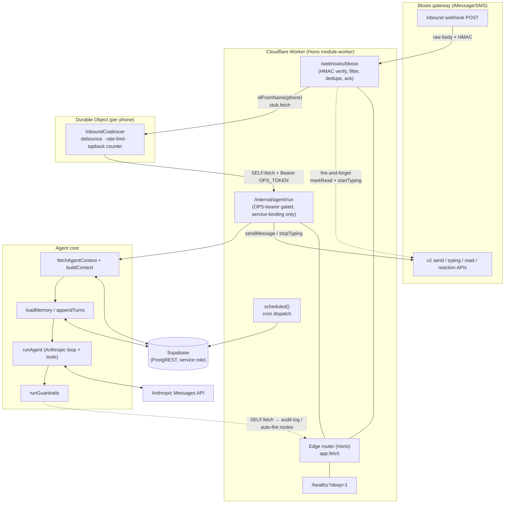
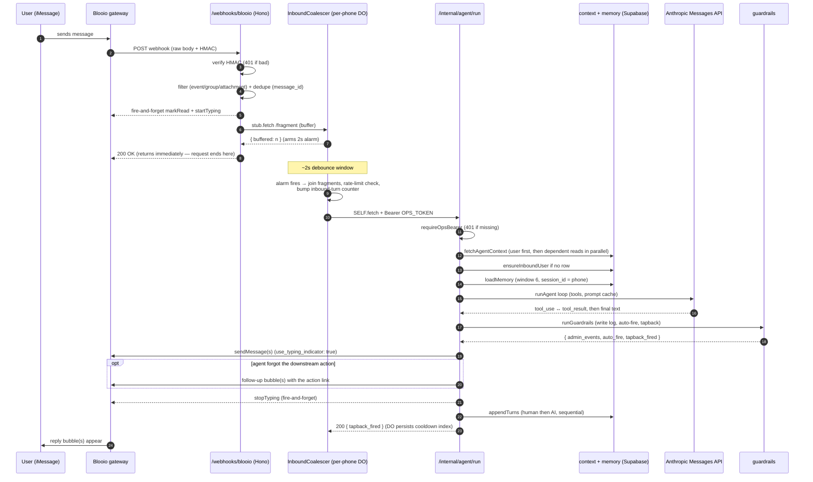

# Architecture

This is the spine document for the reference set. It maps the whole system — an
iMessage/SMS concierge **agent** running entirely on a single Cloudflare Worker —
and walks one inbound message from the Blooio webhook through to the reply the
user sees. Read this first; the sibling docs (the Blooio API surface, the agent
loop, the data layer) drill into each component the diagrams here introduce.

The system is a **stateful conversational agent over a messaging gateway**. A
provider (Blooio) bridges iMessage/SMS and POSTs inbound messages to the Worker;
the Worker runs an Anthropic Messages-API agent loop, calls state-changing tools,
persists conversation memory, and replies back through the same gateway. None of
the architecture below is domain-specific — swap the tools and the system prompt
and you have a support concierge, a booking assistant, or any other text-native
agent.

---

## TL;DR / At a glance

- **One Worker, one Durable Object class.** A Hono router handles all HTTP; a
  single per-phone Durable Object (`InboundCoalescer`) debounces and rate-limits;
  the agent loop runs on an internal route the DO calls back into.
- **Ack fast, work slow.** The inbound webhook route does only cheap,
  bounded work and **returns 200 fast** (a sub-200 ms budget, well inside the
  gateway's webhook timeout). All slow work (the LLM loop,
  Supabase reads/writes, outbound sends) happens later, in the DO alarm's
  *separate execution scope* — so a slow agent turn never risks a webhook timeout.
- **The route almost never fails the upstream.** It returns `200` for every
  outcome *except* a failed HMAC check (which returns `401`). Internal errors are
  logged + paged, never surfaced as a `500`, so Blooio has no reason to retry.
- **Fan-out chain:** inbound route → per-phone DO (debounce/rate-limit) →
  `SELF` service binding → `POST /internal/agent/run`. The internal route is
  gated by a shared bearer secret (`OPS_BEARER_TOKEN`) and is reachable only via
  the service binding, never publicly.
- **Trust root = the verified phone.** `user_id` is derived from the
  HMAC-verified inbound phone, threaded as `AgentCtx`, and tools **override any
  model-supplied user id** with it. The model can never act as another user.
- **Fail-open everywhere except auth.** Every layer degrades gracefully:
  guardrails never throw, fire-and-forget acks swallow errors, the agent surfaces
  tool failures back to the model instead of crashing. Auth fails *closed*.
- **Cron rides along.** The Cloudflare account cron-trigger cap is 5, so multiple
  daily jobs are folded into fewer triggers — one handler awaits several
  self-contained, never-throwing jobs in sequence. (Detail in
  [INFRASTRUCTURE.md](INFRASTRUCTURE.md).)

---

## Component map

The entire backend is one module-worker (`export default { fetch, scheduled }`)
plus one Durable Object class. There are no queues, no separate services, no
external job runner — the Worker calls *itself* through a service binding to move
work off the request path.



| Component | File | Responsibility |
|---|---|---|
| **Edge router** | `src/index.ts` | Hono app; mounts every route, `onError`/`notFound` handlers, `/healthz`, and the `scheduled` cron dispatcher. The module-worker default export. |
| **Inbound webhook** | `src/routes/inbound-sms.ts` | The only publicly-hit hot path. Verifies HMAC, filters, dedupes, fires acks, hands off to the DO, returns 200 fast. Mounted at `/webhooks/blooio`. |
| **Per-phone DO** | `src/do/inbound-coalescer.ts` | `InboundCoalescer` — debounce buffer, atomic hourly rate limit, per-conversation tapback counter, fan-out to the agent route. |
| **Agent route** | `src/routes/agent-run.ts` | `POST /internal/agent/run` — orchestrates context → memory → agent → guardrails → send. Service-binding only; OPS-bearer gated. |
| **Agent loop** | `src/agent/runner.ts` | `runAgent` — hand-rolled Anthropic Messages loop with prompt caching and a tool registry. See [AGENT-LOOP.md](AGENT-LOOP.md). |
| **Context builder** | `src/agent/context.ts` | `fetchAgentContext` (Supabase reads) + `buildContext` (serialize to the user-turn string). |
| **Guardrails** | `src/agent/guardrails.ts` | Post-agent, never-throw: write detection, admin event logging, auto-fire of a forgotten downstream action, success tapback. |
| **Gateway client** | `src/lib/blooio.ts` | Typed Blooio v2 client (`sendMessage`, `startTyping`, `markRead`, `sendTapback`, …). See [BLOOIO-INTEGRATION.md](BLOOIO-INTEGRATION.md). |
| **Internal auth** | `src/lib/internal-auth.ts` | `requireOpsBearer` — fail-closed shared-secret gate for service-binding-only routes. |
| **Data layer** | `src/lib/supabase.ts` | PostgREST REST helpers over Supabase, service-role key. See [INFRASTRUCTURE.md](INFRASTRUCTURE.md). |
| **Cron handlers** | `src/cron/*.ts` | Scheduled jobs, dispatched from `scheduled()` and folded under the 5-trigger cap. |

---

## The "return 200 fast, do the slow work later" pattern

This is the most important structural decision in the system, and it applies to
*any* Worker that sits behind a third-party webhook.

A webhook caller wants a fast `2xx`. If your handler is slow it risks hitting the
caller's timeout, and most providers interpret a timeout or a `5xx` as "delivery
failed — retry." For a conversational agent, a retry is poison: it would
re-trigger the whole LLM loop and double-send the reply. So the inbound route is
engineered to be **cheap, bounded, and almost-always-200**:

1. Read the raw body, verify HMAC, filter, dedupe — all O(1), no LLM, at most one
   tiny Supabase write (the dedupe row).
2. Hand the message to the per-phone Durable Object via `stub.fetch(...)`. The DO
   call only *buffers* the fragment and (maybe) arms a 2-second alarm — it
   returns immediately.
3. Return `200`.

The expensive work — context assembly, the agent loop, outbound sends, memory
writes — happens **inside the DO's alarm handler**, which Cloudflare invokes in a
*separate execution context* milliseconds-to-seconds later. The webhook HTTP
request has long since completed.

```ts
// src/routes/inbound-sms.ts — the handoff is a buffer-and-return, not the work
const id = c.env.INBOUND_COALESCER.idFromName(phone);
const stub = c.env.INBOUND_COALESCER.get(id);
const doResp = await stub.fetch('https://do.internal/fragment', {
  method: 'POST',
  headers: { 'Content-Type': 'application/json' },
  body: JSON.stringify(fragment),
});
// ...
return c.json({ ok: true }, 200);   // returns immediately; the agent runs later in the DO alarm
```

> **Pattern:** Treat the webhook handler as an *acknowledgement*, not a
> *processor*. Do only what's needed to safely accept-or-reject the event
> (verify, dedupe, persist a handoff), then return `2xx`. Push real work into a
> separate execution scope — a Durable Object alarm, a queue consumer, or
> `ctx.waitUntil` for fire-and-forget. The user-visible latency of the *ack* and
> the latency of the *work* become independent.

> **Gotcha:** `ctx.waitUntil` extends a request's lifetime but still runs in the
> *same* invocation — it's right for fire-and-forget acks (mark-read,
> start-typing) but wrong for the multi-second agent loop, which wants its own
> isolate, its own CPU budget, and per-phone serialization. That's exactly what a
> Durable Object gives you. The route uses *both*: `waitUntil` for the acks, the
> DO alarm for the agent run.

### Why the route returns 200 for everything but auth

The handler's hard guarantee: it returns `200` for every outcome — wrong event
type, group chat, attachment-only, duplicate, even an *internal failure during
handoff* — and returns `401` **only** when the HMAC check fails.

```ts
// src/routes/inbound-sms.ts
const verified = await verifyBlooio(rawBody, sig, c.env.BLOOIO_HMAC_SECRET);
if (!verified.ok) {
  return c.json({ rejected: verified.reason }, 401);   // the ONLY non-200
}
```

Even when the DO handoff throws, it logs, pages ops via Slack, and *still*
returns `200`:

```ts
} catch (e) {
  log.error('inbound.do_handoff_threw', { phone, reason: errMsg(e) });
  c.executionCtx.waitUntil(postOpsError(c.env, { /* ... */ }));
  // Still return 200 — Blooio shouldn't retry on internal worker failure.
}
return c.json({ ok: true }, 200);
```

> **Pattern:** A retry from the upstream is only useful if retrying could
> *succeed*. A malformed signature won't fix itself on retry → reject loudly
> (`401`). An internal bug won't fix itself on retry either, and replaying it
> would double-fire the agent → accept (`200`) and page yourself instead. Decide,
> per failure mode, whether a retry is a feature or a hazard, and choose your
> status code accordingly.

### Inbound filtering ladder

Before anything reaches the DO, the route walks a fixed filter ladder. Each rung
short-circuits with a `200` (the event is *accepted* but intentionally not
processed):

| Order | Check | Action |
|---|---|---|
| 1 | HMAC verify (`x-blooio-signature`, 300 s replay window, multi-`v1`) | fail → **401** |
| 2 | `event !== 'message.received'` | `200 ignored:event_type` |
| 3 | missing `external_id` | `200 ignored:no_external_id` |
| 4 | group chat — `external_id` starts with `grp_` | `200 ignored:group` |
| 5 | attachment-only (has attachments / non-text type, empty text) | fire-and-forget canned reply, `200 replied:stock_image` |
| 6 | per-`message_id` dedupe (PK-collision = duplicate) | `200 ignored:duplicate` |
| 7 | otherwise | fire acks, hand to DO, `200 ok` |

> **Gotcha:** HMAC verification needs the **raw request bytes**, not a re-encoded
> JSON object. Read `await c.req.text()` *before* any parse, and verify against
> that exact string. The route reads `rawBody` first thing for this reason. (Wire
> details — header format, replay window, multi-signature `.some()` — are in
> [BLOOIO-INTEGRATION.md](BLOOIO-INTEGRATION.md).)

---

## The Durable Object: per-phone serialization

`InboundCoalescer` is addressed by `idFromName(phone)`, so there is exactly **one
instance per phone number**, and all of a phone's messages serialize through it.
That single property gives three features almost for free (no locks, no
transactions):

1. **Debounce.** People text in fragments ("hey" … "can you" … "do a thing").
   The DO buffers fragments and arms a single 2-second alarm
   (`DEBOUNCE_MS = 2000`); fragments arriving inside the window piggyback on the
   same alarm. On fire, it joins the buffer with `'\n'` and processes one
   coalesced turn — so the agent sees the *whole* thought, and you pay for one
   LLM turn instead of three.
2. **Atomic rate limit.** A per-phone hourly counter
   (`RATE_LIMIT_PER_HOUR = 100`), incremented in DO storage. Because the instance
   is single-threaded per phone, the read-increment-write is inherently
   serializable — no race. DO storage has no TTL, so the bump sweeps the prior
   hour's bucket key when it rolls over.
3. **Tapback cooldown bookkeeping.** A monotonic per-conversation inbound-turn
   counter plus the index of the last reaction fired, so a downstream guardrail
   can cap reactions at one per N turns (`TAPBACK_COOLDOWN_MESSAGES = 4`).

```ts
// src/do/inbound-coalescer.ts — buffer + arm a single debounce alarm
async fragment(req: FragmentRequest): Promise<FragmentResponse> {
  const buf = (await this.state.storage.get<string[]>('fragments')) ?? [];
  buf.push(req.text);
  await this.state.storage.put('fragments', buf);
  const pending = await this.state.storage.getAlarm();
  if (pending === null) {
    await this.state.storage.setAlarm(Date.now() + DEBOUNCE_MS);
  }
  return { buffered: buf.length };
}
```

The `alarm()` handler is where the slow work *begins*: drain the buffer,
rate-limit check, then fan out to the agent route. The handoff `fetch` (the
`fragment()` call) returned to the inbound route long ago; the alarm runs on its
own.

> **Pattern:** When you need "process all of a user's recent messages together,
> exactly once, with a per-user rate limit," reach for a Durable Object keyed by
> the user. The single-instance-per-key guarantee turns concurrency problems
> (debounce windows, atomic counters) into ordinary sequential code. (Full DO
> internals — alarm semantics, the TTL-less storage sweep — in
> [INFRASTRUCTURE.md](INFRASTRUCTURE.md).)

---

## The fan-out chain and the internal-auth gate

The DO alarm does not run the agent inline. It calls *back into the same Worker*
over the `SELF` service binding, hitting `POST /internal/agent/run`:

```ts
// src/do/inbound-coalescer.ts — fan out via SELF, carrying the internal bearer
const r = await this.env.SELF.fetch(`${this.env.WORKER_BASE_URL}/internal/agent/run`, {
  method: 'POST',
  headers: {
    'Content-Type': 'application/json',
    Authorization: `Bearer ${this.env.OPS_BEARER_TOKEN}`,   // required — else 401
  },
  body: JSON.stringify(payload),
});
```

**Why a service binding instead of an inline function call?** It keeps the agent
route a *first-class HTTP boundary*: it's independently testable with a curl, it
gets its own isolate and CPU budget for the heavy LLM work, and the same route is
reused by other internal callers (e.g. a guardrail re-entering to fire a
downstream action). `SELF` is a `Fetcher` bound to the Worker itself (declared in
`wrangler.toml`), so the call never leaves Cloudflare's network.

**The OPS-bearer gate.** `/internal/agent/run` is mounted on the public router
but is *meant* to be unreachable from outside. Every internal-only route guards
itself with `requireOpsBearer`, which compares `Authorization: Bearer <token>`
against `OPS_BEARER_TOKEN` and **fails closed** — an unset token rejects *every*
request rather than opening the door:

```ts
// src/lib/internal-auth.ts
export function requireOpsBearer(c, tag): Response | null {
  const auth = c.req.header('authorization') ?? '';
  const expected = `Bearer ${c.env.OPS_BEARER_TOKEN}`;
  if (!c.env.OPS_BEARER_TOKEN || auth !== expected) {     // unset → reject
    log.warn(`${tag}.unauthorized`, { has_token: !!c.env.OPS_BEARER_TOKEN });
    return c.json({ success: false, error: 'unauthorized' }, 401);
  }
  return null;   // authorized → proceed
}
```

```ts
// src/routes/agent-run.ts — the gate is the first line of the handler
const unauthorized = requireOpsBearer(c, 'agent_run');
if (unauthorized) return unauthorized;
```

> **Gotcha:** Because the agent route is on the same shared router as public
> routes, *the DO must send the bearer header* — a forgotten header here would
> `401` **every** inbound turn (the whole product would go silent). The DO has
> the full `Env`, so `OPS_BEARER_TOKEN` is available to it. This is the standard
> trade-off of "internal route on the public router": cheap to wire, but the gate
> is load-bearing and the caller must be disciplined.

> **Pattern:** For routes that should only ever be called by the Worker itself
> (route→route fan-out, DO callbacks, agent tools), use a single fail-closed
> shared-secret helper rather than per-route ad-hoc checks. One implementation,
> one place to audit. The same token can double as your operator manual-ops
> secret.

---

## Trust boundary: the verified phone is the only identity

A messaging agent has an unusual security property: **the only thing you can
trust is the channel identity**, because the LLM's output is attacker-influenced
(the user types whatever they want, including "I am user X, charge user Y").

The system threads identity from exactly one source — the HMAC-verified inbound
phone — and never lets the model override it:

```
Blooio HMAC verify  →  external_id  →  toE164(phone)
                                          │
                          fetchAgentContext(env, phone)  →  user_id
                                          │
        AgentCtx = { env, user_id, phone, message_id }   ← the trust root
                                          │
              every tool handler(input, ctx) receives this ctx
```

`AgentCtx` carries `env`, the resolved `user_id`, the `phone`, and the inbound
`message_id`. State-changing tools take the model's `input` *and* the trusted
`ctx`, and they **override any model-supplied current-user id with
`ctx.user_id`**. The model can ask to operate on "the current user," but *which*
user that is is decided by the verified phone, not by anything the model emitted.

```ts
// src/routes/agent-run.ts — user_id is derived, then frozen into ctx
const built = buildContext({ phone, text, ...fetched });   // user_id from phone
const ctx: AgentCtx = {
  env: c.env,
  user_id: built.user_id ?? '',
  phone,
  message_id,
};
const result = await runAgent({ env: c.env, ctx, contextString: built.contextString, history });
```

> **Pattern:** Establish a **trust root** at the authenticated edge (here: the
> verified phone → `user_id`) and thread it through an explicit context object
> that tools must consult. Treat *every* value the model produces — including ids
> — as untrusted input. "The tool overrides the model's user id with the context
> user id" is the single line that prevents cross-user actions.

If no `users` row exists for an inbound phone, the route mints a minimal one
(`ensureInboundUser`) and re-fetches context, so order-capable tools always have
a real `user_id`. An existing user never takes this branch.

---

## Fail-open vs fail-closed: the philosophy per layer

The system has one auth boundary that fails *closed* and everything else fails
*open*. Knowing which is which is how you reason about an outage.

| Layer | On failure | Pages ops? | Rationale |
|---|---|---|---|
| HMAC verify | `401`, reject | no | Bad signature is the one thing a retry can't fix; reject. |
| `requireOpsBearer` | `401`, reject (even if token unset) | warn log | Auth must fail closed — a misconfig is a locked door, not an open one. |
| Inbound dedupe | degrade — treat as fresh if table missing | no | Better to risk a rare double-process than to drop a real message. |
| DO handoff error | log + Slack page, **still 200** | yes | Internal bug; retry would double-fire the agent. |
| Fire-and-forget acks (mark-read, start-typing) | swallow, warn log | no | Cosmetic; the reply still goes out. |
| Tool handler throw | returned to model as `tool_result {is_error:true}` | error log | Model recovers (retries / apologizes); only loop-runaway throws. |
| `runGuardrails` | never throws; each sub-job degrades | varies | The user-facing reply must go out even if logging/auto-fire fails. |
| Auto-fire downstream action | log + Slack page; user still got the reply | yes | Operator can complete it by hand; user isn't stranded. |
| Outbound `sendMessage` | throws out of the agent route → `500` to the DO | yes (`agent_run.threw`) | If we can't reply, the turn genuinely failed; surface it. |
| Cron job failure | swallowed inside the never-throwing job | yes (Slack) | One job's failure must not break the others sharing the trigger. |

The agent loop's error handling deserves a callout. A tool throwing is *normal* —
the loop catches it and feeds the error back to the model as a `tool_result`
block with `is_error: true`, and the model recovers:

```ts
// src/agent/runner.ts — tool errors become observations, not exceptions
try {
  observation = await tool.handler(use.input as never, ctx);
} catch (e) {
  observation = { ok: false, error: e instanceof Error ? e.message : String(e) };
  isError = true;          // surfaced as tool_result { is_error: true }
}
```

Only two conditions throw *out* of `runAgent`: the loop exceeding
`MAX_ITERATIONS` (= 12) — runaway — and an unknown `stop_reason`. Both are
genuine bugs that should page, not user-recoverable states. (The full loop, the
two prompt-cache breakpoints, and the tool registry are in
[AGENT-LOOP.md](AGENT-LOOP.md).)

> **Pattern:** Default to fail-open for everything on the *delivery* path
> (logging, analytics, reactions, secondary sends) so a peripheral failure never
> swallows the primary response. Fail-closed only at trust boundaries (auth) and
> at the one action the turn *exists to perform* (here, the reply itself).

---

## End-to-end: one inbound turn

Putting it together — a single user message, from gateway POST to reply:



The agent route's body (`src/routes/agent-run.ts`) executes that lower half in
order:

1. **Context** — `fetchAgentContext` reads the `users` row first (it needs the
   `user_id` to scope the rest), then runs the remaining reads in parallel;
   `buildContext` serializes user + lists into a single user-turn string.
2. **User backfill** — `ensureInboundUser` mints a row if the phone is new.
3. **Memory** — `loadMemory` pulls a window of 6 prior turns from the
   LangChain-shaped `chat_history` table keyed by the E.164 phone as `session_id`.
4. **Agent** — `runAgent` runs the Anthropic loop with the tool registry.
5. **Guardrails** — `runGuardrails` logs writes, auto-fires a forgotten
   downstream action, and (subject to cooldown) fires a single success reaction.
6. **Send** — `sendMessage` to Blooio with `use_typing_indicator: true`; a
   "text + link" reply is split into two bubbles so the link bubble can carry a
   preview (see [IMESSAGE-BEST-PRACTICES.md](IMESSAGE-BEST-PRACTICES.md)).
7. **Stop typing** (fire-and-forget) and **`appendTurns`** to memory (human then
   AI, sequential, so the human row always gets the lower id).

> **Pattern — the "auto-fire a forgotten follow-up action" guardrail:** after the
> agent runs, the system checks the data layer for a state that *should* have
> triggered a downstream action (e.g. a confirmed-but-not-finalized record). If
> the model forgot to call the tool, a guardrail performs the action itself and
> appends the result as an extra bubble. This makes the critical step robust to
> the model occasionally skipping it — a reusable safety net for any
> "agent must always do X after Y" requirement. The guardrail re-enters the
> Worker over `SELF` (with the OPS bearer) to perform the action, reusing the
> same internal-route machinery.

---

## How cron / scheduled work coexists

The same module-worker exports `scheduled` alongside `fetch`:

```ts
// src/index.ts
export default {
  fetch: app.fetch,
  scheduled: scheduledDispatch,
} satisfies ExportedHandler<Env>;
```

Cloudflare invokes `scheduled` with the firing cron string in `controller.cron`;
`scheduledDispatch` looks it up in a `CRON_HANDLERS` map and runs the matching
handler. Because the **account cron-trigger cap is 5**, several logically-distinct
daily jobs **ride along** inside fewer triggers: one handler `await`s several
self-contained, never-throwing jobs in sequence, so a failure in one can't break
the next.

```ts
// src/index.ts — several jobs riding one nudge tick
async function nudgeAndQueueDrainHandler(event, env, ctx) {
  await onboardingNudgeHandler(event, env, ctx);
  await queueDrainHandler(event, env, ctx);
  await recoveryRideAlong(env, ctx);   // self-contained, never throws
}
```

Cron jobs share the Worker's data layer and libraries but are independent of the
inbound hot path — they don't touch the DO or the agent route. The full trigger
table, the ride-along rationale, and how the test env runs cron-less are covered
in [INFRASTRUCTURE.md](INFRASTRUCTURE.md).

> **Optional extension — a per-number new-contact cap and a FIFO signup queue.**
> Some deployments cap how many brand-new contacts a single iMessage number greets
> per day (provider trust/anti-spam) and queue overflow signups into a FIFO that a
> ride-along cron job drains as capacity frees up. That pattern — plus its short-link
> and queue tables — is documented here as an **optional extension**; the base
> template does **not** ship those tables. The cron *ride-along* mechanism above is
> the reusable part; wire your own queue tables if you need one.

---

## The data layer at a glance

The template ships a small, fixed set of tables (full DDL and the RLS note are in
[INFRASTRUCTURE.md](INFRASTRUCTURE.md)):

- **Core (always present):** `users`, `messages`, `chat_history` (agent memory,
  LangChain-shaped), `inbound_webhook_events` (the inbound dedupe table), and
  `audit_log`.
- **Referral add-on (opt-in, migration `0002`):** adds `users.referral_code`,
  `users.referred_by_user_id`, and `users.referral_credit_cents`, plus the
  `referral_credits` and `affiliates` tables. This is off by default — apply the
  migration only if you want peer + affiliate referral. The design lives in
  [REFERRAL-ARCHITECTURE.md](REFERRAL-ARCHITECTURE.md) and the code under
  `template/src/domain/referral*.ts` + `migrations/0002_referral.sql`.

---

## See also

- [README.md](README.md) — index to the whole reference set.
- [BLOOIO-INTEGRATION.md](BLOOIO-INTEGRATION.md) — the gateway's v2 API surface,
  HMAC wire format, send/typing/read/reaction endpoints.
- [AGENT-LOOP.md](AGENT-LOOP.md) — the Anthropic Messages loop, prompt caching,
  tool registry, and `AgentCtx`.
- [IMESSAGE-BEST-PRACTICES.md](IMESSAGE-BEST-PRACTICES.md) — bubble splitting,
  link previews, typing indicators, reactions.
- [PROMPT-BEST-PRACTICES.md](PROMPT-BEST-PRACTICES.md) — prompt-engineering
  lessons for the system prompt.
- [REFERRAL-ARCHITECTURE.md](REFERRAL-ARCHITECTURE.md) — the unified
  peer + affiliate referral system (opt-in, migration `0002`).
- [INFRASTRUCTURE.md](INFRASTRUCTURE.md) — Worker config, env/secrets, the DO
  declaration, cron, the Supabase data layer, deploy, and the RLS security note.
