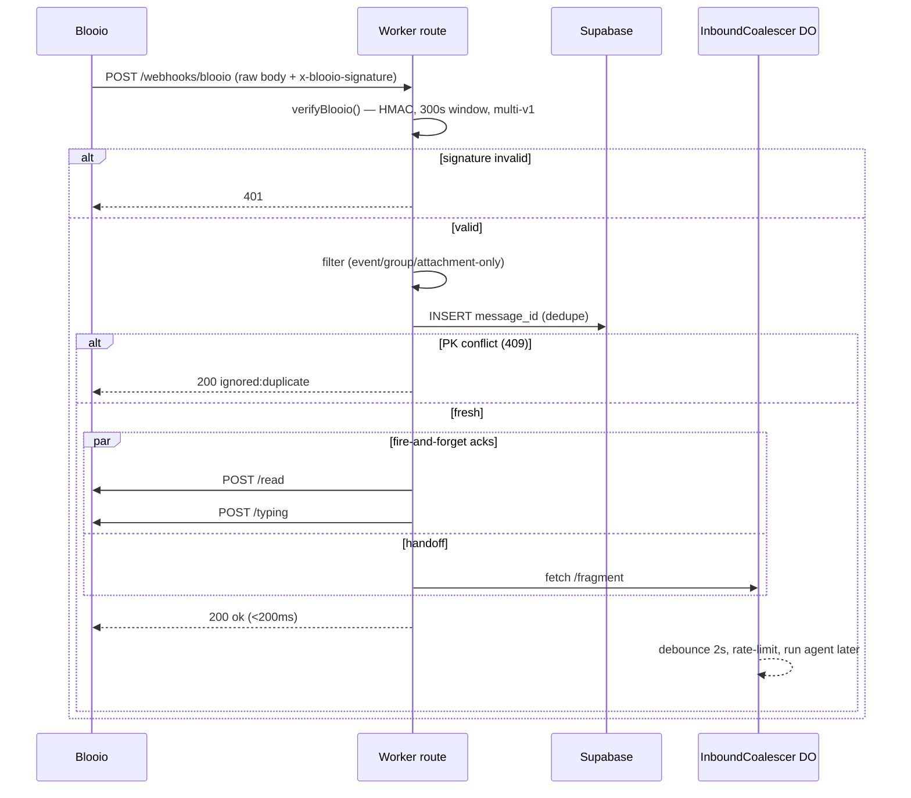

# Blooio Integration

The definitive reference for talking to **Blooio**, the iMessage/SMS gateway that
sits between the public phone network and your Worker. This doc covers both
directions of the wire: the **inbound webhook** (Blooio POSTs you a received
message, you verify its HMAC and dedupe it) and the **outbound API** (your Worker
calls Blooio to send messages, reactions, typing indicators, and read receipts).
Every endpoint path, header name, and field name below is quoted as the
`imessage-agent` Worker actually uses them — copy them verbatim.

---

## TL;DR / At a glance

- **Base URL:** `https://backend.blooio.com`. All calls are under `/v2/api/...`.
- **Outbound auth:** `Authorization: Bearer <BLOOIO_API_KEY>`. `X-API-Key` and a
  bare `Authorization: <key>` both **401** — confirmed against the live API.
- **Inbound auth:** verify the `x-blooio-signature` header (Stripe-style
  `t=...,v1=...`) as an HMAC-SHA256 over `t + "." + rawBody`, using
  `BLOOIO_HMAC_SECRET`. 300-second replay window, multi-`v1` accepted.
- **Two secrets, two directions:** `BLOOIO_API_KEY` (outbound calls) and
  `BLOOIO_HMAC_SECRET` (inbound verification) are distinct.
- **Inbound route:** Blooio POSTs to `/webhooks/blooio`.
- **Inbound filters:** drop everything that isn't `event === 'message.received'`,
  drop group chats (`external_id` starts with `grp_`), special-case
  attachment-only messages, and dedupe on `message_id`.
- **Outbound surface:** send message, add reaction (tapback), start/stop typing,
  mark read. One `sendMessage` helper covers text, attachments, link previews,
  typing flag, and contact-card piggyback.
- **Two-bubble link previews:** `link_preview` only renders when the message text
  is *exactly one* URL — so "text + link" replies go out as **two** bubbles.
- **E.164 everywhere:** normalize the inbound number once and use it as the chat
  identifier in every path (URL-encoded).

---

## Authentication

```ts
const BASE = 'https://backend.blooio.com';
const AUTH_HEADER = 'Authorization';
const AUTH_PREFIX = 'Bearer ';

function authHeaders(env: Env): Record<string, string> {
  return { [AUTH_HEADER]: AUTH_PREFIX + env.BLOOIO_API_KEY };
}
```

> **Gotcha:** Blooio's auth scheme is *not* obvious from the dashboard. Confirmed
> against the live API: `Authorization: Bearer <key>` returns 200; both
> `X-API-Key: <key>` and a bare `Authorization: <key>` (no `Bearer `) return
> **401** with `"Missing API key or ID token"`. It follows the same convention as
> Anthropic / OpenAI / Stripe — use `Bearer`.

The two Blooio secrets serve opposite directions and must not be confused:

| Secret | Direction | Used for |
| --- | --- | --- |
| `BLOOIO_API_KEY` | Outbound | `Authorization: Bearer` on every API call you make |
| `BLOOIO_HMAC_SECRET` | Inbound | Verifying the `x-blooio-signature` on webhooks Blooio POSTs to you |

Both are stored as Worker secrets (`wrangler secret put` / `.dev.vars`), never in
`wrangler.toml` vars. See **INFRASTRUCTURE.md** for the full secret inventory.

---

## Inbound: the webhook

Blooio POSTs every received message to your webhook route — in `imessage-agent`,
the Hono route `/webhooks/blooio`. The handler's contract is strict:

1. Read the **raw body first** — HMAC verification needs the exact bytes, before
   any JSON parse.
2. Verify the HMAC. **Failure → 401** (the only non-200 the route ever returns).
3. Filter by event type — only `message.received` proceeds.
4. Drop group chats (`external_id` prefix `grp_`).
5. Special-case attachment-only messages with a canned reply.
6. Dedupe on `message_id` (graceful-degrade).
7. Fire-and-forget mark-read + start-typing.
8. Hand off to a per-phone Durable Object for debounce + rate-limiting.
9. **Return 200 in <200ms.**

> **Pattern:** The route **always returns 200** except on HMAC failure. Any
> internal error is logged and ops-paged but never surfaces as a 5xx — because a
> gateway interprets a 5xx as "retry this delivery", and a retry storm on a
> transient bug is worse than a single dropped message. Make the webhook's HTTP
> contract about *signature validity*, not *downstream success*.

### Inbound event JSON shape

```ts
interface BlooioInboundEvent {
  event?: string;        // 'message.received' is the only one we act on
  external_id?: string;  // the sender's chat id — phone, or 'grp_...' for groups
  message_id?: string;   // stable per-message id — the dedupe key
  text?: string;         // message body (empty for attachment-only)
  type?: string;         // 'text' | 'image' | 'video' | 'audio' | 'media' | ...
  attachments?: unknown[];
  protocol?: 'imessage' | 'sms' | string;  // which transport delivered it
}
```

> **Gotcha:** `external_id` is the chat identifier, **not** a separate "from"
> field — for a 1:1 conversation it is the sender's phone; for a group it's a
> `grp_`-prefixed opaque id. Use the *same* value as the chat segment of every
> outbound path so replies route back to the right thread.

### HMAC verification (in full)

The signature header is Stripe-shaped: `t=<unix-seconds>,v1=<hex>` (and may carry
multiple `v1=` entries during a key rotation). The algorithm:

```ts
const REPLAY_TOLERANCE_SEC = 300;
const encoder = new TextEncoder();

async function hmacSha256Hex(secret: string, payload: string): Promise<string> {
  const key = await crypto.subtle.importKey(
    'raw', encoder.encode(secret),
    { name: 'HMAC', hash: 'SHA-256' }, false, ['sign'],
  );
  const sig = await crypto.subtle.sign('HMAC', key, encoder.encode(payload));
  const bytes = new Uint8Array(sig);
  let hex = '';
  for (let i = 0; i < bytes.length; i++) hex += bytes[i]!.toString(16).padStart(2, '0');
  return hex;
}

// Constant-time hex compare — never short-circuit on first mismatch.
function timingSafeEqualHex(a: string, b: string): boolean {
  if (a.length !== b.length) return false;
  let mismatch = 0;
  for (let i = 0; i < a.length; i++) mismatch |= a.charCodeAt(i) ^ b.charCodeAt(i);
  return mismatch === 0;
}

function parseSignatureHeader(header: string): { t: string; v1: string[] } | null {
  const parts = String(header).split(',').map((p) => p.trim().split('='));
  const t = parts.find((p) => p[0] === 't')?.[1];
  const v1 = parts.filter((p) => p[0] === 'v1').map((p) => p[1])
    .filter((v): v is string => typeof v === 'string' && v.length > 0);
  if (!t || v1.length === 0) return null;
  return { t, v1 };
}

async function verifyBlooio(
  rawBody: string, sigHeader: string | null, secret: string,
): Promise<{ ok: true; event: unknown } | { ok: false; reason: string }> {
  if (!secret)   return { ok: false, reason: 'missing BLOOIO_HMAC_SECRET' };
  if (!sigHeader) return { ok: false, reason: 'missing x-blooio-signature header' };
  if (!rawBody)  return { ok: false, reason: 'missing raw body' };

  const parsed = parseSignatureHeader(sigHeader);
  if (!parsed) return { ok: false, reason: 'malformed signature header' };

  const tNum = Number(parsed.t);
  if (!Number.isFinite(tNum)) return { ok: false, reason: 'malformed signature header' };

  // Replay window — reject anything older (or future-dated) than 5 minutes.
  const ageSec = Math.abs(Math.floor(Date.now() / 1000) - tNum);
  if (ageSec > REPLAY_TOLERANCE_SEC) return { ok: false, reason: 'event too old (>5min)' };

  // HMAC is computed over `${t}.${rawBody}` — timestamp, a dot, then the raw body.
  const expected = await hmacSha256Hex(secret, parsed.t + '.' + rawBody);
  const matched = parsed.v1.some((v) => timingSafeEqualHex(expected, v));
  if (!matched) return { ok: false, reason: 'signature mismatch' };

  try { return { ok: true, event: JSON.parse(rawBody) }; }
  catch { return { ok: false, reason: 'body not valid JSON' }; }
}
```

The non-obvious details that make or break this:

| Detail | Why it matters |
| --- | --- |
| **Raw body, read once, before parse** | The HMAC is over the exact bytes. If your framework auto-parses JSON and re-serializes, key ordering/whitespace changes and every signature mismatches. Read `c.req.text()` first. |
| **Signed string is `t + "." + rawBody`** | Not just the body. The timestamp is part of the MAC, which is what binds the replay window to the signature. |
| **`Math.abs(...)` on the age** | Rejects both stale replays *and* future-dated timestamps (clock skew abuse). |
| **`.some()` over `v1[]`** | During secret rotation Blooio sends multiple `v1=` values; accept if **any** matches so you can rotate with zero downtime. |
| **Timing-safe compare** | Don't `===` the hex — a byte-by-byte early return leaks signature bytes via timing. |

> **Pattern:** This exact verifier is provider-agnostic — the same code (different
> secret + header name) verifies a third-party payment webhook. Both share a
> `verifyCommon(rawBody, sigHeader, secret, opts)` core; only the
> "missing header/secret" reason strings differ. Write the HMAC core once.

### Inbound filters

After verification, four filters run before the message reaches the agent:

```ts
// Filter 1: only handle inbound receipts.
if (event.event !== 'message.received') return c.json({ ok: true, ignored: 'event_type' }, 200);

const external_id = String(event.external_id ?? '');
if (!external_id) return c.json({ ok: true, ignored: 'no_external_id' }, 200);

// Filter 2: group chats — never let the agent loose in a group thread.
if (external_id.startsWith('grp_')) return c.json({ ok: true, ignored: 'group' }, 200);

const text = String(event.text ?? '').trim();
const attachments = Array.isArray(event.attachments) ? event.attachments : [];
const messageType = String(event.type ?? 'text').toLowerCase();
const nonTextType = ['image', 'video', 'audio', 'media'].includes(messageType);
const isImageOnly = (attachments.length > 0 || nonTextType) && text.length === 0;

// Filter 3: attachment-only — the agent can't see media, so reply with a canned line.
if (isImageOnly) {
  c.executionCtx.waitUntil(safeStockReply(c, phone));
  return c.json({ ok: true, replied: 'stock_image' }, 200);
}
```

> **Gotcha:** Attachment-only inbound (someone sends just a photo, no text) would
> otherwise reach the agent as an empty user turn and waste a model call on
> nothing. Detect it (`attachments.length > 0 || nonTextType` **and** empty text)
> and fire a fixed reply explaining you can't receive media — fire-and-forget, no
> agent invocation.

### Per-message dedupe (idempotency)

Gateways occasionally re-deliver. Dedupe on `message_id` using a table whose
**primary key is the message id** — a PK collision *is* the duplicate signal.

```ts
export async function dedupeBlooioInbound(env: Env, message_id: string): Promise<{ fresh: boolean }> {
  if (!message_id) return { fresh: true };
  try {
    await insertRow(env, 'inbound_webhook_events', { message_id });
    return { fresh: true };               // inserted cleanly → first time we've seen it
  } catch (e) {
    if (e instanceof SupabaseError && e.status === 409) return { fresh: false }; // PK violation → dup
    // Table missing / network / 5xx → warn and treat as fresh (graceful-degrade).
    return { fresh: true };
  }
}
```

> **Pattern:** **Idempotency via INSERT-and-catch-conflict.** Don't `SELECT` then
> `INSERT` (a race between the two re-processes the message). Let the unique
> constraint be the gate: PostgREST returns **409** on PK violation. The same
> shape backs a generic third-party-webhook dedupe table keyed on the provider's
> `event_id`. Crucially, **graceful-degrade**: any error *other* than the
> conflict (table not yet migrated, transient DB blip) returns `fresh: true` so a
> dedupe outage never silently swallows real messages.

`inbound_webhook_events(message_id PK, received_at)` schema lives in
**INFRASTRUCTURE.md**.

### Fire-and-forget acks + DO handoff

Once a message is fresh, the route does two things and returns immediately:

```ts
// Mark-read + start-typing run in parallel via waitUntil; the HTTP response
// doesn't wait on them.
c.executionCtx.waitUntil(safeAcks(c, external_id));

// Hand the fragment to the per-phone Durable Object (debounce + rate limit),
// then return 200. The agent itself runs later, in the DO's alarm.
const id = c.env.INBOUND_COALESCER.idFromName(phone);
const stub = c.env.INBOUND_COALESCER.get(id);
await stub.fetch('https://do.internal/fragment', {
  method: 'POST',
  headers: { 'Content-Type': 'application/json' },
  body: JSON.stringify({ text, meta: { phone, external_id, message_id, protocol } }),
});
return c.json({ ok: true }, 200);
```

The DO (`InboundCoalescer`) and the agent run are covered in **ARCHITECTURE.md**
and **AGENT-LOOP.md**. The takeaway for Blooio integration: the webhook's job ends
at "verified, deduped, acked, handed off" — it never blocks on the model.



---

## Outbound: the API surface

All outbound calls go through one tiny client. The chat segment of every path is
the **URL-encoded E.164 phone**:

```ts
function chatPath(phone: string, suffix: string): string {
  return `/v2/api/chats/${encodeURIComponent(phone)}${suffix}`;
}
```

### Endpoint table

| Method | Path | Purpose | Body |
| --- | --- | --- | --- |
| `POST` | `/v2/api/chats/{phone}/messages` | Send a message | `{ text, attachments?, use_typing_indicator?, link_preview?, share_contact? }` |
| `POST` | `/v2/api/chats/{phone}/messages/{id}/reactions` | Tapback / reaction | `{ reaction: '+love' }` |
| `POST` | `/v2/api/chats/{phone}/typing` | Start typing indicator | — |
| `DELETE` | `/v2/api/chats/{phone}/typing` | Stop typing indicator | — |
| `POST` | `/v2/api/chats/{phone}/read` | Mark chat read | — |
| `PUT` | `/v2/api/me/numbers/{number}/contact-card` | Set the sender's contact card (one-time setup) | `{ first_name, last_name, avatar, sharing }` |

`{phone}` is the recipient chat id; `{number}` (contact-card only) is *your own*
sending number.

### The send helper

```ts
export interface SendMessageInput {
  phone: string;
  text: string;
  /** Public-CDN URLs — rendered as MMS / inline previews. */
  attachments?: string[];
  /** Defaults to true (see "Hybrid typing" below). */
  use_typing_indicator?: boolean;
  /** Override the auto-fetched preview when text is exactly one URL. */
  link_preview?: { image_url?: string; title?: string };
  /** Piggyback the sender's contact card onto this send (once per chat). */
  share_contact?: boolean;
  // logging / attribution
  user_id?: string | null;
  external_id?: string | null;
  intent?: string | null;   // tag the outbound, e.g. 'nudge_onboarding_1'
  log?: boolean;            // set false to skip the atomic messages-row write
}

export async function sendMessage(env: Env, input: SendMessageInput): Promise<{ message_id: string | null; raw: unknown }> {
  const body: Record<string, unknown> = { text: input.text };
  if (input.attachments?.length) body.attachments = input.attachments;
  if (input.use_typing_indicator !== false) body.use_typing_indicator = true;
  if (input.link_preview && (input.link_preview.image_url || input.link_preview.title)) {
    body.link_preview = input.link_preview;
  }
  if (input.share_contact) body.share_contact = true;

  const raw = await bloo(env, 'POST', chatPath(input.phone, '/messages'), body) as
    | { id?: string; message_id?: string } | null;

  // The response id may be `id` or `message_id` — accept either.
  const message_id =
    (raw && typeof raw.id === 'string' && raw.id) ||
    (raw && typeof raw.message_id === 'string' && raw.message_id) || null;

  // Atomic outbound log — but never fail the user-facing send on a log error.
  if (input.log !== false) {
    try { await insertMessage(env, { /* direction:'out', body:text, message_id, intent, ... */ }); }
    catch (e) { log.error('blooio.message_log_failed', { /* ... */ }); }
  }
  return { message_id, raw };
}
```

> **Gotcha:** Parse the response id defensively — Blooio's send response may carry
> the id as either `id` or `message_id`. Coalesce both. You need this id to attach
> a later tapback to the *right* message.

> **Pattern:** **Log the outbound atomically, but swallow log failures.** Every
> send writes a `messages` row (`direction='out'`) in the same call so the
> conversation is auditable — but the row insert is wrapped in try/catch so an
> audit-log hiccup never breaks the actual delivery. Observability must not be
> load-bearing for the user experience.

#### curl: send a plain message

```bash
curl -X POST "https://backend.blooio.com/v2/api/chats/%2B15555550123/messages" \
  -H "Authorization: Bearer $BLOOIO_API_KEY" \
  -H "Content-Type: application/json" \
  -d '{ "text": "your booking is confirmed for 2pm.", "use_typing_indicator": true }'
```

(`%2B15555550123` is the URL-encoded `+15555550123`.)

### Reactions (tapbacks)

```ts
export async function sendTapback(
  env: Env, args: { phone: string; message_id: string; reaction?: string },
): Promise<void> {
  const path = chatPath(args.phone, `/messages/${encodeURIComponent(args.message_id)}/reactions`);
  await bloo(env, 'POST', path, { reaction: args.reaction ?? '+love' });
}
```

`'+love'` is the heart tapback. The reaction targets a specific inbound
`message_id` — that's why the inbound `message_id` is carried through the whole
pipeline. In `imessage-agent` a single heart fires on "success moments" (e.g.
when the user completes their first request), subject to a cooldown so it
doesn't spam. See **IMESSAGE-BEST-PRACTICES.md** for when tapbacks land well.

```bash
curl -X POST \
  "https://backend.blooio.com/v2/api/chats/%2B15555550123/messages/MSG_ID/reactions" \
  -H "Authorization: Bearer $BLOOIO_API_KEY" \
  -H "Content-Type: application/json" \
  -d '{ "reaction": "+love" }'
```

### Typing + read receipts (the hybrid two-layer approach)

```ts
export async function markRead(env: Env, phone: string)   { await bloo(env, 'POST', chatPath(phone, '/read')); }
export async function startTyping(env: Env, phone: string) { await bloo(env, 'POST', chatPath(phone, '/typing')); }
export async function stopTyping(env: Env, phone: string)  { await bloo(env, 'DELETE', chatPath(phone, '/typing')); }
```

There are **two** layers of typing indicator, and the Worker uses both:

1. **Inbound layer** — the webhook fires `POST /read` + `POST /typing`
   (fire-and-forget) the instant a message arrives, so the user sees the
   typing bubble *immediately*, before the agent has even started thinking.
2. **Outbound layer** — `sendMessage` sets `use_typing_indicator: true` on the
   message body, so the gateway also paces the send with a typing animation.

> **Pattern:** **Hybrid typing.** The inbound `/typing` call covers the latency
> between "message received" and "first bubble sent" (model thinking time); the
> outbound `use_typing_indicator` flag covers the moment just before each bubble
> lands. Together they make a multi-second agent turn feel like a human typing
> rather than dead air. Always `stopTyping` after the final bubble.

### Link previews and the two-bubble split

> **Gotcha — the single-URL rule:** Blooio's `link_preview` field is honored
> **only when the message text is exactly one `http(s)` URL** and nothing else. A
> "text + URL" message ignores `link_preview` and falls back to iMessage's
> auto-fetched generic card (or a 404 preview if the URL doesn't render HTML).

The fix is to split a "lead-in text + link" reply into **two bubbles**: bubble 1
is the human text with the URL surgically removed, bubble 2 is the URL *alone*,
carrying the `link_preview` override so it renders as a branded card.

```ts
export interface LinkSplit { leadIn: string | null; url: string; }

const ACTION_URL_RE = /https:\/\/(?:book|checkout|app)\.example\.com\/[^\s)]+/; // your downstream-action host

export function splitLinkText(text: string, opts: { workerBaseUrl?: string } = {}): LinkSplit | null {
  let url: string | null = null;
  const m = ACTION_URL_RE.exec(text);
  if (m) url = m[0];
  else if (opts.workerBaseUrl) {
    // also detect your own short links: `${workerBaseUrl}/p/{code}`
    const shortRe = new RegExp(`${escapeForRegex(opts.workerBaseUrl)}\\/p\\/[A-Za-z0-9]+`);
    const sm = shortRe.exec(text);
    if (sm) url = sm[0];
  }
  if (!url) return null;

  // Strip the URL, then clean up punctuation it orphaned (": —", trailing ":", etc.)
  let leadIn = text.replace(url, '')
    .replace(/:\s*—\s*/, ' — ')
    .replace(/:\s{2,}/g, ' ')
    .replace(/[:\-—–]\s*$/, '').trim()
    .replace(/^[\-—–]\s*/, '').trim()
    .replace(/\s{2,}/g, ' ').trim();

  return { leadIn: leadIn.length > 0 ? leadIn : null, url };
}
```

Caller logic: if `splitLinkText` returns non-null, send `leadIn` (if present) as
bubble 1, then send `url` as bubble 2 with `link_preview` set. If it returns
`null`, there's no URL — send a single normal message.

```ts
const split = splitLinkText(reply, { workerBaseUrl: env.WORKER_BASE_URL });
if (split) {
  if (split.leadIn) await sendMessage(env, { phone, text: split.leadIn });
  await sendMessage(env, {
    phone,
    text: split.url,                          // URL-ONLY text → link_preview honored
    link_preview: { image_url: BRAND_PREVIEW_IMAGE_URL, title: BRAND_PREVIEW_TITLE },
  });
} else {
  await sendMessage(env, { phone, text: reply });
}
```

> **Gotcha:** The `link_preview.image_url` is fetched **server-side by Blooio at
> send time** and must be a public HTTPS image (PNG/JPG/WebP/GIF, ≤16 MB). The
> image URL never appears in the user's bubble — they only see the original link,
> rendered as a card with your hero image and title. Host it on a stable CDN
> (e.g. a Worker static asset), not behind auth.

The full UX rationale for two-bubble splitting is in **IMESSAGE-BEST-PRACTICES.md**.

### Attachments

`attachments` is an array of **public CDN URLs**. Blooio fetches each and renders
it inline (MMS / inline image preview). Don't send data URIs or authed URLs — the
gateway must be able to GET them anonymously.

```ts
await sendMessage(env, {
  phone,
  text: 'here is your confirmation',
  attachments: ['https://cdn.example.com/public/confirmation-123.png'],
});
```

---

## Contact cards

Blooio can attach a **contact card** (your sender's name + avatar) so the
recipient sees a friendly identity instead of an unknown number. There are two
moving parts:

### 1. One-time per-number setup (`PUT .../contact-card`)

A setup script (`scripts/setup-contact-card.mjs`) configures the card on each
sending number. It:

1. `GET`s the current card state for the number (so you can see what's there /
   run a `DRY_RUN`).
2. Reads a local avatar image, base64-encodes it.
3. `PUT`s the new card:

```ts
// PUT https://backend.blooio.com/v2/api/me/numbers/{encodedNumber}/contact-card
const putBody = {
  first_name: 'Your Assistant',
  last_name: '',
  avatar: avatarBase64,
  sharing: {
    enabled: true,
    audience: 1,      // 0 = Contacts Only, 1 = Always Ask (prompt new recipients to save)
    name_format: 1,   // 1 = First Only (cleaner display)
  },
};
```

> **Gotcha — plan gate:** `PUT .../contact-card` requires a **Dedicated**
> (Commercial or Enterprise) Blooio plan. On a lower plan the endpoint returns
> **403** (`GET` returns 403 too). The setup script detects and reports this
> explicitly rather than failing opaquely. Also note: a test API key generally
> can't touch a production number's card — set the card with the same plan/key
> that owns the number.

### 2. Per-message piggyback (`share_contact: true`)

Once the card is configured, set `share_contact: true` on an outbound message to
*offer* the card to the recipient:

```ts
await sendMessage(env, { phone, text: welcomeText, share_contact: true });
```

> **Pattern:** **Send the card once per chat, on the first message.** Apple
> dedupes the contact-card prompt, so setting `share_contact: true` on the first
> outbound (e.g. the welcome message) is safe even on resends — the recipient is
> prompted to save your identity exactly once. The string env var
> `SHARE_CONTACT_ENABLED` gates whether the piggyback fires at all, so an
> operator can disable it without a redeploy if the plan lapses.

---

## Sender capacity (new-contact cap)

Blooio's lower tiers cap how many **new** contacts a number can message per
rolling 24h (the Starter plan = **5 new contacts / 24h**). This is a hard product
constraint on onboarding throughput, not something you can retry past.

> **Optional extension — not in the base template.** The base `imessage-agent`
> scaffold does **not** ship a number registry or a signup queue; its core tables
> are `users`, `messages`, `chat_history`, `inbound_webhook_events`, and
> `audit_log`. The capacity pattern below is documented here as a design you can
> add when you outgrow a single number's cap — but you won't find these tables in
> a fresh scaffold.

If you do add it, the pattern is two data structures:

- `phone_numbers(blooio_number, label, daily_new_contact_cap default 5, reserve,
  active, priority)` — a registry of sending numbers and their caps.
- `signup_queue(phone, kind new|returning, status, attempts, slot_at, ...)` — a
  FIFO queue that meters **new-contact** onboarding to stay under the cap;
  returning contacts (already-messaged) bypass the meter.

> **Pattern:** Treat the new-contact cap as a **scheduling problem**, not an error
> path. Queue new onboards and release them at the cap rate from a cron job;
> never let the agent blow the cap and eat a gateway rejection mid-conversation.

---

## Phone normalization (E.164)

The chat id must be consistent across inbound and outbound, so normalize once at
the edge. The rule: strip whitespace/dashes/parens/dots; if there's no leading
`+`, assume the default country prefix.

```ts
/** Strip formatting; prepend +1 if no leading +. */
export function toE164(raw: string | null | undefined): string {
  if (!raw) return '';
  const stripped = String(raw).replace(/[\s\-()\.]/g, '');
  if (!stripped) return '';
  if (stripped.startsWith('+') ) return stripped;
  return '+1' + stripped;   // default-country assumption — adjust for your locale
}
```

> **Gotcha:** Anything already in `+`-form is passed through untouched, so
> international numbers survive. The hardcoded `+1` is the *default* for
> bare-digit input — swap it for your locale, or do real libphonenumber parsing
> if you serve multiple countries. The key invariant: the value you feed into
> `encodeURIComponent(phone)` for outbound paths must byte-match the normalized
> inbound `external_id`.

---

## Error handling

The client wraps every non-2xx in a typed error carrying the method, path, and a
truncated body — so a failed Blooio call is greppable in logs and ops alerts:

```ts
export class BlooioError extends Error {
  override readonly name = 'BlooioError';
  constructor(
    readonly status: number, readonly bodyText: string,
    readonly method: string, readonly path: string,
  ) {
    super(`Blooio ${method} ${path} → ${status}${bodyText ? ': ' + bodyText.slice(0, 240) : ''}`);
  }
}
```

| Symptom | Likely cause |
| --- | --- |
| **401** on every outbound | Wrong auth scheme — must be `Authorization: Bearer <key>`, not `X-API-Key` or bare. |
| **401** on inbound (your route) | HMAC mismatch — usually the body was parsed/re-serialized before signing, or wrong `BLOOIO_HMAC_SECRET`. |
| **403** on `contact-card` | Plan gate — needs a Dedicated plan; or test key against a prod number. |
| `link_preview` ignored | Message text isn't *exactly* one URL — use the two-bubble split. |
| Tapback 404 / no-op | `message_id` wrong or expired — confirm you parsed `id`/`message_id` from the send response. |
| Duplicate replies | Dedupe table missing/erroring — it graceful-degrades to "process", so a dedupe outage looks like dupes. |

---

## See also

- [ARCHITECTURE.md](./ARCHITECTURE.md) — end-to-end request lifecycle and where this webhook sits.
- [AGENT-LOOP.md](./AGENT-LOOP.md) — what runs after the DO handoff.
- [IMESSAGE-BEST-PRACTICES.md](./IMESSAGE-BEST-PRACTICES.md) — two-bubble splits, tapback timing, typing UX.
- [INFRASTRUCTURE.md](./INFRASTRUCTURE.md) — secrets, the dedupe/messages table schemas, the `APP_FLAGS` KV namespace, and the `AGENT_PAUSED` / `AGENT_ALLOWLIST` kill-switch.
- [REFERRAL-ARCHITECTURE.md](./REFERRAL-ARCHITECTURE.md) — the opt-in referral/affiliate add-on (`template/src/domain/referral*.ts` + `migrations/0002_referral.sql`).
- [README.md](./README.md) — index of this reference set.
</content>
</invoke>
