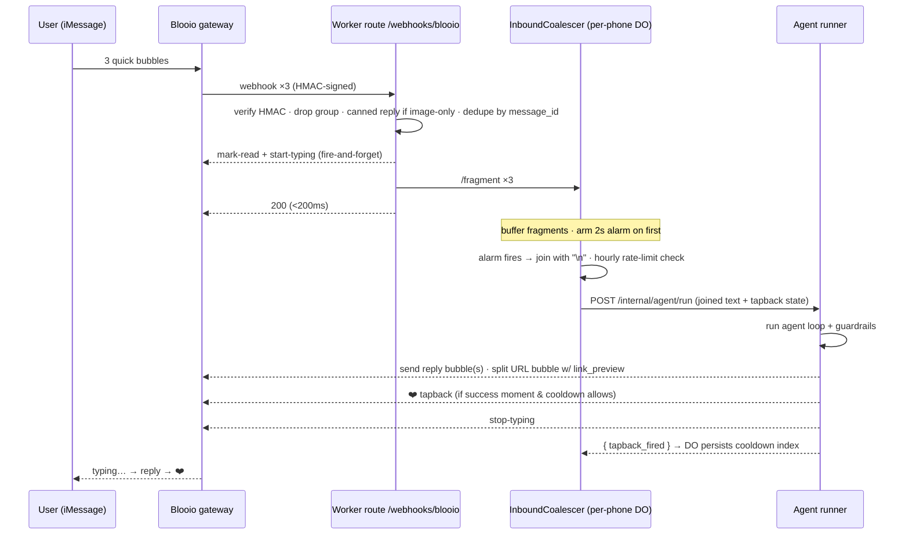

# iMessage Best Practices

This document collects the hard-won UX patterns that make an automated iMessage
agent feel like a person texting back — not a bot blasting form replies. They all
come from a production Cloudflare Worker that runs a conversational agent over the
[Blooio](./BLOOIO-INTEGRATION.md) iMessage gateway. Each pattern is presented as
**problem → approach → reusable takeaway**, with the real code that implements it.

iMessage is an intimate, latency-sensitive channel: people see typing bubbles, read
receipts, tapbacks, and link-preview cards, and they fire off three half-sentences
in a row the way they would to a friend. An agent that ignores those affordances
reads as spam. The patterns below are about closing that gap.

---

## TL;DR / At a glance

- **Coalesce bursts.** Buffer fragments for a 2 s debounce in a *per-phone Durable
  Object*, join with `\n`, treat as one turn. Serializability + in-memory buffer,
  no DB round-trips.
- **Fake the human tells.** Fire `mark-read` + `start-typing` the instant a webhook
  lands; set `use_typing_indicator: true` on every outbound; `stop-typing` after the
  real reply. Two layers, both cheap.
- **Tapbacks, sparingly.** A single ❤️ (`reaction: '+love'`) on genuine success
  moments only, gated by a per-conversation cooldown so a dense burst doesn't spray
  hearts. Edits are not celebrations.
- **One thought per bubble.** Multi-bubble onboarding (greeting+image → how-it-works
  → soft ask) reads as a person, not a wall of text.
- **Link previews need the single-URL rule.** A "text + link" reply must be split
  into two bubbles so the URL-only bubble can carry a branded preview card.
- **Inbound hygiene.** Canned reply for attachment-only messages (the model can't
  see images), drop group chats, dedupe re-delivered webhooks so you never
  double-reply.
- **Throttle and respect quiet hours.** Per-phone hourly cap with a friendly
  throttle message; gate proactive pings to 08:00–21:59 UTC.
- **Honor the gateway's new-contact cap.** Onboard new numbers through a FIFO queue;
  deliver the welcome idempotently and create the user row *after* the first send.
  (The queue/capacity machinery is an **optional extension** — see §8.)

---

## 1. Burst coalescing / debounce

**Problem.** On iMessage, people type the way they talk:

```
> hey
> can you book me a slot
> for thursday
```

That's *one* intent arriving as three webhooks within ~800 ms. If the agent runs
once per webhook, the user gets three overlapping, half-informed replies and three
sets of typing bubbles. It feels broken.

**Approach.** Buffer fragments and flush them as a single turn after a short
quiet period. The natural home is a **per-phone Durable Object** (`InboundCoalescer`):
a DO is single-threaded per key, so all of one phone's fragments serialize through
one instance with no locking, and the buffer lives in memory/DO storage instead of a
remote table you'd round-trip on every keystroke.

The inbound HTTP route does *not* run the agent. It hands the fragment to the DO and
returns `200` in well under 200 ms; the agent runs later, in the DO's **alarm**
execution scope.

```ts
// routes/webhooks-blooio.ts — hand off, then return fast
const id = c.env.INBOUND_COALESCER.idFromName(phone);   // per-phone DO
const stub = c.env.INBOUND_COALESCER.get(id);
await stub.fetch('https://do.internal/fragment', {
  method: 'POST',
  headers: { 'Content-Type': 'application/json' },
  body: JSON.stringify(fragment),
});
return c.json({ ok: true }, 200);
```

Inside the DO, the first fragment of a burst arms a single alarm; later fragments
piggyback on it:

```ts
// do/inbound-coalescer.ts
export const DEBOUNCE_MS = 2_000;

async fragment(req: FragmentRequest): Promise<FragmentResponse> {
  const buf = (await this.state.storage.get<string[]>('fragments')) ?? [];
  buf.push(req.text);
  await this.state.storage.put('fragments', buf);

  // Anchor metadata once — the first fragment's message_id/external_id are
  // the canonical anchors for the whole burst (used later for the tapback).
  if (!(await this.state.storage.get('meta'))) {
    await this.state.storage.put('meta', req.meta);
  }

  // Arm the alarm only if none pending; subsequent fragments ride along.
  if ((await this.state.storage.getAlarm()) === null) {
    await this.state.storage.setAlarm(Date.now() + DEBOUNCE_MS);
  }
  return { buffered: buf.length };
}

async alarm(): Promise<void> {
  const fragments = (await this.state.storage.get<string[]>('fragments')) ?? [];
  await this.state.storage.delete(['fragments', 'meta']);
  const text = fragments.join('\n');     // ← one turn
  // …rate-limit check, then fan out to the agent runner…
}
```

> **Pattern:** A 2 s debounce window in a per-key Durable Object turns "many
> fragments" into "one turn" with zero database round-trips. The triggering HTTP
> request returns immediately; the expensive work runs in the alarm. The DO's
> single-threaded-per-key guarantee gives you serializability for free — no mutex,
> no optimistic-locking dance.

> **Gotcha:** DO storage has **no TTL**, unlike Workers KV. Anything you stash
> (buffers, counters) you must clean up yourself. The coalescer deletes
> `fragments`/`meta` at the top of `alarm()`, and the rate-limit counter
> (below) sweeps the prior hour's key when it rolls into a new bucket.

> **Gotcha:** Anchor per-burst identifiers (the inbound `message_id` you'll later
> react to, the chat `external_id`) on the **first** fragment and reuse them. If you
> grab them off the last fragment you may react to the wrong message, and a tapback
> on the wrong bubble looks worse than none.

---

## 2. Typing + read receipts (the human tells)

**Problem.** The agent loop — context fetch, memory load, a multi-step model call,
tool execution — takes a few seconds. On iMessage, several seconds of *nothing*
after you hit send reads as "ignored" or "broken."

**Approach.** Use a **hybrid two-layer** approach so the human signals fire as early
as possible and stay accurate:

1. **Inbound, immediately:** the webhook route fires `mark-read` + `start-typing`
   *before* it even hands off to the agent. The "Read" receipt and the typing
   bubble appear within the same ~200 ms the route takes to return.
2. **Outbound:** every send sets `use_typing_indicator: true`, so the gateway also
   shows typing right up until each bubble lands.
3. **After the real reply:** `stop-typing` (fire-and-forget) clears any residual
   indicator.

```ts
// routes/webhooks-blooio.ts — fire the acks in parallel, don't block the handoff
c.executionCtx.waitUntil(safeAcks(c, external_id));

async function safeAcks(c, external_id) {
  await Promise.allSettled([
    markRead(c.env, external_id).catch(/* log, never throw */),
    startTyping(c.env, external_id).catch(/* log, never throw */),
  ]);
}
```

```ts
// lib/blooio.ts — outbound also carries the typing flag
export async function sendMessage(env, input) {
  const body = { text: input.text };
  if (input.use_typing_indicator !== false) body.use_typing_indicator = true;
  // … POST /v2/api/chats/{phone}/messages
}
```

The relevant gateway endpoints:

| Endpoint | Method | When |
|---|---|---|
| `/v2/api/chats/{phone}/read` | `POST` | On inbound, immediately |
| `/v2/api/chats/{phone}/typing` | `POST` | On inbound (start) |
| `/v2/api/chats/{phone}/typing` | `DELETE` | After the reply is sent (stop) |
| `messages` body field `use_typing_indicator: true` | — | On every outbound |

> **Pattern:** Acknowledge before you compute. Read-receipt + typing on inbound is
> the cheapest possible "I heard you," and it buys you the multi-second budget the
> agent loop actually needs. Make all of these **fire-and-forget** (`waitUntil` +
> `.catch`) — a failed typing indicator must never delay or fail the real reply.

> **Gotcha:** Don't forget the `stop-typing`. Because the inbound route already
> started typing, a crash between "start" and "reply" can leave the bubble spinning
> forever. Send the stop after the message lands, also fire-and-forget.

---

## 3. Tapbacks as lightweight acknowledgment

**Problem.** A reaction (❤️ on the user's message — an iMessage *tapback*) is a
wonderfully human way to say "got it" without another bubble. But naïve triggers
fire too often: during a dense onboarding burst, almost every turn touches some
state-changing tool, and the user ends up with a screenful of hearts. That's
creepy, not warm.

**Approach.** Two rules: **react only on genuine success moments**, and **enforce a
per-conversation cooldown.**

*Trigger set* (any one fires exactly one ❤️ for the turn). Generalized, these are
"the user committed something real":

| Trigger | Meaning (generic) |
|---|---|
| First time a profile/display name is set | the "nice to meet you" moment |
| A create-record tool succeeded | user added an entity to remember |
| A confirm/select tool succeeded | user made a choice |
| A create-action tool succeeded | user committed to a downstream action |

> **Pattern:** *Edits are not celebration moments.* Update/skip/reschedule tools are
> course-corrections, not wins — they do **not** fire a tapback. Only the first
> creation of a thing is worth a heart.

```ts
// agent/guardrails.ts — pure predicate over the agent's tool steps
export function shouldFireTapback(userBefore, steps): boolean {
  if (firstDisplayNameSet(userBefore, steps)) return true;        // "nice to meet you"
  if (toolSucceededInSteps(steps, 'create_contact'))     return true;
  if (toolSucceededInSteps(steps, 'confirm_booking'))    return true;
  if (toolSucceededInSteps(steps, 'create_request'))     return true;
  if (toolSucceededInSteps(steps, 'create_reminder'))    return true;
  return false;   // update_*/skip_* are edits, not wins → no tapback
}
// "Successful" means the tool's observation is { ok: true } — a tool that
// errored never earns a heart.
```

*Cooldown.* The per-phone Durable Object owns a monotonic inbound-turn counter and
the index at which the last heart fired. The guardrail only reacts if enough turns
have elapsed:

```ts
export const TAPBACK_COOLDOWN_MESSAGES = 4;   // ≤ 1 heart per 4 inbound turns

// allow when: never fired yet, OR (currentIndex - lastIndex) >= cooldown
export function tapbackCooldownAllows(inboundIndex, lastTapbackIndex): boolean {
  if (lastTapbackIndex == null) return true;
  if (inboundIndex == null) return true;          // missing index → no throttle
  return inboundIndex - lastTapbackIndex >= TAPBACK_COOLDOWN_MESSAGES;
}
```

The DO is per-phone, so "the conversation" *is* the DO instance — no extra keying
needed. After the agent run, the DO records the new last-fired index **only if a
tapback actually fired** (read back from the run's response body):

```ts
// do/inbound-coalescer.ts — persist cooldown state based on the real outcome
if (body?.tapback_fired === true) {
  await this.state.storage.put(LAST_TAPBACK_INDEX_KEY, inbound_index);
}
```

The send itself is one call:

```ts
// lib/blooio.ts
export async function sendTapback(env, { phone, message_id, reaction }) {
  await bloo(env, 'POST',
    `/v2/api/chats/${encodeURIComponent(phone)}/messages/${encodeURIComponent(message_id)}/reactions`,
    { reaction: reaction ?? '+love' });   // '+love' = the ❤️ tapback
}
```

> **Pattern:** Treat reactions as a *rate-limited* delight, not a per-event log.
> Define an explicit, narrow trigger set ("creations, not edits") and put a hard
> cooldown on top. The cooldown state belongs wherever your conversation
> serializes — for a per-key DO that's free.

> **Gotcha:** React to the *inbound* message id (anchored on the first burst
> fragment), never to an outbound one. And make the whole thing best-effort: the
> tapback guardrail must never throw, because a failed reaction must not fail the
> turn's actual text reply.

---

## 4. Multi-bubble messages

**Problem.** A single dense paragraph is how an email reads, not how a text reads.
Worse, link previews and inline images have their own bubble rules (see §5). One
fat bubble flattens all of that.

**Approach.** **One thought per bubble.** The onboarding sequence is the canonical
example — a three-bubble cadence:

1. **Greeting + hero image** (an attachment, which renders inline as an MMS-style
   preview). Short and warm. *This is the contact-creating send* (see §8).
2. **How-it-works** — a few bulleted lines explaining the value, with light emoji
   structure.
3. **A soft, single ask** — one question that invites a reply (e.g. *"real quick —
   what's your name?"*), so onboarding becomes a conversation instead of a monologue.

```ts
// domain/deliver-welcome.ts — bubbles sent in sequence
await sendMessage(env, {
  phone,
  text: GREETING_TEXT,                 // bubble 1: short greeting
  attachments: [env.WELCOME_IMAGE_URL],// hero image → inline preview
  use_typing_indicator: true,
  intent: 'welcome_greeting',          // tag → idempotency + dedupe (see §8)
});
// …then bubble 2 (how-it-works) and bubble 3 (the soft ask), best-effort.
```

> **Pattern:** Structure a canned sequence as **greeting+image → value → one
> question**. The image gives the first bubble warmth and a face; ending on a single
> question turns a broadcast into a dialogue. Generalize the *shape*, not the copy —
> this works for a booking assistant, a support concierge, or a sales concierge
> onboarding equally well.

> **Gotcha:** Your conversational memory and the bubbles the user sees can
> legitimately diverge. The *memory* seed for a bubble is sometimes richer than the
> SMS text (extra context the model should know but that doesn't belong in a tight
> iMessage bubble). Keep the two explicit so the agent's "what did I just say"
> context matches reality without bloating the UI.

> **Gotcha:** Order matters and later bubbles are best-effort. The first bubble is
> the one that creates the contact and must succeed-or-retry; bubbles 2–3 failing
> just means a slightly thinner onboarding, not a broken one — so don't let a
> bubble-2 failure flip the whole delivery to "failed."

---

## 5. Link previews done right

**Problem.** You want to send "tap to confirm — `https://…`" with a *branded*
preview card. But the gateway's `link_preview` field only applies when the message
text is **exactly one http(s) URL**. If your bubble is "text + URL," iMessage
ignores your card and auto-fetches the URL's generic preview instead (often an
unbranded or 404 card).

**Approach.** **Split "text + link" into two bubbles:** a lead-in text bubble, then
a URL-only bubble carrying the `link_preview`.

```
bubble 1:  "tap to confirm — one charge of $X.XX covers it"
bubble 2:  "https://…"            ← rendered as a branded preview card
```

The splitter finds the (single) URL, removes it from the lead-in, and cleans up the
punctuation orphaned by the removal (`": —"`, trailing `:`, dangling dashes):

```ts
// domain/link-split.ts (the pattern; the URL set is app-specific)
export function splitLinkText(text, options): { leadIn: string|null; url: string } | null {
  const match = URL_RE.exec(text);
  if (!match) return null;                 // no URL → caller sends one normal bubble
  const url = match[0];
  let leadIn = text.replace(url, '')
    .replace(/:\s*—\s*/, ' — ')            // "confirm: — one charge" → "confirm — one charge"
    .replace(/[:\-—–]\s*$/, '')            // trailing dangling colon/dash
    .replace(/\s{2,}/g, ' ')
    .trim();
  return { leadIn: leadIn.length ? leadIn : null, url };
}
```

```ts
// routes/agent-run.ts — send the two bubbles
const split = splitLinkText(output, { workerBaseUrl: c.env.WORKER_BASE_URL });
if (split) {
  if (split.leadIn) await sendMessage(c.env, { ...base, text: split.leadIn });
  await sendMessage(c.env, {
    ...base,
    text: split.url,                       // URL-only bubble
    link_preview: { image_url: BRAND_PREVIEW_IMAGE_URL, title: BRAND_PREVIEW_TITLE },
  });
} else {
  await sendMessage(c.env, { ...base, text: output });   // ordinary single bubble
}
```

`link_preview` accepts an `image_url` (the gateway fetches it server-side — the URL
never surfaces to the user) and a `title` that overrides the page's `og:title`:

| Field | Notes |
|---|---|
| `image_url` | HTTPS hero image; fetched server-side at send time |
| `title` | Bold title line over the image; overrides `og:title` |

**Inline images** are a separate mechanism: pass `attachments: [publicCdnUrl, …]`
and they render as MMS/inline previews (this is how the welcome hero image in §4
ships).

> **Pattern:** "Branded preview card" and "text in the same bubble" are mutually
> exclusive on iMessage. Make the URL its own bubble. Bonus: short-link the URL so
> the bubble stays tidy, and detect *both* the short and raw forms in the splitter.

> **Gotcha:** Whoever generates the message text (a prompt, a template) doesn't need
> to know about the split — keep the splitter entirely in the send pipeline. That
> way the model can keep emitting natural "tap here: <url>" copy and the transport
> layer reshapes it.

---

## 6. Inbound hygiene

Three filters keep junk and duplicates out of the agent, applied in the webhook
route *before* any expensive work.

**Attachment-only messages.** The text model can't see images. An image/video/audio
message with no text gets a **canned reply** ("can't receive media at this number,
email us at …") rather than being fed to the agent, where it would produce a
confused response:

```ts
// routes/webhooks-blooio.ts
const isImageOnly =
  (attachments.length > 0 || nonTextType) && text.length === 0;
if (isImageOnly) {
  c.executionCtx.waitUntil(safeStockReply(c, phone));   // fire-and-forget canned reply
  return c.json({ ok: true, replied: 'stock_image' }, 200);
}
```

**Group chats.** The gateway prefixes group chat ids; this agent is 1:1 only, so
group messages are dropped with a `200`:

```ts
if (external_id.startsWith('grp_')) {
  return c.json({ ok: true, ignored: 'group' }, 200);
}
```

**Idempotent dedupe.** Webhooks get re-delivered. Without dedupe, a redelivery
double-replies. The route writes the inbound `message_id` to a primary-keyed table;
a PK collision *is* the duplicate signal, and the gate **graceful-degrades** if the
table is missing (a rare double-reply beats never replying):

```ts
const dedupe = await dedupeBlooioInbound(c.env, message_id);
if (!dedupe.fresh) {
  return c.json({ ok: true, ignored: 'duplicate' }, 200);   // already processed
}
```

The dedupe table is `inbound_webhook_events`, one of the core tables the template
ships:

```
inbound_webhook_events(message_id PK, received_at)   -- PK collision = duplicate
```

> **Pattern:** Use a **PK-collision-as-dedup** table for every at-least-once webhook
> source (inbound messages, payment webhooks, etc.). Insert the event id; if it
> conflicts, you've already handled it. See [INFRASTRUCTURE.md](./INFRASTRUCTURE.md)
> for the generalized idempotency-table pattern and
> [BLOOIO-INTEGRATION.md](./BLOOIO-INTEGRATION.md) for the inbound event shape.

> **Gotcha:** The whole route **always returns `200`** (the only exception is HMAC
> failure → `401`). If an internal step throws, you log + page ops but still return
> `200`, because a `5xx` tells the gateway to *retry* — and a retry storm on a
> transient bug is far worse than one dropped message you can see in your logs.

---

## 7. Rate limiting + quiet hours

**Problem.** A stuck client, a loop, or a bad actor can hammer the number. And
proactive (system-initiated) pings sent at 3 a.m. are a great way to get blocked.

**Approach — inbound rate limit.** The per-phone DO enforces an **atomic hourly
cap**. Because the DO is single-threaded per phone, the counter needs no locking.
DO storage has no TTL, so it buckets by hour and sweeps the previous bucket when it
rolls over:

```ts
// do/inbound-coalescer.ts
export const RATE_LIMIT_PER_HOUR = 100;

private async bumpHourlyCount(): Promise<number> {
  const bucket = Math.floor(Date.now() / 3_600_000);
  const k = `cnt:${bucket}`;
  const next = ((await this.state.storage.get<number>(k)) ?? 0) + 1;
  await this.state.storage.put(k, next);
  if (next === 1) await this.state.storage.delete(`cnt:${bucket - 1}`); // sweep
  return next;
}
```

When the cap trips, the user gets one **friendly throttle message** — not silence,
which would read as broken:

```ts
const count = await this.bumpHourlyCount();
if (count > RATE_LIMIT_PER_HOUR) {
  await sendRateLimitSMS(this.env, meta.phone);  // "woah, I need a break — try again in an hour"
  return;                                        // and the burst is dropped
}
```

**Approach — quiet hours.** Proactive pings (onboarding nudges, reminders) are
gated to daytime UTC. Here it's enforced in the candidate-selection query, so a
nudge simply isn't *eligible* outside the window:

```sql
-- the proactive-ping candidate selector only returns rows during the window
AND EXTRACT(HOUR FROM NOW() AT TIME ZONE 'UTC') BETWEEN 8 AND 21
-- → pings fire 08:00–21:59 UTC; the 22:00–08:00 quiet window stays silent
```

> **Pattern:** Two different limiters for two different risks. Inbound: a per-phone
> hourly counter with a friendly "try again later" reply — never silence. Outbound
> proactive: a quiet-hours gate (and a cadence limit) so the system never texts
> someone in the middle of the night. Reactive replies to a user who just texted you
> are *not* subject to quiet hours — they asked.

> **Gotcha:** "Quiet hours" in a single fixed UTC window is a simplification — it's
> not the user's local night. For a global audience, store each user's timezone and
> gate on local time. The fixed-UTC window is a reasonable v1 when your users
> cluster in a few zones; flag it as a known limitation.

---

## 8. New-contact capacity & idempotent welcome

**Problem.** iMessage gateway plans cap how many **brand-new contacts** you may
message per rolling 24 h (e.g. a Starter plan = 5 new contacts/day). The *first*
message to a never-before-texted number is the one that consumes that cap. Blast
past it and the gateway `429`s — or worse, silently degrades deliverability. Mass
signups can't all be welcomed instantly.

> **Scope note — optional extension.** The base template does **not** ship the
> per-number capacity registry, the FIFO signup queue, or short-link tables. Those
> are documented here (and in [INFRASTRUCTURE.md](./INFRASTRUCTURE.md)) as an
> opt-in extension you add when your volume actually approaches the gateway cap.
> The **idempotent-welcome** half of this section, by contrast, uses only the core
> `users` and `messages` tables and applies from day one.

**Approach — FIFO queue + drain (optional).** New signups land in a `signup_queue`
and are drained at the plan's rate; a sender-capacity registry tracks each number's
daily allowance. The mechanics live in [INFRASTRUCTURE.md](./INFRASTRUCTURE.md); the
relevant tables (again, **not** in the base scaffold — add them with this extension):

```
phone_numbers(blooio_number, label, daily_new_contact_cap default 5, reserve,
              active, priority)                      -- sender capacity registry
signup_queue(phone, kind new|returning, status queued|claimed|sent|failed,
             attempts, slot_at, …)                   -- FIFO onboarding queue
```

**Approach — idempotent welcome delivery (core).** The welcome path must be safe to
retry (a drain reclaim, a redelivery, a worker death mid-sequence). Two ordering
rules make it correct, and they rely only on the core `users` and `messages` tables:

1. **Idempotency check first.** If this phone already got the greeting (a tagged
   `messages` row, or a `users` row already exists), the contact was already
   created — skip, so a retry never creates a *second* gateway contact or
   double-texts the user.
2. **Send before the user row.** Create the `users` row *only after* the first
   bubble succeeds. A failed send therefore leaves **no orphan** user row — so a
   re-submit of a never-welcomed person isn't misclassified as "returning."

```ts
// domain/deliver-welcome.ts — the two guarantees, in order
const alreadyGreeted = await selectOne(env, 'messages',
  `?phone=eq.${enc(phone)}&intent=eq.welcome_greeting&limit=1`);
const existingUser  = await selectOne(env, 'users', `?phone=eq.${enc(phone)}&limit=1`);
if (alreadyGreeted || existingUser?.id) {
  return { ok: true, retryable: false, user_id: existingUser?.id ?? null }; // skip
}

// Bubble 1 = the contact-creating send. Sent BEFORE the users row.
try {
  await sendMessage(env, { phone, text: GREETING_TEXT, attachments: [env.WELCOME_IMAGE_URL],
                           intent: 'welcome_greeting' });
} catch (e) {
  const status = e instanceof BlooioError ? e.status : 0;
  const retryable = status === 429 || status === 0 || status >= 500; // cap/network/5xx → retry
  return { ok: false, retryable, status, user_id: null };            // no orphan user row
}
// Only now create the durable "welcomed" marker:
const user = await upsertRow(env, 'users', { phone }, { onConflict: 'phone', returning: true });
```

Note the **error classification**: a `429` (cap hit), a network error, or a `5xx`
is *transient* — release the reserved slot and re-queue. Any other `4xx` (e.g. a bad
number) is *permanent* — give up and page ops. This keeps the queue draining
correctly instead of burning retries on unfixable rows.

> **Pattern:** When the *first* outbound is the scarce/capped action, do it
> **before** persisting the entity it represents, and make the whole path
> idempotent on a durable marker (a tagged message row or the entity's existence).
> Then a redelivery, a queue reclaim, or a mid-sequence crash converges to "exactly
> one welcome" instead of duplicates or orphans.

> **Gotcha:** Tag the contact-creating send with a stable `intent` (here
> `'welcome_greeting'`) so your idempotency check has something precise to look for.
> Without the tag you can't distinguish "already welcomed" from "any prior message."

---

## Putting it together — the inbound lifecycle



---

## Cheat sheet — knobs & their defaults

| Constant | Default | What it controls |
|---|---|---|
| `DEBOUNCE_MS` | `2000` | Burst-coalescing window (§1) |
| `RATE_LIMIT_PER_HOUR` | `100` | Per-phone inbound hourly cap (§7) |
| `TAPBACK_COOLDOWN_MESSAGES` | `4` | Min inbound turns between hearts (§3) |
| `reaction` | `'+love'` | The ❤️ tapback (§3) |
| Quiet hours | `08:00–21:59 UTC` eligible | Proactive-ping window (§7) |
| `daily_new_contact_cap` | `5` | New contacts/24 h per sender number (§8, optional extension) |
| `intent: 'welcome_greeting'` | — | Idempotency tag on the contact-creating send (§8) |
| `use_typing_indicator` | `true` | Per-outbound typing layer (§2) |

---

## See also

- [README.md](./README.md) — index for this reference set
- [ARCHITECTURE.md](./ARCHITECTURE.md) — end-to-end request lifecycle + component map
- [BLOOIO-INTEGRATION.md](./BLOOIO-INTEGRATION.md) — gateway API reference (endpoints, wire shapes, HMAC)
- [AGENT-LOOP.md](./AGENT-LOOP.md) — the Anthropic Messages agent loop these UX patterns wrap
- [PROMPT-BEST-PRACTICES.md](./PROMPT-BEST-PRACTICES.md) — making the *copy* in these bubbles read like a person
- [INFRASTRUCTURE.md](./INFRASTRUCTURE.md) — Durable Object config, the optional queue/drain + capacity registry, cron, data layer
- [REFERRAL-ARCHITECTURE.md](./REFERRAL-ARCHITECTURE.md) — the referral system (opt-in, migration `0002_referral.sql`) referenced by the welcome path
