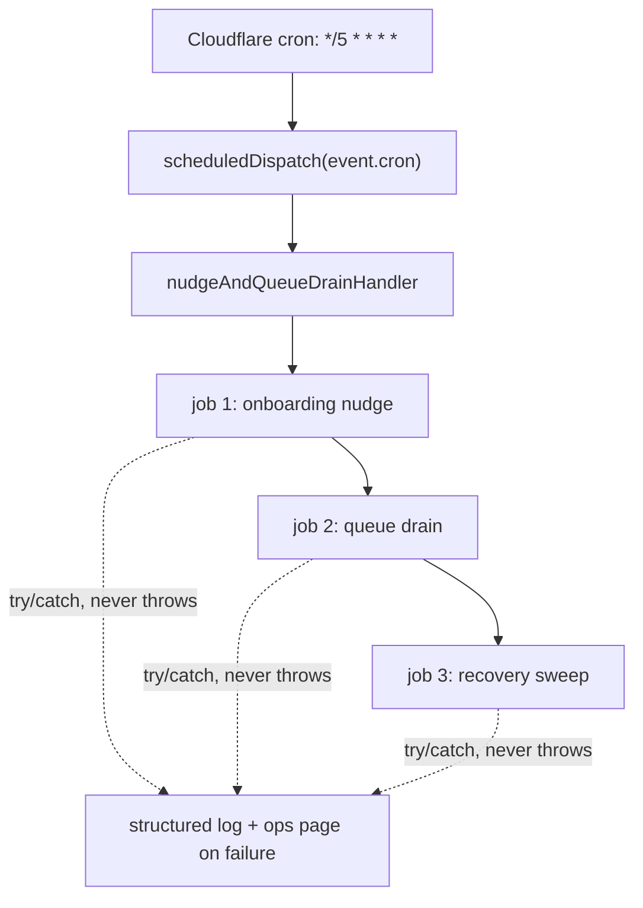
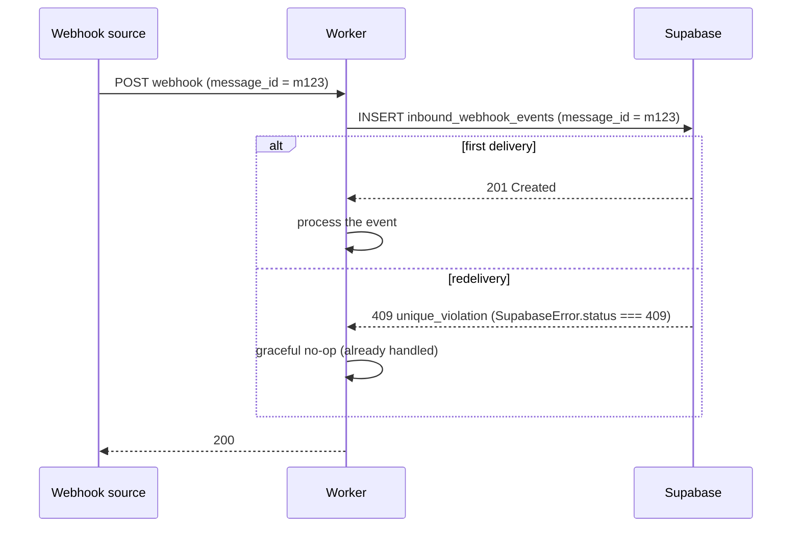

# Infrastructure, Config & Operations

This doc is the operations manual for the Worker: everything you need to stand it up, configure it, observe it, and keep it running. It covers the `wrangler.toml` anatomy, the vars-vs-secrets split, the feature-flag / kill-switch convention, the cron model (and the 5-trigger account cap that shapes it), the Supabase-over-PostgREST data layer, idempotency patterns, observability wiring, and a deploy checklist. The conventions transfer to any Cloudflare-hosted concierge agent.

## TL;DR / At a glance

- **Single module-worker** with a `{ fetch, scheduled }` default export. Hono owns HTTP; `scheduled` dispatches cron by `event.cron`.
- **Two envs** in one `wrangler.toml`: `test` (plain route, no crons) and `production` (custom domain, owns all crons). Bindings are **not** inherited into named envs — they're repeated per env.
- **Config split:** public, non-secret values are `vars` in `wrangler.toml`; secrets go through `wrangler secret put` / `.dev.vars`. Never inline a secret as a var.
- **Feature flags & kill-switches are string vars** compared to `"true"`/`"false"`. An operator flips behavior with no redeploy.
- **5 cron triggers max per account.** Multiple daily jobs **ride along** inside fewer triggers — one handler `await`s several self-contained, never-throwing jobs in sequence.
- **Data layer is Supabase over PostgREST** with the **service-role key** server-side (a ~150-line hand-rolled `fetch` wrapper, no ORM).
- **Idempotency = a PK table per webhook source.** Insert collides with `409` → it's a duplicate → graceful no-op.
- **Observability:** Cloudflare Workers Logs (structured JSON), Sentry `captureException`, a Slack `#ops` pager, and `/healthz?deep=1` dependency probes. None of them can throw back into a request.
- **Security note:** only the **service-role** key is used; the anon key is unused and RLS is disabled on several tables. Safe today, hazardous the moment a client/anon key is exposed — enable RLS if you ship a client.

---

## 1. `wrangler.toml` anatomy

The whole Worker config lives in one file. Top-level keys apply to the default (un-named) worker; per-env tables under `[env.X]` override and **do not inherit bindings** — a gotcha worth pinning up front.

```toml
name = "imessage-agent"
main = "src/index.ts"
compatibility_date = "2026-04-01"
compatibility_flags = ["nodejs_compat"]

# Inline every *.md file as a string default export (esbuild's text loader).
# Lets `prompts/agent-system.md` be `import`ed directly as the agent's system prompt.
rules = [
  { type = "Text", globs = ["**/*.md"], fallthrough = true },
]

[observability]
enabled = true   # Workers Logs panel, both envs

[[migrations]]
tag = "v1"
new_sqlite_classes = ["InboundCoalescer"]
```

### The pieces, and why each matters

| Key | Purpose | Reusable lesson |
|---|---|---|
| `main` | Entry module — the `{ fetch, scheduled }` default export | One module ships both HTTP and cron |
| `compatibility_date` | Pins the Workers runtime semantics | Bump deliberately; it changes runtime behavior |
| `compatibility_flags = ["nodejs_compat"]` | Node built-ins (`crypto`, `Buffer`, …) inside the Worker | Needed by most SDKs; turn it on early |
| `rules` (Text loader) | Inlines `**/*.md` as string imports | **Pattern:** ship a long system prompt as a versioned `.md` file `import`ed at build time — no runtime fetch, no KV read, prompt changes ride your normal deploy |
| `[observability] enabled = true` | Turns on the Workers Logs panel | Free structured-log retention in the dashboard |
| `[[migrations]] new_sqlite_classes` | Registers the Durable Object class for SQLite-backed storage | Required exactly once when you introduce a new DO class |

> **Gotcha:** the `rules` table must appear **before** any TOML table-array section (like `[[migrations]]`). A `rules = [...]` line placed after a `[[…]]` block gets parsed as a member of that array, not as a top-level key, and silently stops inlining your `.md` files.

> **Pattern — system prompt as a build-time string import.** The Text rule turns `import systemPrompt from '../prompts/agent-system.md'` into a plain string. The prompt is versioned in git, diffable in PRs, and shipped atomically with the code that depends on it — no separate config store to keep in sync.

### Durable Object binding + the SELF service binding

The DO **class** is declared once at top level (`[[migrations]] new_sqlite_classes`), but the **binding** must be repeated in every env because named envs don't inherit top-level bindings:

```toml
[[env.production.durable_objects.bindings]]
name = "INBOUND_COALESCER"      # how code addresses it: env.INBOUND_COALESCER
class_name = "InboundCoalescer" # the exported class

[[env.production.services]]
binding = "SELF"                        # env.SELF — a Fetcher pointing back at this Worker
service = "imessage-agent-production"   # the deployed service name for THIS env
```

The DO class is re-exported from the entry module so wrangler can register it:

```typescript
// src/index.ts
export { InboundCoalescer } from './do/inbound-coalescer.js';
```

> **Pattern — the SELF service binding.** A Durable Object alarm can't call a Hono route on `localhost`. Bind the Worker to *itself* (`SELF`), and the DO does `env.SELF.fetch('https://internal/internal/agent/run', …)` to invoke an internal route. The service name in `service = "imessage-agent-<env>"` must match the deployed name for that env, or the binding resolves to the wrong Worker.

See [ARCHITECTURE.md](./ARCHITECTURE.md) for how the inbound route, the `InboundCoalescer` DO, and the `SELF`-bound `/internal/agent/run` route hand off to each other.

### Routes: plain route vs `custom_domain`

The two envs attach to the edge differently:

```toml
# test — plain route on an EXISTING DNS record
[env.test]
routes = [
  { pattern = "api-test.example.co/*", zone_name = "example.co" },
]

# production — custom_domain auto-provisions the DNS record + edge cert
[env.production]
routes = [
  { pattern = "api.example.co", custom_domain = true },
]
```

| Mode | When | Notes |
|---|---|---|
| Plain `route` + `zone_name` | DNS record already exists | Pattern usually ends in `/*`; you manage the DNS record |
| `{ custom_domain = true }` | wrangler should own DNS + TLS | wrangler provisions the record and edge certificate; pattern is the bare hostname (no `/*`) |

---

## 2. Config strategy: vars vs secrets

There are two config channels, and the rule is simple: **if it's a credential, it's a secret; otherwise it's a var.**

| | **Vars** | **Secrets** |
|---|---|---|
| Where | `wrangler.toml` `[env.X.vars]` | `wrangler secret put` (deployed) / `.dev.vars` (local) |
| Visibility | Plaintext, committed to git | Encrypted at rest, never in git |
| Use for | URLs, model IDs, feature flags, non-sensitive tuning | API keys, signing secrets, DB service-role keys, bearer tokens |
| Change cost | Redeploy (it's in the bundle) | `wrangler secret put` — no redeploy of code |

Both surface on a single typed `Env` interface — one source of truth for what the Worker can touch:

```typescript
export interface Env {
  // ── Vars (public, in wrangler.toml) ──
  ENVIRONMENT: 'test' | 'production' | string;
  SUPABASE_URL: string;
  WORKER_BASE_URL: string;
  ANTHROPIC_MODEL_AGENT: string;
  // ...feature flags as strings (see §3)...

  // ── Secrets (wrangler secret put / .dev.vars) ──
  BLOOIO_HMAC_SECRET: string;
  BLOOIO_API_KEY: string;
  ANTHROPIC_API_KEY: string;
  SUPABASE_SERVICE_ROLE_KEY: string;
  OPS_BEARER_TOKEN: string;
  SENTRY_DSN: string;
  SLACK_OPS_WEBHOOK_URL: string;

  // ── Bindings ──
  INBOUND_COALESCER: DurableObjectNamespace;
  SELF: Fetcher;
}
```

### Reusable secret names (portable to any project)

| Secret | What it gates |
|---|---|
| `BLOOIO_HMAC_SECRET` | Verifies the inbound webhook signature (HMAC; see [BLOOIO-INTEGRATION.md](./BLOOIO-INTEGRATION.md)) |
| `BLOOIO_API_KEY` | `Authorization: Bearer` for all outbound iMessage gateway calls |
| `ANTHROPIC_API_KEY` | `x-api-key` for the Messages API agent loop |
| `SUPABASE_SERVICE_ROLE_KEY` | Server-side DB access (bypasses RLS) |
| `OPS_BEARER_TOKEN` | Shared secret gating service-binding-only internal routes and manual ops curls |
| `SENTRY_DSN` | Error capture endpoint (empty = no-op) |
| `SLACK_OPS_WEBHOOK_URL` | Ops pager webhook (empty = no-op) |

> **Pattern — empty-secret means disabled.** Every optional integration (`SENTRY_DSN`, `SLACK_OPS_WEBHOOK_URL`) checks `if (!env.X) return;` and no-ops when unset. Local dev and tests run with those secrets blank and never page anyone or hit a third party.

> **Pattern — the internal-route bearer.** `OPS_BEARER_TOKEN` is one shared secret with two jobs: it authenticates the DO → `SELF` fan-out into `/internal/agent/run`, and it gates the manual ops curls (e.g. `POST /…-run-refund-cron`). Internal routes are reachable only via the service binding *and* the bearer — never publicly.

**Domain-specific secrets** (a payment-provider key, additional webhook signing secrets, an email-provider key, any third-party vendor auth) follow the exact same channel — they're just `[env].secrets` named for your integrations. Treat them as placeholders when porting this architecture.

### Local secrets: `.dev.vars`

`.dev.vars` is a gitignored key=value file that `wrangler dev` loads as secrets:

```bash
cp .dev.vars.example .dev.vars   # then fill in real values from your secret store
```

Never commit `.dev.vars`. Verify it's gitignored before every commit.

### The `wrangler --config` / `--env` gotcha

> **Gotcha:** always pass **both** `--config ./wrangler.toml` **and** `--env <env>` on every wrangler command. In a monorepo where another `wrangler.*` config exists at the repo root, a bare `wrangler deploy` can pick up the *wrong* config and deploy a stray worker to the wrong name/route. The npm scripts below bake the flags in so you never type a bare invocation by hand.

---

## 3. Feature flags & kill-switches (no-redeploy control)

The convention: **a flag is a string var compared to a literal `"true"` / `"false"`.** Because it's a var, an operator can flip it from the dashboard (or `wrangler`) and the next request sees the new value — no code change, no redeploy.

```typescript
// Enabled ONLY when exactly "true". Anything else (unset, "", "false") = off.
if (env.SOME_FEATURE_ENABLED === 'true') {
  // ...the gated behavior...
}

// Kill-switch idiom: ON by default, disabled only by an exact "false".
const refundLive = env.AUTO_REFUND_ENABLED !== 'false'; // defaults safe-ON
```

Pick the polarity to match the safe default:

| Idiom | Default when unset | Use for |
|---|---|---|
| `=== 'true'` | **off** | New/risky behavior you opt *into* (e.g. enable an external mirror, share a contact card via `SHARE_CONTACT_ENABLED`) |
| `!== 'false'` | **on** | Safety behavior you only ever opt *out* of (e.g. auto-refund a charged-but-incomplete action) |

### Worked example — a "paused" kill-switch + allowlist

A generic money-safety guard. Suppose the agent can trigger a real charge through a payment provider, but you want a global pause while you finish validating the live path — without losing the ability to self-test it. Two vars gate it:

```toml
# When "true", refuse the gated action for anyone NOT on the allowlist.
AGENT_PAUSED = "true"
# Comma-separated E.164 lines exempt from the pause (operator test numbers),
# so the live path can still be self-tested while paused.
AGENT_ALLOWLIST = "+12485550123"
```

```typescript
const paused = env.AGENT_PAUSED === 'true';
const allow = env.AGENT_ALLOWLIST.split(',').map((s) => s.trim());
if (paused && !allow.includes(ctx.phone)) {
  return refuse('action paused');
}
```

> **Pattern — paired pause + allowlist.** A blanket kill-switch is binary and blunt; pairing it with an allowlist lets the operator keep the dangerous path *self-testable* while it's globally off. One flip of `AGENT_PAUSED` to `"false"` re-opens it for everyone the instant you're ready.

> **Gotcha:** flags are **strings**, not booleans. `env.X === true` is always false. Always compare to the literal `'true'` / `'false'` string. And `=== 'true'` vs `!== 'false'` are *not* interchangeable — they differ for the unset/empty case, which is exactly the case that bites you.

A second flag channel — a KV namespace (the reserved `APP_FLAGS` namespace) read at runtime — is reserved for flags an operator must flip *mid-incident* without touching `wrangler.toml`. KV reads are async and cost a binding; the string-var channel is preferred for anything that can wait for a deploy or be set as a var.

---

## 4. Cron & scheduling

### The single `scheduled` dispatcher

Cloudflare invokes one `scheduled` export with the firing cron string in `event.cron`. The Worker dispatches from a map:

```typescript
const CRON_HANDLERS: Record<
  string,
  (event: ScheduledEvent, env: Env, ctx: ExecutionContext) => Promise<void>
> = {
  '0 12 * * *': dailyScanHandler,
  '0 8 * * *':  refundAndRefreshHandler,      // ride-along: two jobs
  '*/5 * * * *': nudgeAndQueueDrainHandler,    // ride-along: three jobs
  '0 13 * * *': maturationAndDigestHandler,    // ride-along: three jobs
  '0 0 1 * *':  monthlyPayoutHandler,
};

async function scheduledDispatch(controller, env, ctx) {
  const handler = CRON_HANDLERS[controller.cron];
  if (!handler) {
    log.warn('scheduled.unknown_cron', { cron: controller.cron });
    ctx.waitUntil(postOpsError(env, { route: 'scheduledDispatch',
      error: `no handler for cron '${controller.cron}'` }));
    return;
  }
  return handler(controller as unknown as ScheduledEvent, env, ctx);
}

export default {
  fetch: app.fetch,          // Hono router
  scheduled: scheduledDispatch,
} satisfies ExportedHandler<Env>;
```

> **Pattern — fail-loud on an unmapped cron.** If `wrangler.toml` declares a cron that `CRON_HANDLERS` doesn't know, the dispatcher logs and **pages ops** rather than silently doing nothing. The map and the `[triggers] crons` list must be kept in lockstep; this turns a config drift into a visible alert.

### The 5-trigger account cap → the ride-along pattern

A Cloudflare account is capped at **5 cron triggers total**. Real systems want more than 5 scheduled jobs. The fix: **multiple jobs ride along inside one trigger** — a single handler `await`s several self-contained jobs in sequence.

```typescript
// One trigger (*/5) runs three independent jobs back-to-back.
async function nudgeAndQueueDrainHandler(event, env, ctx) {
  await onboardingNudgeHandler(event, env, ctx);
  await queueDrainHandler(event, env, ctx);
  await recoverySweepRideAlong(env, ctx); // self-contained + never throws
}
```

The rule that makes this safe: **every ride-along job must be self-contained and must never throw.** If job 2 could throw, it would skip job 3. So each job wraps its own work in `try/catch`, logs, and returns — a failure in one is contained and cannot break the others sharing the trigger.



A typical 5-trigger budget, with ride-alongs noted:

| Cron | Primary job | Rides along |
|---|---|---|
| `0 12 * * *` | daily scan | — |
| `0 8 * * *` | daily refund reconcile | weekly data refresh (age-gated: re-syncs only if >6 days stale) |
| `*/5 * * * *` | onboarding nudge | queue drain; charged-but-incomplete recovery sweep |
| `0 13 * * *` | payout maturation | daily ops-digest email; referral-credit expiry |
| `0 0 1 * *` | monthly payout sweep | — |

> **Gotcha:** the cap is **per account**, not per Worker. The production Worker here owns **all 5** triggers. The test Worker runs **cron-less** (`crons = []`) — its jobs are still exercisable via the manual ops routes (e.g. `POST /…-run-queue-drain`, OPS-bearer gated). Restoring test crons means either upgrading the plan or temporarily freeing a prod trigger.

> **Pattern — age-gated ride-along.** A *weekly* job can ride a *daily* trigger by checking its own last-run timestamp at the top and returning early if it ran recently (here: skip the data re-sync unless the cached index is >6 days old). No dedicated trigger, no extra cron — the job self-throttles.

Trigger a scheduled handler locally:

```bash
wrangler dev --config ./wrangler.toml --env test --test-scheduled --scheduled "*/5 * * * *"
```

---

## 5. Data layer: Supabase over PostgREST

The data layer is Supabase's PostgREST REST API, hit directly with `fetch` through a thin hand-rolled wrapper (`lib/supabase.ts`, ~150 lines). No ORM, no `postgrest-js` — which keeps the bundle small and the surface obvious for a small schema.

Every call carries the **service-role key** in both `apikey` and `Authorization: Bearer`:

```typescript
const headers = {
  apikey: env.SUPABASE_SERVICE_ROLE_KEY,
  Authorization: `Bearer ${env.SUPABASE_SERVICE_ROLE_KEY}`,
};
```

### Public surface

| Function | PostgREST verb | Notes |
|---|---|---|
| `selectRows<T>(env, table, query)` | `GET` | `query` is the raw query string starting with `?` (e.g. `?id=eq.42&select=id,name`); caller URI-encodes values |
| `selectOne<T>(env, table, query)` | `GET` | first row or `null` |
| `insertRow<T>(env, table, row, {returning})` | `POST` | `Prefer: return=representation` or `return=minimal` |
| `updateRows<T>(env, table, filter, patch)` | `PATCH` | `filter` like `id=eq.<uuid>` |
| `upsertRow<T>(env, table, row, {onConflict})` | `POST` | `Prefer: resolution=merge-duplicates` |
| `upsertRows(env, table, rows[], {onConflict})` | `POST` | bulk, `return=minimal`, no-ops on empty array |
| `deleteRows(env, table, filter)` | `DELETE` | — |
| `rpcCall<T>(env, fn, args)` | `POST /rpc/{fn}` | invoke a Postgres function (e.g. a candidate-selection RPC) |

### `SupabaseError` carries `.status` — the key to dedupe

A non-2xx response throws a typed error whose `.status` is the HTTP code. That status is what makes insert-or-409 idempotency (next section) work:

```typescript
export class SupabaseError extends Error {
  override readonly name = 'SupabaseError';
  constructor(
    readonly status: number,     // ← inspect this for 409 (unique-violation)
    readonly bodyText: string,
    readonly method: string,
    readonly path: string,
  ) { super(`Supabase ${method} ${path} → ${status}: ${bodyText.slice(0, 240)}`); }
}
```

### The template's tables

The base template ships five core tables (migration `0001`), always present:

| Table | Shape | Pattern it encodes |
|---|---|---|
| `users` | `id, phone (E.164), created_at, …` | **Canonical contact record** keyed by phone |
| `messages` | `id, user_id, phone, direction in\|out, body, intent, sent_at, external_id, message_id, metadata jsonb` | **Log every inbound and outbound** message for audit + replay |
| `chat_history` | `id bigserial, session_id=<E.164 phone>, message jsonb {type: human\|ai, data:{content,…}}, created_at` | **Conversation memory** keyed by phone; LangChain-shaped so off-the-shelf memory loaders work — see [AGENT-LOOP.md](./AGENT-LOOP.md) |
| `inbound_webhook_events` | `message_id PK, received_at` | **Webhook idempotency** — one PK table per source (§6) |
| `audit_log` | `event, user_id, metadata jsonb, created_at` | **Durable admin event sink** — every state change recorded |

The **referral add-on** (opt-in, migration `0002`) extends `users` with `referral_code`, `referred_by_user_id`, and `referral_credit_cents`, and adds two tables:

| Table | Shape | Pattern it encodes |
|---|---|---|
| `referral_credits` | `user_id, amount_cents SIGNED, reason, related_user_id, related_order_id, expires_at` | **Append-only credit ledger** — never mutate, only append; see [REFERRAL-ARCHITECTURE.md](./REFERRAL-ARCHITECTURE.md) |
| `affiliates` | `code, owner, rate, …` | **Affiliate registry** — unifies operator-driven referrals with the peer ledger above |

> **Pattern — append-only ledgers over mutable counters.** Credits, payouts, and balances are stored as signed append-only rows, not a single `balance` column you `UPDATE`. The truth is `SUM(amount_cents)`; a denormalized counter (`users.referral_credit_cents`, kept for speed) is reconciled against the recomputed ledger by a daily cron. Append-only is auditable and immune to lost-update races.

#### Optional extension — capacity registry + FIFO signup queue + short links

Some deployments need to rate-limit *new* outbound contacts because an upstream gateway caps how many fresh conversations a sender number may start per 24h. The pattern below documents how to do that — but **the base template does not ship these tables** (`phone_numbers`, `signup_queue`, `short_links`); add them yourself if you need this behavior.

| Table | Shape | Pattern it encodes |
|---|---|---|
| `phone_numbers` | `blooio_number, label, daily_new_contact_cap (default 5), reserve, active, priority` | **Sender-capacity registry** — gateways cap new-contact rate per number |
| `signup_queue` | `phone, kind new\|returning, status queued\|claimed\|sent\|failed, attempts, slot_at` | **FIFO onboarding queue** that rate-limits new contacts to the cap |
| `short_links` | `code PK (7-char base62), url, uses, last_used_at` | **SMS-friendly short URLs** — long links wreck a text bubble |

> **Pattern — capacity registry + FIFO queue.** When an upstream gateway caps the rate of *new* contacts (e.g. 5 new conversations / 24h per sender), don't fire onboarding messages inline. Enqueue them in `signup_queue` and let a `*/5` cron drain the queue against the per-number `daily_new_contact_cap` in `phone_numbers`. Backpressure becomes a row count, not a dropped message.

---

## 6. Idempotency patterns

The gateway (and any third-party webhook) will redeliver. The Worker is idempotent by construction: **one PK table per webhook source; the first insert wins, a colliding insert is a duplicate.**



```typescript
try {
  await insertRow(env, 'inbound_webhook_events', { message_id });
} catch (e) {
  if (e instanceof SupabaseError && e.status === 409) {
    return; // duplicate delivery — already processed, no-op
  }
  throw e;  // a real DB error — let it surface
}
```

The same `*_webhook_events(<id> PK, received_at)` shape covers every source: the iMessage gateway dedupes on `message_id` via `inbound_webhook_events`; if you add a payment-provider webhook, give it its own table keyed on the provider's `event_id`. One table, one PK, one collision check per source.

> **Pattern — let the database be the lock.** A unique constraint on the message/event id makes the insert *itself* the dedupe primitive. No `SELECT`-then-`INSERT` race, no distributed lock — the PK collision (`409`) is the answer. This is the cheapest correct idempotency you can build.

> **Gotcha — graceful-degrade on the dedupe write.** The inbound webhook route **always returns 200** to the upstream (only an HMAC failure returns `401`), even if the dedupe insert errors for a non-409 reason. The gateway must never retry on the Worker's *internal* failure — a retry storm is worse than one dropped event you can see in the logs. See [ARCHITECTURE.md](./ARCHITECTURE.md) and [BLOOIO-INTEGRATION.md](./BLOOIO-INTEGRATION.md).

---

## 7. Observability & ops

Four independent signals. The unifying rule: **observability code can never throw back into the request it's reporting on.** Every helper is wrapped, logged, and swallowed.

### Structured JSON logging

One line = one event = one JSON object, so `wrangler tail | jq` always parses cleanly:

```typescript
log.info('inbound.received', { phone, message_id });
log.warn('data_refresh.skipped', { reason });
log.error('unhandled', { route, message: err.message });
```

A subtle safety detail: a data field literally named `event` can't clobber the log's own event name — the emitter spreads user fields first, then pins `ts`, `level`, `event` last, preserving any colliding `event` under `event_value`.

### Cloudflare Workers Logs

`[observability] enabled = true` turns on the dashboard log panel for both envs. Live tail:

```bash
wrangler tail --config ./wrangler.toml --env production
wrangler tail --config ./wrangler.toml --env production --status error
```

### Sentry (`captureException`)

A dependency-free, single-`fetch` Sentry client — no SDK (the official Cloudflare SDK pulls ~80 KB the Worker doesn't need). It posts one event envelope to Sentry's store endpoint, parses the DSN itself, and **no-ops when `SENTRY_DSN` is unset**. Called from Hono's `onError`.

### Slack `#ops` pager (`postOpsError`)

The primary human pager. `postOpsError` posts a structured message to a Slack incoming webhook, **never throws**, and **no-ops when `SLACK_OPS_WEBHOOK_URL` is unset**. There's a companion `postOpsHeartbeat` so cron jobs can confirm they ran on a zero-result day, routed/muted separately from real pages.

### How error reporting is wired — fire-and-forget via `waitUntil`

Hono's `onError` flushes the 500 response **first**, then lets Sentry and Slack finish *after* the response via `waitUntil` — so paging never blocks or delays the response, and a failing pager can't turn a 500 into a hang:

```typescript
app.onError((err, c) => {
  const route = new URL(c.req.url).pathname;
  log.error('unhandled', { route, message: err.message, stack: err.stack });
  c.executionCtx.waitUntil(captureException(c.env, err, { route }));
  c.executionCtx.waitUntil(postOpsError(c.env, { route, error: err }));
  return c.json({ ok: false, error: 'internal_error' }, 500);
});
```

> **Pattern — report after you respond.** Side-effecting observability (Sentry, Slack) goes through `ctx.waitUntil(...)`, not `await`, in the error path. The user gets their response immediately; the pages land a beat later. A dead Sentry or Slack degrades to "we didn't get paged," never to "the request hung."

### `/healthz` dependency probes

`GET /healthz` is a cheap liveness check; `GET /healthz?deep=1` actively pings every upstream **in parallel**, each behind a 3s `AbortController` timeout and its own try/catch so one dead/slow dependency can't cascade:

| Probe | Call | Required for top-level `ok`? |
|---|---|---|
| Supabase | `HEAD /rest/v1/` | yes |
| Anthropic | `POST /v1/messages/count_tokens` (cheapest valid call; no HEAD exists) | yes |
| iMessage gateway | `GET /v2/api/chats?limit=1` | no (nice-to-have) |
| (your own vendor API) | a cheap vendor GET | yes if action-critical |

```json
{ "ok": true, "env": "production", "ts": "…",
  "supabase_ping_ms": 41, "anthropic_ping_ms": 88, "blooio_ping_ms": 120 }
```

> **Pattern — tiered health.** Not every dependency is load-bearing. Required deps flip the top-level `ok` to `false`; nice-to-have deps (the iMessage gateway here) are *reported* with their latency but don't fail the check. Your uptime monitor alerts only on genuine outages.

---

## 8. Security: service-role-only access & disabled RLS

The Worker uses **only the Supabase service-role key**, server-side. The anon key is unused. The service-role key bypasses Row-Level Security entirely — which is why RLS is **disabled** on several tables here (the webhook-dedupe table, and the referral/affiliate tables when the add-on is enabled).

**This is fine *today*** because only the service role ever touches Supabase, and the service-role key lives exclusively in the Worker's secrets — it never reaches a browser. It becomes a **hazard the moment any client or anon key is exposed**: with RLS off, an anon key could read/write those tables directly.

> **Gotcha — RLS-off is a loaded gun for any future client.** If you ever ship a client (web/mobile) that talks to Supabase with the anon key, enable RLS **with explicit policies** on every table *before* that client ships. The service-role-only model silently depends on "no untrusted key ever touches the DB" — an assumption a new client breaks. Audit for RLS coverage as part of any "expose a client" change.

Recommendation for a fresh project copying this architecture: enable RLS from day one with policies that grant the service role full access and clients nothing, so the safe posture is the default rather than a thing you remember to add later.

---

## 9. Deploy & local dev

### npm scripts (flags baked in)

| Script | Command | Purpose |
|---|---|---|
| `dev` | `wrangler dev --config ./wrangler.toml --env test` | Local Worker, test bindings (in-memory DO) |
| `dev:remote` | `wrangler dev … --env test --remote` | Run on the real edge (real DOs/KV) |
| `deploy:test` | `wrangler deploy --config ./wrangler.toml --env test` | Ship to test |
| `deploy:production` | `wrangler deploy --config ./wrangler.toml --env production` | Ship to prod |
| `tail:test` / `tail:production` | `wrangler tail … --env <env>` | Live structured logs |
| `typecheck` | `tsc --noEmit` | Type-check before every deploy |
| `test` | `vitest run` | Unit tests (HMAC, idempotency, wire-format helpers) |

Every script carries `--config ./wrangler.toml` and `--env <env>` so a bare wrangler invocation (which could grab the wrong config) is never typed by hand. See the `--config`/`--env` gotcha in §2.

### Webhook forwarding to localhost

```bash
# Cloudflare's free tunnel → a temporary public https URL for the inbound webhook
cloudflared tunnel --url http://localhost:8787
# Paste the printed https://<random>.trycloudflare.com into the gateway's dashboard

# A payment-provider CLI (if you add one) forwards events with a local signing secret
<provider> listen --forward-to localhost:8787/<webhook-route>
# Put the printed signing secret into .dev.vars
```

### Secrets management

```bash
wrangler secret put SLACK_OPS_WEBHOOK_URL --config ./wrangler.toml --env production  # interactive; value not logged
wrangler secret list  --config ./wrangler.toml --env production                       # names only, no values
wrangler secret delete <NAME> --config ./wrangler.toml --env production
```

### Deploy checklist

1. `npm run typecheck` — clean.
2. `npm test` — green (HMAC verification, webhook dedupe, log/Slack/Sentry wire-format helpers).
3. Confirm any new var/secret is reflected on the `Env` interface **and** set in the target env (`wrangler secret list`).
4. If you added or changed a cron, confirm `[triggers] crons` in `wrangler.toml` and the `CRON_HANDLERS` map agree (the dispatcher pages on a mismatch — §4).
5. **Deploy to `test` first.** Never deploy straight to production.
6. Smoke-test on test: `curl https://<test-host>/healthz?deep=1` (all required deps `ok`), then drive one real inbound message end-to-end.
7. `npm run deploy:production`.
8. `npm run tail:production` for the first live events; watch Slack `#ops` for pages.
9. Verify kill-switches/flags are in the intended state for prod (e.g. a launch pause flag like `AGENT_PAUSED` still `"true"` if the gated path isn't live yet).

> **Gotcha — never deploy to production without deploying to test first.** Test and production share the same Supabase project and external integrations in many setups; the test env exists to catch a bad bundle before it touches real users. Make "test, then prod" a hard rule, not a habit.

---

## See also

- [README.md](./README.md) — index of this reference set
- [ARCHITECTURE.md](./ARCHITECTURE.md) — end-to-end request lifecycle + component map
- [BLOOIO-INTEGRATION.md](./BLOOIO-INTEGRATION.md) — iMessage gateway API reference (HMAC, endpoints)
- [AGENT-LOOP.md](./AGENT-LOOP.md) — the Anthropic Messages agent loop + memory
- [IMESSAGE-BEST-PRACTICES.md](./IMESSAGE-BEST-PRACTICES.md) — iMessage UX patterns
- [PROMPT-BEST-PRACTICES.md](./PROMPT-BEST-PRACTICES.md) — prompt-engineering lessons
- [REFERRAL-ARCHITECTURE.md](./REFERRAL-ARCHITECTURE.md) — unified peer + affiliate referral system
