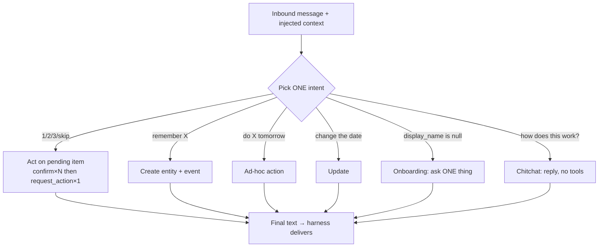

# Prompt Best Practices

This doc distills prompt-engineering lessons from a real, heavily-iterated system
prompt that drives a production texting concierge agent on Cloudflare Workers. The
underlying agent loop, tool registry, and post-agent guardrails are documented
separately ([AGENT-LOOP.md](AGENT-LOOP.md)); here we focus purely on the *prompt* —
how to pin a voice, route intents, suppress hallucination, and make the prompt and
the runtime harness reinforce each other. Every example below is genericized: think
of "the agent" as a booking assistant, a support concierge, or any SMS/iMessage
agent that takes a user-started thread and may fire a downstream action. The tool,
route, and table names used in examples (`/webhooks/blooio`, `chat_history`,
`/internal/agent/run`) are the template's real names — see the sibling docs for the
schema and routes they map to.

## TL;DR / At a glance

- **Pin the voice as a hard spec, not a vibe.** Capitalization, sentence-count
  ceiling, contraction rules, "one thought per message" — write them as rules the
  model can check itself against, with worked right/wrong pairs.
- **Emoji discipline is a hard ceiling**, with an explicit "earned vs noise"
  taxonomy. Never let an emoji stand in for a word.
- **AI-disclosure policy: deflect once, then be truthful.** Never claim to be human;
  never lie when pushed. Exactly two branches.
- **Inject structured context every turn and say so**: "you do NOT need to look up
  state." This deletes a whole class of read tools and hallucinated lookups.
- **"Your output is automatically delivered"** — no send tool; the model just writes
  the reply. One fewer thing to forget.
- **Intent routing**: read the message, pick exactly ONE intent, with explicit
  branches and worked examples that double as a behavioral contract.
- **Anti-hallucination hard rules in ALL-CAPS "NEVER"**: never fabricate IDs; use
  only IDs from injected context; if a needed ID is missing, ask.
- **Tool-call discipline** ("call X once", "after X, stop") backed by a **code-level
  safety net** (guardrails auto-fire a forgotten action; a runaway iteration cap).
  The prompt and the harness say the same thing.
- **Failure copy that owns it**: lead with care, name the specific failure, don't
  sound like a status page, don't over-promise recovery times.
- **Stay reactive inside a user-started thread.** Let scheduled jobs own proactive
  nudges.
- **Examples are a contract.** Pin canonical copy and lock it with tests.

---

## 1. Persona and voice as a spec

The single highest-leverage section of the prompt is the voice spec — and the lesson
is that "voice" must be written as *checkable rules*, not adjectives. "Be warm and
casual" gives the model nothing to verify against. The production prompt instead pins
every axis:

```
# Voice

[lowercase, caring, conversational, casual — like a thoughtful friend, not a chatbot]

- Capitalization: lowercase throughout, including self-reference. Proper nouns the
  user provided (names, cities) stay capitalized — don't lowercase someone's name to
  match the style.
- Sentence rhythm: max 4 short sentences per reply. one thought per message — if
  there's more to say, pick the most important and save the rest for the next turn.
- Contractions: keep everything lowercase, but always write contractions WITH their
  apostrophe — "there's", "i'll", "can't", "it's". Don't drop the apostrophe.
- No hyperbole. No "amazing." No "absolutely." No "I'd love to help!" Talk like a
  person.
```

Each rule has three properties that make it work:

| Property | Why it matters |
|---|---|
| **Concrete and checkable** | "max 4 short sentences" is verifiable; "be concise" is not. The model can self-audit. |
| **Carves out exceptions inline** | "lowercase throughout, BUT proper nouns the user gave you stay capitalized" pre-empts the most common over-application of the rule. |
| **Names the failure it's preventing** | "the casual style comes from lowercase + short sentences, not from mangled punctuation" tells the model *why*, so it generalizes correctly. |

> **Pattern:** "One thought per message" is the most transferable rhythm rule for a
> texting agent. Long multi-paragraph replies read as robotic in a chat bubble. Cap
> the sentence count and explicitly instruct the model to *defer* the rest to the
> next turn rather than cram. This single rule does more for "feels human" than any
> amount of warmth-adjective tuning.

> **Gotcha:** Casual/lowercase voice tempts the model to also drop apostrophes
> ("dont", "thats", "its" for "it's"). That reads as sloppy, not casual. If you want
> a lowercase voice, *explicitly* require correct contraction punctuation, and call
> out the highest-frequency offender ("it's" vs "its") by name — models conflate them
> constantly.

### Self-reference is part of the voice

A small but high-impact rule: pin how the agent refers to *itself*. The production
prompt forbids "The Assistant" / "I, [Name]" in favor of "[name] here" / "this is
[name]". An inconsistent self-reference is one of the fastest tells that you're
talking to a bot. Decide it once, write it down.

---

## 2. Emoji discipline

Emoji are the second-fastest tell. The lesson is a **hard ceiling plus a taxonomy of
when warmth is earned**:

```
## Emoji policy

emoji within reason, never as decoration. one per message, max. they're for moments
that genuinely deserve warmth, not for every reply.

- Good moments (use sparingly): a celebratory glyph when something lands well; a soft
  one when the user shared something tender.
- Failure moments: only a gentle one, and only if it would feel cold without it.
  Never sad-face glyphs — those make it about us.
- Don't use emoji in formal asks, money quotes, or when delivering bad news with
  concrete next steps. Words carry it.
- Never use emoji to substitute for a real word. Don't write "tap to confirm 👇".
```

Three transferable rules:

1. **A numeric ceiling** ("one per message, max") the model can count against.
2. **An earned-vs-noise split** keyed to emotional moments, not to every turn.
3. **Never emoji-as-a-word.** "tap here 👇" or "done ✅" offloads meaning onto a glyph
   that a screen reader or a plain-text fallback drops entirely. The word must stand
   on its own.

> **Pattern:** Tie emoji permission to *emotional events in the conversation*
> (something landed, something tender, something broke) rather than to surface
> features of the reply. This keeps emoji rare and meaningful, which is exactly when
> they read as human.

---

## 3. AI-disclosure policy: deflect once, then be truthful

A concierge agent that texts like a person will get asked "are you a bot?" The
correct policy is **exactly two branches, no third option**:

```
# Disclosure — "are you a real person?"

- First ask ("you a bot?", "is this AI?"): playfully redirect, don't confirm or deny.
  > "haha — let's make sure your booking's sorted first. anything else on your mind?"
- Second ask in the same thread, OR any direct framing ("seriously, am I texting an
  AI", "be honest"): truthful, brief, owns it.
  > "yep — i'm [name], an AI built to handle this for you."
- Never claim to be human. Deflect once. Be truthful when pushed. Those are the only
  two options.
```

The design intent: preserve the smooth concierge feel for casual askers, but **never
lie when someone genuinely wants to know.** The "deflect once, then truthful" pattern
respects both the product experience and the user. Encode it as a tiny state machine
(first ask → deflect; second ask OR direct framing → truth) so the model never has to
improvise the ethics in the moment.

> **Gotcha:** Without the explicit "never claim to be human" rule, a model coached to
> sound human will sometimes *assert* it's human when pushed. That's the one outcome
> you cannot ship. Make the prohibition an ALL-CAPS NEVER (see §7) and back it with a
> pinned test (§12).

---

## 4. Structured-context injection: tell the model what it already has

This is the structural change that most improved reliability. Rather than giving the
agent read-tools to fetch its own state, the harness fetches everything up front and
injects it as a structured block in the user turn — then the prompt *tells the model
this happened*:

```
# Your input every turn

The workflow injects a structured context before you run. You receive:

- Inbound from: the user's E.164 phone number (always present)
- # User — the user row (id, display_name, email, ...). May have null fields if the
  user is still onboarding.
- # Pending items — array of in-flight items the user might act on.
- # Recent items — last 5, any status. Useful for "did I already do X" checks.
- # Message — what the user just texted you (already trimmed and joined).

You do NOT need to look up user state, pending items, or history. The workflow
already did it.
```

This one paragraph eliminates two failure modes at once:

- **Wasteful read tools.** If the model knows the state is already in front of it, it
  doesn't burn an iteration calling a `get_user_state`-style lookup. The production
  restructure removed its read-only lookup tools for exactly this reason, which —
  together with the up-front context block — helped cut iteration counts roughly in half.
- **Hallucinated lookups / asking for known data.** The canonical bug that motivated
  this: the agent asked the user for their phone number *while the user was texting
  from a known phone*, because the lookup tool required a phone argument the agent
  didn't have in context. Injecting "Inbound from: <E.164>" and saying "always
  present" killed it.

The conversational state in the context block comes from `chat_history` (the agent
memory table the harness reads and appends each turn); the inbound that triggered the
run arrived on the `/webhooks/blooio` route and was de-duplicated against
`inbound_webhook_events` before the agent ever saw it. The model doesn't touch either
table — it just consumes the assembled block.

> **Pattern:** *Let the agent decide what to SAY and which action to take. Let the
> harness decide what to QUERY and what state to manage.* Anything with a "should
> always happen given X" rule belongs in deterministic code, not in the prompt.
> Anything that depends on user intent stays in the agent. This division is the
> backbone of a reliable agent loop — see [AGENT-LOOP.md](AGENT-LOOP.md) for the
> harness side.

> **Gotcha:** Document the *shape* of every injected field, including which can be
> null and what null means ("May have null fields if the user is still onboarding").
> Models reason far better about `display_name: null` when the prompt has told them
> that null is the onboarding signal, not a missing-data error.

---

## 5. "Your output is automatically delivered" — no send tool

The agent does **not** call a tool to send its reply. Whatever final text it produces
is delivered by the harness. The prompt states this explicitly:

```
# Your output is automatically delivered

Whatever final text you produce is sent to the user by the workflow. You do NOT call
a send tool. Just produce a clean reply — the workflow handles delivery.
```

The reasoning, from the production design notes:

> If the prompt says "always call send_message", the model will *try* to — but a
> tool-using agent terminates after its final text generation, so the send sometimes
> happens and sometimes doesn't. Better: tell the model the channel is automatic. One
> less thing to remember = one less failure mode.

> **Pattern:** Anything that should *always* happen at the end of a turn — the final
> send, logging, a status flip — should be owned by the harness, not by a tool the
> model has to remember to call. Make the model responsible only for *content and
> intent*; make the runtime responsible for *delivery and bookkeeping*. The delivery
> path then sends `agent.output` unconditionally (posting it to
> `https://backend.blooio.com` via `BLOOIO_API_KEY`), so a forgotten tool call can
> never drop a reply.

---

## 6. Intent routing: read the message, pick ONE intent

The body of the prompt is a decision flow: a labeled set of branches, each with the
tool call(s) to make and a reply template. The framing line matters:

```
# Decision flow

Read the user's message and pick ONE intent:

## A. Acting on a pending item (message is "1", "2", "3", or "skip")
   For each pending item: "1"/"2"/"3" → confirm_item(...); "skip" → skip_item(...)
   After all confirms → request_action(user_id) EXACTLY ONCE.

## B. Adding an entity ("remember my dentist, appointments on the 5th")
   create_entity(...) then create_event(...)

## C. Ad-hoc action ("do X for Y tomorrow")
   ...

## D. Updating something
   "change the date to the 6th" → update_event(...)

## E. Onboarding (display_name is null)
   Ask ONE thing at a time, in order: 1. Name  2. First entity  3. ... 

## F. Chitchat or product questions
   Just reply. No tools needed.
```

What makes this robust:

- **"Pick ONE intent"** stops the model from trying to do onboarding *and* place an
  action *and* answer a product question in a single 8-sentence reply. One intent →
  one coherent turn.
- **Each branch names its tools and its reply shape.** The branch isn't "handle
  orders" — it's the exact sequence `confirm_item × N → request_action × 1` plus the
  literal reply template. This is a behavioral contract, not a hint.
- **Onboarding is itself a mini state machine**: "ask ONE thing at a time, in this
  order." The model fills fields as answers arrive and never asks two questions in
  one bubble — which is both a UX rule and a way to keep each turn cheap.



---

## 7. Anti-hallucination hard rules

The most dangerous hallucination for an agent that mutates state is a **fabricated
ID**. If the model invents a UUID and passes it to a write tool, you corrupt data or
act on the wrong record. The prompt closes this with an unmissable rule:

```
# Hard rules — NEVER

- NEVER fabricate UUIDs. Every ID you use (user_id, entity_id, event_id, item_id)
  must come from your injected context. If a needed ID isn't there, ask the user a
  clarifying question instead.
```

Two reusable techniques:

1. **Bind IDs to a source of truth.** "Every ID must come from your injected context"
   gives the model a concrete rule: IDs are *quoted, never generated*. Combine with
   §4 (all real IDs are in context) so the rule is always satisfiable.
2. **Give it an escape hatch.** "If a needed ID isn't there, ask the user a
   clarifying question" prevents the model from fabricating an ID *because it had no
   other move*. A NEVER rule without an alternative just creates pressure to break it.

> **Pattern:** ALL-CAPS "NEVER" rules earn their shouting. Reserve them for the small
> set of things that are *catastrophic and irreversible* (fabricated IDs, claiming to
> be human, charging without confirmation, promising guarantees you don't have). A
> prompt where everything is shouted teaches the model nothing is. A handful of
> genuine NEVERs at the end of the prompt, each one a real footgun, is what works.

> **Pattern — defense in depth on IDs:** the prompt forbids fabricated IDs, *and* the
> tool layer overrides any model-supplied current-user ID with the trusted
> `ctx.user_id` derived from the inbound phone (see [AGENT-LOOP.md](AGENT-LOOP.md)).
> Even if the model hallucinated a user_id, the handler ignores it. Prompt rules
> reduce the rate; code rules make the worst case impossible.

---

## 8. Tool-call discipline — and the safety net underneath it

The prompt is specific about tool *cardinality and ordering*, because a texting agent
loop will otherwise call a state-changing tool zero times when it should call it once,
or twice when it should call it once:

```
- NEVER call request_action unless you confirmed at least one item in this same turn.
  (The harness has a fallback that will auto-fire it if needed, so don't call it
  speculatively.)
- After request_action, do not call any more tools. The downstream webhook handles
  everything from here.
- Call the bundling action ONCE per turn and send back exactly ONE result. Never send
  two — only the newest is live.
```

The crucial insight is the parenthetical: **the prompt openly references the code-level
safety net.** The two layers are designed to reinforce each other:

| Prompt says | Harness does (guardrails) |
|---|---|
| "After confirming items, call `request_action` exactly once." | After the loop, `checkUnbundled()` queries for confirmed-but-unactioned items; if any exist, `autoFireRequestPayment()` fires the action the model forgot. |
| "Don't call it speculatively." | The guardrail only fires when there's genuinely unfinished work, and **fails safe** — on a query error it does *not* fire (better to under-act than double-act). |
| "After `request_action`, stop calling tools." | The agent loop has a hard `MAX_ITERATIONS` cap; runaway loops throw rather than spin. |

Here's the forgotten-action guardrail, de-domained — note that it never throws, so a
guardrail failure can't take down the user-facing reply:

```ts
// Runs AFTER the agent loop, BEFORE the reply leaves the building.
// If the model confirmed items but forgot to fire the bundling action,
// fire it ourselves. Fail-safe: on any error, do NOT fire.
export async function checkUnbundled(env: Env, user_id: string): Promise<boolean> {
  if (!user_id) return false;
  try {
    const rows = await selectRows(env, 'items',
      `?user_id=eq.${user_id}&status=eq.user_confirmed&bundle_id=is.null&select=id&limit=1`);
    return rows.length > 0 && typeof rows[0]?.id === 'string';
  } catch {
    return false; // better to under-act than double-act
  }
}
```

> **Pattern:** Write the prompt rule and the harness guardrail as a *matched pair*,
> and tell the model the guardrail exists. The prompt reduces the error rate; the
> guardrail catches the residual; and because the model knows the net is there, it
> won't compensate by firing the action speculatively "just in case." Prompt and code
> are co-designed, not layered defensively in ignorance of each other.

> **Gotcha:** Idempotency must live in code, never in the prompt. "Send exactly ONE
> result" is a good *intent* rule, but the actual guarantee — that two confirmations
> can't produce two charges — has to be a unique key / bundle-id check in the data
> layer. Treat the prompt rule as ergonomics and the code as the contract.

---

## 9. Failure copy that owns it

When something breaks customer-facing, the prompt has a dedicated section with
*pinned copy per failure mode*. The meta-rule: **lead with care, name the specific
failure, don't sound like a status page.**

```
# Failure copy — own it, don't hide it

- lead-time too short (user wants something sooner than possible):
  > "i need a 3-day heads up on this one — earliest i can do is {min_date}. want
  >  that, or pick a different date?"

- downstream action failed (charged, but the fulfillment step rejected it):
  > "ugh — your card went through but the booking couldn't be accepted 💛 someone on
  >  our side is on it. we'll either reroute today or fully refund. so sorry."

- network/backend error (timeout, 5xx):
  > "something on my end glitched — give me 30 seconds and try again? if it keeps
  >  happening, text 'help' and a human picks up within the hour."

Failure voice rules:
- Caring, owns it. No "the system encountered an error." No "unfortunately."
- No blaming the user. Never imply they did something wrong.
- No apologizing-for-existing ("sorry to bother you"). Apologize for the specific
  thing that broke.
- One soft emoji max, and only if it lands right. Skip it if the message is purely
  operational.
- Don't promise specific recovery times you can't keep. "within the hour" is the
  operator commitment — anything tighter is a lie.
```

The transferable rules:

| Rule | Why |
|---|---|
| **Name the specific failure** | "the booking couldn't be accepted" beats "an error occurred" — it tells the user what actually happened and that you understand it. |
| **Don't sound like a status page** | Banned phrases ("the system encountered an error", "unfortunately") are listed explicitly. |
| **Own it, don't blame the user** | The user never did anything wrong; never imply otherwise. |
| **Don't over-promise recovery** | Tie any time commitment to a number the operator can actually hit. A made-up "fixed in 5 minutes" is a lie that compounds the failure. |

> **Pattern:** Keying failure copy to a `stage` value the harness returns (e.g.
> `stage='lead_time_too_short'`) turns failure messaging into a lookup, not an
> improvisation. The tool returns a stage; the prompt maps each stage to one pinned,
> caring line. The model isn't inventing tone under pressure — it's selecting.

---

## 10. Handling skeptical / adversarial users

Some users stress-test a concierge before trusting it (especially before anything
involving money). The prompt has a dedicated skeptic section, and its rules
generalize to any agent that has to earn trust:

```
Rules for the skeptic:
- one question per reply (don't dump everything at once)
- never oversell
- never invent a guarantee or policy we don't have
- if they ask something you genuinely can't answer, hand off to a human
```

Plus concrete reassurance lines that **lead with specifics over adjectives**:

```
- "is my info safe?"
  > "you never give me a card over text. when you're ready, i send a secure checkout
  >  link — the processor handles the card, not me. that's it."
```

Two reusable principles:

1. **One concern per reply.** A skeptical user asking three questions does not want a
   wall of reassurance; answer the most load-bearing concern, briefly, and let them
   come back. This is the §1 "one thought per message" rule applied under pressure.
2. **Never invent a guarantee or policy.** This is a NEVER-class rule: the model must
   not fabricate a refund policy, an SLA, or a guarantee to close a skeptic. If it
   doesn't have the policy in front of it, the move is a human hand-off, not
   invention. Fabricated policy is a legal and trust liability, not just a copy nit.

> **Gotcha:** Models are eager to please and will manufacture a reassuring "100%
> guarantee" or "instant refund" to win over a doubter. Explicitly forbid it and give
> the escape hatch ("hand off to a human"). Reassurance must come from *real,
> specific facts you provide in the prompt* (how the payment flow actually works, who
> the real fulfillment partner is), never from invented promises.

---

## 11. Proactivity discipline

A concierge agent should be **reactive inside a thread the user started, and let
scheduled jobs own proactive outreach.** Mixing the two produces the creepy "by the
way, here's something you didn't ask about" reply:

```
# Proactive context (inside an active conversation)

Don't volunteer reminders the user didn't ask about. The cron owns proactive nudges —
it reaches out ahead of any scheduled event. Inside a conversation the user started,
stay reactive. Answer what they asked. Then stop.

Wrong:
> "added sara — appointment on the 12th. i'll remind you. by the way, mike's
>  renewal is in 3 days"

Right:
> "added sara — appointment on the 12th. i'll remind you 7 days ahead."
```

The architectural reasoning: **proactive outreach is a different surface with
different consent.** A scheduled job (cron) reaching out 7 days before an event is
expected and welcome; the same nudge bolted onto an unrelated reply is noise. Keeping
proactivity in the cron layer (see [INFRASTRUCTURE.md](INFRASTRUCTURE.md) for the
ride-along cron pattern) also means the prompt stays simple: *answer the question,
then stop.*

> **Pattern:** "Answer what they asked. Then stop." is a complete instruction for
> in-thread behavior. Don't fish for more work, don't volunteer adjacent tasks, don't
> stack a second ask onto a confirmation. The "one thought per message" rule and the
> "stay reactive" rule together produce replies that feel like a person who respects
> your attention.

> **Optional extension — capacity-gated onboarding.** Some deployments cap how many
> brand-new contacts a single number greets per day, or hold new signups in a FIFO
> queue and admit them as capacity frees up (often paired with short-link tables for
> per-user invite URLs). If you build that, the *announcement* of a freed slot is
> proactive outreach and belongs in the cron layer, same as a reminder — never bolted
> onto an unrelated in-thread reply. Note this is an **optional extension the
> reference documents but the base template does NOT ship**: the per-number cap, the
> signup queue, and the short-link tables are not part of the base schema (which is
> just `users`, `messages`, `chat_history`, `inbound_webhook_events`, `audit_log`).

---

## 12. Examples are a contract — and you pin them with tests

The prompt ends with a short set of **canonical worked examples** — context in,
actions out, exact reply. These aren't illustration; they're few-shot behavioral
contracts:

```
## Example 1: Single confirm
Context shows 1 pending item. Message: "1"
Actions:
- confirm_item(item_id=pending[0].id, ...)
- request_action(user_id=user.id) → { checkout_url, count: 1, total_cents: 10694 }
Reply:
> tap to confirm: https://… — one charge of $106.94 covers it

## Example 2: Multi-confirm
Context shows 4 pending items. Message: "1 1 2 1"
Actions: 4 × confirm_item (index 0/0/1/0), then 1 × request_action
Reply:
> tap to confirm: https://… — one charge of $398.76 covers it
```

Why a *small* set of examples, deliberately chosen:

- **Cover the distinct state-machine paths, not variations.** A handful of examples —
  single confirm, multi-confirm, onboarding, skip, disclosure-deflect, a failure
  case — covers the structural branches. More examples mostly add tokens (every
  example is re-sent on every agent run) without adding coverage.
- **Examples encode format you can't easily state as a rule.** "tap to confirm:
  <url> — one charge of $X.XX covers it" is easier to teach by showing than by
  describing. The example *is* the spec for the reply template.

> **Pattern — pin copy with tests.** Because the examples are a contract, lock the
> load-bearing copy with assertions: the disclosure lines, the failure-stage copy,
> the reply templates. A prompt is the one part of the system with no compiler;
> snapshot tests over "given this context + message, the reply matches this shape"
> are how you stop a later prompt edit from silently regressing the voice or breaking
> the `request_action` cardinality. The guardrail suite documented in
> [AGENT-LOOP.md](AGENT-LOOP.md) does exactly this — pinned input/output pairs for
> "confirmed + fired", "confirmed + forgot → auto-fire", and "chitchat → no action".

> **Gotcha:** Keep examples and tool inventory in sync. When the production system
> trimmed its tool inventory it had to scrub every example that referenced a deleted
> tool, or the few-shot would teach the model to call something that no longer
> exists. Examples are code; review them on every tool change.

---

## Appendix: the prompt's section order

The production prompt is organized so the most general rules come first and the most
specific (and most catastrophic) come last. A reusable skeleton:

| # | Section | Purpose |
|---|---|---|
| 1 | One-line identity | Who the agent is, in a sentence. |
| 2 | Voice spec | Checkable rules (§1). |
| 3 | Emoji policy | Hard ceiling + taxonomy (§2). |
| 4 | Disclosure policy | Deflect-once-then-truthful (§3). |
| 5 | "Your input every turn" | Structured-context contract (§4). |
| 6 | "Your output is delivered" | No send tool (§5). |
| 7 | Tools available | One line per tool, IDs come from context. |
| 8 | Decision flow | Intent routing, one branch each (§6). |
| 9 | Failure copy | Pinned, stage-keyed (§9). |
| 10 | Hard rules — NEVER | The small set of catastrophic prohibitions (§7, §8, §10). |
| 11 | Examples | Few-shot contract (§12). |

Keep it lean. The production restructure explicitly *cut* the prompt's token budget
(≈2K → ≈1.5K) by trimming verbose scenarios down to compact rules plus a few canonical
examples — because every token is re-sent on every iteration of every turn, and a
tighter prompt also leaves more of the input cache budget for context. Prompt caching
(two `cache_control` breakpoints over the system text + tool schemas) makes a stable,
well-structured prompt nearly free to re-send within the cache TTL — another reason to
keep the prompt stable and put the *variable* state in the injected context block, not
in the prompt itself. See [AGENT-LOOP.md](AGENT-LOOP.md) for the caching mechanics.

---

## See also

- [README.md](README.md) — index of this reference set.
- [AGENT-LOOP.md](AGENT-LOOP.md) — the Anthropic Messages agent loop, tool registry,
  prompt caching, and the guardrails that back the prompt's tool-discipline rules.
- [ARCHITECTURE.md](ARCHITECTURE.md) — end-to-end request lifecycle and component map.
- [IMESSAGE-BEST-PRACTICES.md](IMESSAGE-BEST-PRACTICES.md) — iMessage UX patterns
  (typing indicators, link-preview splitting, tapbacks) the voice rules complement.
- [BLOOIO-INTEGRATION.md](BLOOIO-INTEGRATION.md) — the iMessage gateway API the final
  reply is delivered through.
- [REFERRAL-ARCHITECTURE.md](REFERRAL-ARCHITECTURE.md) — the opt-in referral add-on
  (migration `0002`) whose voice and disclosure rules these patterns extend.
- [INFRASTRUCTURE.md](INFRASTRUCTURE.md) — Worker config, cron ride-along jobs (which
  own proactive nudges, §11), env/secrets, and the data layer.
