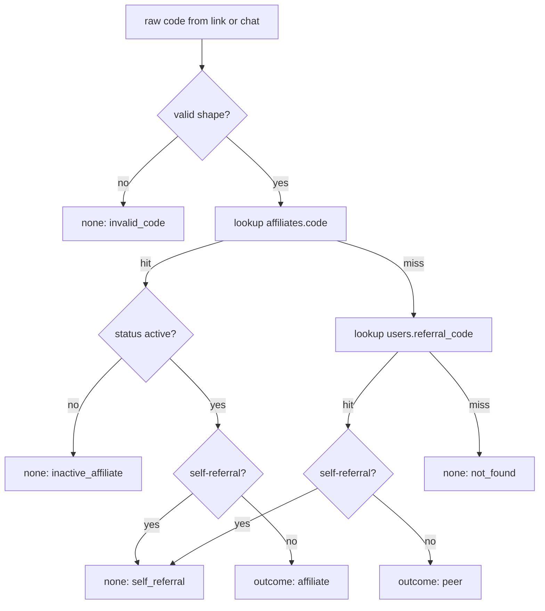
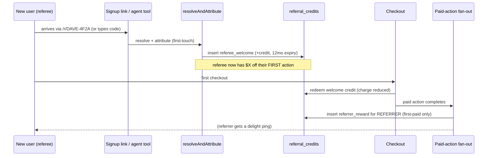

# Referral & Credit Architecture

This document describes a reusable design for a **unified referral system** that runs two
referrer types — ordinary peer users and cash-paid affiliates (influencers) — on **one
attribution path**. It is the only domain-specific feature in this reference set, written up
because the underlying engineering is broadly applicable: any product that already has (or
plans) an affiliate/commission system can add peer referral for almost free by *reusing the
same plumbing* and branching only on the reward. The implementation that ships with this kit
lives in `template/src/domain/referral*.ts` and `migrations/0002_referral.sql`; this doc is the
design narrative for those files.

Throughout, the reward is genericized: an **affiliate** earns **cash commission** (paid out via
a payment-processor Connect rail), while a **peer** earns **non-cash account credit** redeemable
against their next purchase. Swap "credit" / "cash" for whatever two reward shapes your product
needs — the mechanics are identical.

> **What ships vs. what's optional.** The base template ships the core agent tables (`users`,
> `messages`, `chat_history`, `inbound_webhook_events`, `audit_log`) and the **referral add-on is
> opt-in**: applying `migrations/0002_referral.sql` adds `users.referral_code`,
> `users.referred_by_user_id`, `users.referral_credit_cents`, plus the `referral_credits` and
> `affiliates` tables. Everything in this doc keyed on those names is real and shipping. Where a
> section reaches for a pattern that needs tables *beyond* that set (a per-number new-contact cap,
> a FIFO signup queue, short-link tables), it is called out inline as an **optional extension** the
> reference documents but the scaffold does **not** ship — so you're never confused when a table
> isn't in your migrations.

---

## TL;DR / At a glance

- **One resolver, two referrer types.** A single `resolveReferralCode` / `resolveAndAttribute`
  path handles both namespaces. Affiliate codes are tried first, peer codes second; the *only*
  downstream branch is which reward fires.
- **Reuse the expensive affiliate plumbing.** Attribution, first-touch lock, self-referral block,
  payout ledger, processor Connect onboarding, and the monthly batch already exist for affiliates.
  Peer referral = auto-issued codes + a non-cash credit ledger. That's the whole new build.
- **Readable share codes inside a link.** `NAME-SLUG` + a confusable-free 4-char suffix
  (`DAVE-4F2A`) wrapped in `/r/<CODE>`. Users never type a bare code. Uniqueness is enforced
  across *both* namespaces.
- **Two reward triggers (the key anti-abuse idea).** The **referee** "welcome" credit is granted
  at **attribution time** (so it discounts their first purchase). The **referrer** reward is
  granted only on the referee's **first *paid* action** — never at signup — so throwaway accounts
  can't mint payouts.
- **Append-only signed-cents ledger.** FIFO consumption + 12-month expiry computed by pure
  functions; a denormalized cached balance kept in sync by an atomic DB delta; a daily reconcile
  cron repairs drift and ages out expired credit.
- **Fail-open everywhere.** Attribution and credit grants never block a signup or an agent turn.
  Worst case is a missing credit a later reconcile repairs.

---

## 1. The insight: reuse, don't rebuild

Most teams build an **affiliate** program first (influencers, partners) because that's where the
acquisition leverage is. That system is *expensive*: it needs first-touch attribution, a
self-referral block, a payout ledger, KYC/tax onboarding through a payments processor's Connect
product, and a monthly payout batch.

A **peer** referral program ("refer a friend, you both get a reward") needs **almost all the same
parts**. The mistake is to build it as a parallel system. Instead:

> **Pattern:** Treat affiliates and peer referrers as two *tiers of the same thing*. Give every
> user an auto-issued code, route both code types through one resolver, and branch only at the
> reward. You inherit attribution, the self-referral block, first-touch, and the payout
> machinery for free.

| | **Peer referrer** (every user) | **Affiliate referrer** (influencer / partner) |
|---|---|---|
| Who | Any user, automatically | Operator-approved |
| Code source | Auto-issued at signup | Operator-created |
| Reward | **Account credit** (non-cash) | **Cash commission** via processor Connect |
| Payout rail | Internal credit ledger (new) | Payout ledger + monthly batch (exists) |
| Tax / KYC | None (it's credit) | Connect onboarding (exists) |
| Approval | Automatic | Operator-gated |

The genuinely-new work is small: (1) auto-issue a code to every user, (2) a unified resolver that
accepts either namespace, (3) a credit ledger + redemption-at-checkout path, (4) sharing
surfaces, (5) anti-abuse for the peer path.

---

## 2. Data model

Two columns and one ledger table layered on top of the existing affiliate schema (which already
provides `users.affiliate_id` + `affiliate_attributed_at` and the cash payout tables). All of
this is what `migrations/0002_referral.sql` applies.

```sql
-- Every user gets a shareable code + a denormalized credit balance.
alter table public.users
  add column if not exists referral_code         text,                       -- UNIQUE (partial index)
  add column if not exists referred_by_user_id   uuid references public.users(id),  -- peer attribution
  add column if not exists referral_credit_cents integer not null default 0;  -- cached ledger sum

-- Append-only credit ledger. amount_cents is SIGNED: + earned, - spent.
create table if not exists public.referral_credits (
  id               uuid primary key default gen_random_uuid(),
  user_id          uuid not null references public.users(id),   -- whose balance this affects
  amount_cents     integer not null,                            -- + earned, - spent
  reason           text not null
    check (reason in ('referrer_reward','referee_welcome','redeemed')),
  related_user_id  uuid references public.users(id),            -- the referee that triggered it
  related_order_id uuid references public.orders(id),           -- the paid action that triggered/consumed it
  expires_at       timestamptz,                                 -- null for redeemed rows
  created_at       timestamptz not null default now()
);
```

> **Optional extension — `orders`.** The `related_order_id` foreign key points at the host app's
> purchases/orders table. The base template ships no `orders` table (it's an SMS agent kit, not a
> commerce app), so this column references **your** application's paid-action table. If your product
> has no concept of a paid order, drop the FK and store whatever identifier your "first paid action"
> produces (a payment-intent id, an invoice id) as plain text.

Key design choices:

- **Distinct code namespaces.** Affiliate codes live in `affiliates.code`; peer codes live in
  `users.referral_code`. Keeping them in separate tables makes the resolver unambiguous: try one,
  then the other. A cross-table `UNIQUE` can't be a single DB constraint, so uniqueness is
  enforced *application-side at issuance* (check both tables) plus a per-table partial unique
  index as the final guard.

  ```sql
  -- Partial unique index so multiple NULLs are fine during lazy backfill,
  -- but every non-null code is unique within the table.
  create unique index if not exists users_referral_code_uniq
    on public.users (referral_code)
    where referral_code is not null;
  ```

- **Signed-cents ledger, not a mutable balance.** The ledger is the source of truth and is
  append-only. `users.referral_credit_cents` is a *denormalized cache* for fast checkout reads,
  kept in sync by an atomic delta (below) and periodically reconciled.

- **One-reward-per-referee guard.** A partial unique index on the *earned* reasons makes the
  referrer reward idempotent against a retried webhook — at most one earned row per referee, ever:

  ```sql
  create unique index if not exists referral_credits_one_reward_per_referee
    on public.referral_credits(related_user_id, reason)
    where reason in ('referrer_reward','referee_welcome');
  ```

- **Atomic balance delta.** The cached column is never read-modify-written in app code (that
  loses updates when a referrer has several referees paying at once, or a grant races a redeem).
  Instead a one-statement DB function applies a signed delta and floors at zero:

  ```sql
  create or replace function public.apply_referral_credit_delta(
    p_user_id uuid, p_delta integer
  ) returns integer language sql as $$
    update public.users
       set referral_credit_cents = greatest(0, coalesce(referral_credit_cents, 0) + p_delta)
     where id = p_user_id
    returning referral_credit_cents;
  $$;
  ```

> **Pattern:** Ledger as truth, denormalized column as cache, atomic DB function for every
> mutation, periodic reconcile for drift. This is the standard "money-adjacent" shape — it keeps
> reads fast without making the cache authoritative, and the append-only ledger is your audit
> trail.

---

## 3. Readable share codes

Codes are meant to be shared out loud and read off screens, so they're *readable*, not random
gibberish: a name slug plus a short confusable-free suffix.

```
DAVE-4F2A
└─┬─┘ └─┬─┘
 slug  random suffix (uniqueness)
```

- **Slug** — first whitespace token of the display name, stripped to `A–Z`, uppercased, capped at
  8 chars. Falls back to `FRIEND` when the name yields no letters, so every user gets a
  pronounceable code even before they share a name.
- **Suffix** — 4 chars from a **Crockford-minus-confusables** alphabet `ABCDEFGHJKMNPQRSTVWXYZ23456789`
  (no `0/O`, `1/I/L`, `U`). 30 symbols, so the raw byte source needs rejection sampling to avoid
  modulo bias.

```ts
const SUFFIX_ALPHABET = 'ABCDEFGHJKMNPQRSTVWXYZ23456789'; // 30 symbols, confusable-free
const SUFFIX_LEN = 4;

export function randomSuffix(randomBytes: RandomBytes = defaultRandomBytes): string {
  const out: string[] = [];
  const bytes = randomBytes(SUFFIX_LEN * 4); // over-draw so rejection rarely re-loops
  const LIMIT = 240; // largest multiple of 30 <= 256
  for (let i = 0; i < bytes.length && out.length < SUFFIX_LEN; i++) {
    const b = bytes[i]!;
    if (b >= LIMIT) continue;          // reject high bytes -> no modulo bias
    out.push(SUFFIX_ALPHABET[b % SUFFIX_ALPHABET.length]!);
  }
  while (out.length < SUFFIX_LEN) {    // defensive top-up; should never trigger
    out.push(SUFFIX_ALPHABET[randomBytes(1)[0]! % SUFFIX_ALPHABET.length]!);
  }
  return out.join('');
}

export function buildReferralCode(name: string | null, rb = defaultRandomBytes): string {
  return `${firstNameSlug(name)}-${randomSuffix(rb)}`; // "DAVE-4F2A"
}
```

> **Gotcha:** `256 % 30 !== 0`, so naive `byte % 30` over-weights the first six symbols. Mask to
> the largest multiple of the alphabet length below 256 (here 240) and reject the rest. A
> 32-symbol alphabet gets this for free; a 30-symbol one does not. Over-draw bytes so the
> rejection loop almost never needs a second syscall.

### Issuance & uniqueness across both namespaces

Issuance must guarantee uniqueness across *both* `affiliates.code` and `users.referral_code`
(they share the `/r/<CODE>` link namespace). The flow mirrors a short-link minter: generate,
check both tables, retry on collision, with the DB unique index as the final race guard.

```ts
async function codeTaken(env: Env, code: string): Promise<boolean> {
  const enc = encodeURIComponent(code);
  try {
    if ((await selectOne(env, 'affiliates', `?code=eq.${enc}&select=id&limit=1`))?.id) return true;
    if ((await selectOne(env, 'users', `?referral_code=eq.${enc}&select=id&limit=1`))?.id) return true;
    return false;
  } catch {
    return true; // fail toward regenerate — never claim a possible dup
  }
}
```

Three issuance entry points keep a code on every user without ever blocking a critical path:

| Entry point | When | Behavior |
|---|---|---|
| `ensureReferralCode` | At user creation; lazy backfill on any read of a null code | Re-reads current code, generates if absent, guarded `PATCH ... where referral_code is null` so a concurrent setter wins cleanly. Never throws. |
| `reissueReferralCodeForName` | When the display name lands after a placeholder code was issued | Upgrades `FRIEND-XXXX` → `DAVE-XXXX`. No-op if the code is already personalized (it may already be shared on a link). |
| SQL backfill | Migration apply time | Best-effort bulk issuance for existing users, same shape, so they don't wait for a read to mint one. |

> **Gotcha:** Once a personalized code might be on a shared link, never churn it. The reissue path
> only upgrades *placeholder* codes (`FRIEND-` prefix) and leaves anything personalized alone.

---

## 4. The unified resolver

One function resolves a raw code to a referrer and classifies the outcome. It is **pure-ish**
(one read per namespace, no writes) and **never throws** — a lookup error degrades to
`not_found`, because attribution is best-effort and must never block a signup or a turn.

```ts
export type ResolveOutcome =
  | { kind: 'affiliate'; affiliate_id: string; code: string }
  | { kind: 'peer'; referrer_user_id: string; code: string }
  | { kind: 'none'; reason: 'invalid_code' | 'not_found' | 'inactive_affiliate' | 'self_referral' };
```

**Resolution order** (namespaces stay distinct, so it's unambiguous):

1. `affiliates.code` — operator/influencer codes, tried first. An inactive affiliate resolves to
   `inactive_affiliate` (not a silent miss).
2. `users.referral_code` — peer codes, tried second.
3. Otherwise `not_found` (silent).

**Shared guards both namespaces enforce:**

- **Self-referral block** — refuse if the would-be referee's phone or email matches the
  referrer's; for peer, also if the resolved `user_id` *is* the referee's own id (someone pasting
  their own code).
- **Code shape gate** — a permissive `isValidReferralCode` regex (4–24 chars, alnum with optional
  single dashes) short-circuits obvious junk before any DB round-trip. It is a *shape* check, not
  an authenticity check; the table lookup is the real gate.



### Attribution write: first-touch-wins, fail-open

`resolveAndAttribute` resolves *and* writes first-touch attribution onto the referee. It reads the
referee's current attribution state up front; if **either** namespace is already set, it's an
idempotent no-op (`already_attributed: true`). A peer referral never overwrites an affiliate
attribution and vice versa — first to land owns the user.

The write itself is **guarded against a race** by filtering on both attribution columns being
null, so a concurrent attribute can't clobber it:

```ts
await updateRows(
  env, 'users',
  `id=eq.${enc(refereeUserId)}&affiliate_id=is.null&referred_by_user_id=is.null`,
  { referred_by_user_id: outcome.referrer_user_id }, // OR affiliate_id + *_attributed_at
  { returning: false },
);
```

> **Pattern:** Make the attribution write *conditional on still being unattributed* (`...is.null`
> filter). The DB does the compare-and-set; your app code stays a simple "best-effort, fire and
> forget" without a transaction or lock.

Two call sites share this one resolver:

| Call site | Trigger | Notes |
|---|---|---|
| Signup link route | Code arrives in the `/r/<CODE>` signup payload | Primary path — attributes **before the agent ever runs**. |
| `attribute_referral` agent tool | User types a code in chat ("DAVE-4F2A referred me") | Fallback. `ctx.user_id` is the trust root; any model-supplied id/phone is ignored. |

---

## 5. The two-trigger reward model (anti-abuse core)

This is the most important design decision. The referee and referrer rewards fire at **different
moments**, by design:

| Reward | Granted at | Why |
|---|---|---|
| **Referee "welcome"** credit | **Attribution time** (the moment `referred_by_user_id` is set) | The acquisition incentive must discount their **first** action. Granting it later (e.g. a credit toward a *second* purchase) blunts the hook. Harmless to farm — it only ever discounts the abuser's *own* first purchase; it never pays anyone out. |
| **Referrer** reward | The referee's **first *paid* action**, not signup | Anti-farming. If the referrer were paid at signup, anyone could mint payouts with throwaway accounts. Tying it to a real paid action makes abuse cost money. |



### Referee welcome — granted at attribution

Granted inside `resolveAndAttribute`, immediately after a genuinely-new peer attribution lands
(past the self-referral block and first-touch guard). Idempotent and fail-open:

```ts
// Pre-check: one-per-referee slot already taken? (welcome OR referrer reward)
const prior = await selectOne(env, 'referral_credits',
  `?related_user_id=eq.${enc(refereeUserId)}&reason=in.(referrer_reward,referee_welcome)&select=id&limit=1`);
if (prior?.id) return; // already granted — short-circuit

await insertRow(env, 'referral_credits', {
  user_id: refereeUserId, amount_cents: REFEREE_WELCOME_CENTS,
  reason: 'referee_welcome', related_user_id: refereeUserId,
  related_order_id: null, expires_at: creditExpiryDate(new Date()).toISOString(),
});
await rpcCall(env, 'apply_referral_credit_delta', {
  p_user_id: refereeUserId, p_delta: REFEREE_WELCOME_CENTS,
});
```

The cheap pre-check handles the common case; the **partial unique index is the hard guarantee**
against a concurrent double-attribute (the second insert raises `23505`, caught and logged). The
whole grant is wrapped so it can never break attribution.

### Referrer reward — granted on the referee's first paid action

Granted in the **paid-action fan-out**, right alongside the existing affiliate payout insert — the
same place the cash commission already fires. It resolves the acting user, checks for a peer
referrer, and grants once:

```ts
// FIRST-PAID-ONLY guard: has the referrer_reward for THIS referee already fired?
const prior = await selectOne(env, 'referral_credits',
  `?related_user_id=eq.${enc(refereeId)}&reason=eq.referrer_reward&select=id&limit=1`);
if (prior?.id) return; // anti-double-fire on a retried webhook

await insertRow(env, 'referral_credits', {
  user_id: referrerId, amount_cents: REFERRER_REWARD_CENTS,
  reason: 'referrer_reward', related_user_id: refereeId,
  related_order_id: order.id, expires_at: creditExpiryDate(new Date(placed_at)).toISOString(),
});
await bumpCreditBalance(env, referrerId, REFERRER_REWARD_CENTS);
```

> **Gotcha:** The referrer-reward guard keys on `reason=eq.referrer_reward` **only** — not on both
> earned reasons. The `referee_welcome` row was already written at attribution time, so checking
> *both* reasons would see it and wrongly suppress *every* referrer reward. Be precise about which
> reason the idempotency guard checks.

> **Pattern:** Bolt the new reward onto an *existing* post-action fan-out (the one that already
> does idempotent side-effects on a paid action). It inherits the same "runs once per paid action,
> resolves the user the same way, entirely non-fatal" contract as the affiliate payout. The fan-out
> awaits several self-contained, never-throwing side-effects in sequence; the reward is just one
> more.

### Affiliate tier earns strictly more

To keep "influencer" a meaningfully better tier, the affiliate cash payout is the base commission
**plus a clearly-marked bump**, defined as a single constant so it's the one source of truth:

```ts
export const REFERRER_REWARD_CENTS        = 500; // peer: account credit
export const REFEREE_WELCOME_CENTS        = 500; // peer: account credit
export const AFFILIATE_REFERRAL_BUMP_CENTS = 500; // affiliate: cash on TOP of base commission
```

At payout-insert time: `amount_cents = baseCommission + AFFILIATE_REFERRAL_BUMP_CENTS`. An
affiliate always earns strictly more per referral (and in *cash*) than a peer earns in credit.

---

## 6. Credit ledger math (pure functions)

All the money logic is pure: no `Date.now()`, no IO, the caller passes `now`. This makes it
trivially unit-testable and lets the same functions run at checkout, in the reconcile cron, and in
tests with a fixed clock.

### Available balance — FIFO consumption + expiry

`computeAvailableReferralCents(rows, now)` recomputes the *true* spendable balance from the
ledger. It is **pure and idempotent by construction**: it reads only earned rows (`> 0`) and
`redeemed` debits (`< 0`), ignoring the denormalized column and any other row, so running it twice
yields the same number.

Algorithm:

1. **Earned grants**, sorted by `created_at` ascending (FIFO, oldest first; stable tiebreak).
2. **Total ever spent** = Σ of `redeemed` debit magnitudes.
3. **Drain spend oldest-first** across grants. Each grant's unspent remainder counts toward
   `available` *only if it hasn't expired* (`expires_at == null` or `>= now`).

> **Pattern:** Attribute spend to the **oldest** grants first. The credits left standing are then
> the **newest** ones — the least likely to expire. Spending against the newest grants would expire
> balance the user has effectively already used. FIFO-oldest-first is what makes expiry fair.

Defensive details that matter for a money path: non-finite amounts coerce to 0; an *unparseable*
`expires_at` is treated as **not expired** (fail toward keeping the credit, never silently
confiscate); the result is always `>= 0`.

### Redemption — apply credit with a minimum-charge floor

`computeRedemption` applies the smaller of (available credit, order total) against the charge, with
one safety rail: **never leave a charge strictly between 0 and the processor minimum**. Payment
processors reject sub-minimum charges (commonly ~50¢), so a naive "subtract all credit" can
produce an un-chargeable amount.

```ts
export const STRIPE_MIN_CHARGE_CENTS = 50; // processor minimum

let applied = Math.min(credit, total);
let charge  = total - applied;

if (charge > 0 && charge < floor) {
  if (total >= floor) { charge = floor; applied = total - floor; } // charge the legal minimum
  else                { charge = 0;     applied = total;        }  // tiny order — cover it fully
}
```

| Case | Result |
|---|---|
| credit ≥ total | charge `0`, apply `total` (fully covered) |
| credit < total, remaining ≥ floor | charge `total − credit`, apply `credit` |
| credit < total, remaining in `1..floor-1` | trim credit so charge lands *exactly* at the floor |
| total below floor entirely | cover it fully, charge `0` |

> **Gotcha:** This is a payment-critical helper — it must **never throw**. Non-finite or negative
> inputs yield a no-op (apply 0, charge `max(0, total)`); the caller treats any surprise as "fail
> open to full charge." Never let a credit-math edge case fail a real payment.

### Expiry math

Credits expire 12 months out, computed with calendar-month arithmetic so a Feb-29 grant expires
Feb-28 rather than drifting:

```ts
export function creditExpiryDate(now: Date): Date {
  const d = new Date(now.getTime());
  d.setUTCMonth(d.getUTCMonth() + CREDIT_EXPIRY_MONTHS); // 12
  return d;
}
```

### Daily reconcile cron

Both grant sites stamp `expires_at`, but nothing *acts* on it — the denormalized balance keeps
showing expired cents as spendable until something recomputes. A once-daily job is that something.
It walks the ledger, recomputes each user's true balance with `computeAvailableReferralCents`, and
syncs the cache via the atomic delta.

It is deliberately the **smallest possible mutation**:

- It **never inserts a ledger row** and adds no new `reason`. The ledger stays immutable truth; the
  job only corrects the cached sum. That's what makes it idempotent — a second run applies a zero
  delta.
- It only moves the cache **toward** the recomputed value. Expiry shows up as a negative delta
  (counted as `cents_expired`); a cache that under-reports is corrected up.

The job never throws (failures accumulate into a result struct) and **rides along** inside an
existing cron tick rather than claiming its own trigger — relevant because the platform caps cron
triggers (see [INFRASTRUCTURE.md](INFRASTRUCTURE.md)). One handler awaits several self-contained,
never-throwing jobs in sequence.

---

## 7. Sharing surfaces

The user-facing artifact is **always a link**, `https://<your-site>/r/<CODE>` — users never type a
bare code. The `/r/<CODE>` landing page pre-fills attribution into the signup payload so the
referee never has to type anything.

| Surface | What it is |
|---|---|
| `/r/<CODE>` link | Landing page that carries `referred_by` into the signup payload → attribution happens before the agent runs. |
| `get_my_referral_link` agent tool | User asks "what's my referral link?" (or it's offered at end of onboarding / after a purchase). Returns `{ code, link, reward_copy }`; lazily backfills the code if absent. |
| Email footer | The user's code/link appended to confirmation emails. |

The agent tool keeps the boundary-trust discipline (`ctx.user_id`, never a model-supplied id) and
hands the model the *pieces* plus the locked reward framing, letting the agent own the final
voice:

```ts
return {
  ok: true, code, link: `${base}/r/${encodeURIComponent(code)}`,
  reward_copy: 'when a friend you refer places their first order, you both get $X.',
};
```

> **Pattern:** Have the tool return structured pieces (`code`, `link`, `reward_copy`) rather than a
> finished sentence. The agent folds them into one on-brand message; the tool stays a pure data
> provider and the reward framing stays a single source of truth.

---

## 8. Anti-abuse checklist

| Control | Where | Status |
|---|---|---|
| Self-referral blocked (phone / email / own user_id) | resolver | ✅ |
| First-touch-wins, one attribution per user, guarded write | `resolveAndAttribute` | ✅ |
| **Referrer** reward only on referee's **first paid action** (not signup) | paid-action fan-out | ✅ |
| One reward per referee, ever (idempotent vs. retried webhook) | partial unique index `(related_user_id, reason)` | ✅ |
| Referee welcome harmless to farm (only discounts abuser's own first action) | by design | ✅ |
| Credit can't exceed order total; never sub-floor charge | `computeRedemption` | ✅ |
| 12-month expiry, FIFO consumption | `computeAvailableReferralCents` + reconcile cron | ✅ |
| Per-referrer reward cap per period | — | ⬜ recommended |
| Duplicate-identity check (same card/device) before granting | — | ⬜ recommended |

The two open items are the standard next layer once the program has real volume: a per-period cap
on rewarded referrals, and a same-card/same-device fraud check before granting the referrer reward.

> **Optional extension — abuse caps.** A per-referrer "N rewarded referrals per rolling window" cap
> is the natural next control, but it needs a counter the base schema doesn't ship (either a small
> `referral_caps` table or an aggregate query over `referral_credits` windowed by `created_at`).
> Treat it as an add-on you build when volume justifies it, not part of the migration `0002` set.

---

## 9. Build order

A pragmatic sequencing that ships value at each step:

1. **Codes + resolver** — migration, auto-issue at signup, generalize the affiliate-attribute tool
   to accept both namespaces, grant the referee welcome at attribution. Ships "anyone can refer
   anyone"; affiliate behavior unchanged. *This step alone makes a previously-inert "were you
   referred?" prompt do something real for the first time.*
2. **Credit ledger + redemption** — the ledger table, redemption applied at checkout, referrer
   reward on first paid action.
3. **Sharing** — `/r/<CODE>` link, `get_my_referral_link` tool, email-footer code.
4. **Affiliate self-serve** (optional) — a gated affiliate-signup route that calls the existing
   processor Connect onboarding + issues a code, closing the "no way to create affiliates" gap.

---

## See also

- [README.md](README.md) — index of this reference set
- [ARCHITECTURE.md](ARCHITECTURE.md) — end-to-end request lifecycle + component map
- [AGENT-LOOP.md](AGENT-LOOP.md) — the agent loop and the tool registry (`attribute_referral`,
  `get_my_referral_link` are tools)
- [INFRASTRUCTURE.md](INFRASTRUCTURE.md) — data layer, the cron ride-along pattern, secrets
- [BLOOIO-INTEGRATION.md](BLOOIO-INTEGRATION.md) — the messaging gateway used for the referrer
  delight ping
- `template/src/domain/referral*.ts` + `migrations/0002_referral.sql` — the shipping
  implementation this document describes
